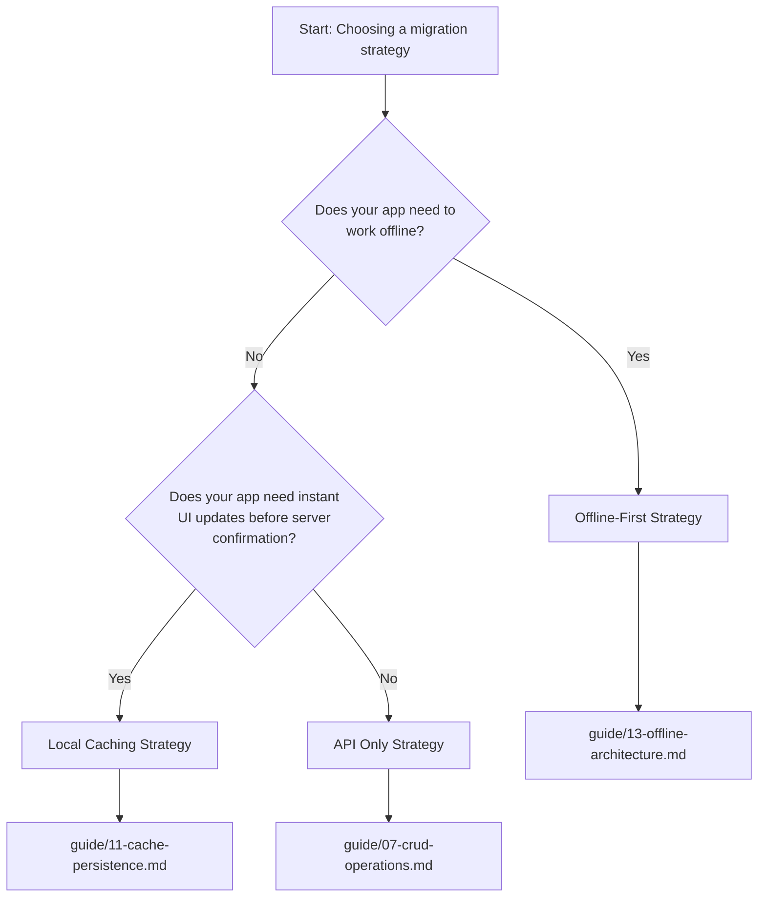

# Choosing Your Migration Strategy

<!-- ai:metadata -->
<!--
  Guide section: Decision Framework (STRC-01)
  Purpose: Help readers choose between API Only, Local Caching, and Offline-First strategies
  Navigation: 00-introduction.md -> [this] -> 03-prerequisites.md
-->

<!-- ai:default-recommendation -->
## The Default Recommendation

> **Start with API Only unless you have a specific need for caching or offline.**
>
> API Only handles all CRUD operations, filtering, pagination, relationships, and real-time updates with minimal setup. Most apps that used DataStore never actually needed offline support -- DataStore just provided it automatically. Before committing to a more complex strategy, honestly assess whether your users depend on offline functionality.

<!-- ai:decision-tree -->
## Decision Flowchart

Use this flowchart to determine which strategy fits your app.

### Mermaid Diagram



### Plain-Text Version

```
Does your app need to work offline?
  |
  +-- Yes --> Offline-First Strategy (guide/13-offline-architecture.md)
  |
  +-- No
        |
        Does your app need instant UI updates before server confirmation?
          |
          +-- Yes --> Local Caching Strategy (guide/11-cache-persistence.md)
          |
          +-- No --> API Only Strategy (guide/07-crud-operations.md)
```

<!-- ai:strategy:api-only -->
## API Only Strategy

### What It Provides

- Direct GraphQL queries and mutations through Apollo Client
- Apollo's in-memory normalized cache for the duration of the session
- React hooks (`useQuery`, `useMutation`) for declarative data fetching
- Real-time updates via Amplify subscriptions with refetch-based cache updates
- Full access to GraphQL filtering, pagination, and sorting

### When to Level Up

Consider Local Caching if you want data to persist across page refreshes or need instant optimistic UI feedback. Consider Offline-First if your users need to read and write data without network connectivity.

### Complexity

**Effort estimate: 1-2 hours for basic setup**, plus time to convert existing DataStore calls to Apollo queries and mutations. This is primarily a find-and-replace exercise with some GraphQL query writing.

### Best For

Apps where users are always online, where a brief loading spinner is acceptable during data operations, and where the simplicity of direct API calls outweighs the benefits of local persistence. This includes dashboards, admin panels, content management tools, and apps that primarily display server-side data.

<!-- ai:strategy:local-caching -->
## Local Caching Strategy

### What It Provides

- Everything in API Only, plus:
- Persistent cache that survives page refreshes (via `apollo3-cache-persist`)
- Optimistic UI updates that show changes instantly before server confirmation
- `watchQuery` for reactive list updates similar to DataStore's `observeQuery`
- Faster perceived performance from cache-first data fetching

### When to Level Up

Consider Offline-First if your users need to queue writes while offline and sync them when connectivity returns.

### Complexity

**Effort estimate: 2-4 hours including cache persistence setup.** Beyond the API Only foundation, you add cache persistence configuration, optimistic response functions for mutations, and cache update logic. The conceptual overhead is moderate -- you need to understand Apollo's normalized cache.

### Best For

Apps that benefit from instant UI feedback and cached data between sessions, but do not need true offline write support. Social feeds, collaborative editing with online-only users, e-commerce product browsing, and apps where users expect snappy interactions.

<!-- ai:strategy:offline-first -->
## Offline-First Strategy

### What It Provides

- Everything in Local Caching, plus:
- Full offline read and write support via a local Dexie.js (IndexedDB) database
- Mutation queue that persists offline writes and replays them when connectivity returns
- Sync engine for delta and base query synchronization with the AppSync backend
- Conflict resolution using `_version` tracking (manual implementation)
- Network state detection and online/offline mode switching

### Full Control

You implement conflict resolution, sync filtering, and lifecycle events exactly the way your application needs them. This means more code, but every behavior is explicit and customizable.

### Complexity

**Effort estimate: 1-2 weeks for a full implementation.** This strategy involves building a local database layer, a mutation queue with retry logic, a sync engine, and conflict resolution handling. Choose this if your app genuinely requires offline functionality.

### Best For

Field service apps, data collection tools used in areas with unreliable connectivity, apps where users must be able to create and edit records without network access, and any app where losing unsaved work due to a network interruption is unacceptable.

<!-- ai:offline-assessment -->
## Important: Offline Might Not Be Required

DataStore gave every app offline support automatically, whether the app needed it or not. Before choosing the Offline-First strategy, honestly assess whether your users actually depend on offline functionality.

Ask yourself these questions:

- **Do your users actually use the app without connectivity?** If your app is primarily used on desktop browsers or in offices with reliable internet, offline support may be unnecessary overhead.
- **Do you have error reports or support tickets about offline scenarios?** If users have never complained about connectivity issues, they may not need offline support.
- **Would a loading spinner during brief network issues be acceptable?** Many apps can tolerate a few seconds of loading state during network hiccups without degrading the user experience.
- **Is the data time-sensitive?** If users need the absolute latest data (stock prices, live dashboards), offline cached data may be stale and misleading anyway.

If you answered "no" to most of these questions, **start with API Only**. You can always adopt Local Caching or Offline-First later if the need arises. The migration strategies are additive -- each builds on the previous one.

---

**Next:** [Prerequisites](./03-prerequisites.md) | **Back:** [Introduction](./00-introduction.md)
