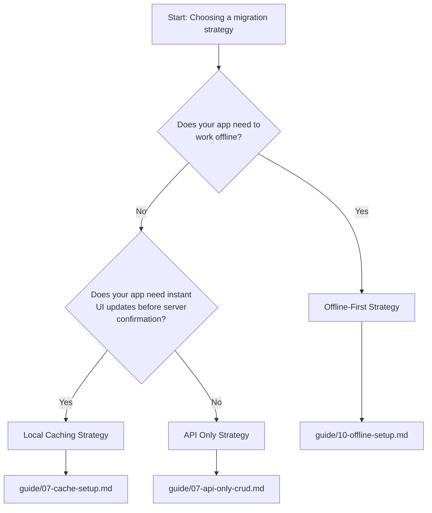

<!-- ai:guide-metadata -->
# Amplify DataStore (Gen 1) to Apollo Client (Gen 2) Migration Guide

<!-- ai:version -->
<!-- Version: 1.1.0 | Date: 2026-03-18 | Sections: 16 | Lines: ~8,500+ -->
<!-- Target: Engineers migrating AWS Amplify Gen 1 DataStore apps to Gen 2 with Apollo Client -->
<!-- Strategies: API Only | Local Caching | Offline-First -->
<!-- Usage: Paste this entire file into an LLM context window for AI-assisted migration -->
<!-- Structure: All sections bounded by section markers for machine parsing -->

## Table of Contents

- [Section 0: Introduction](#section-0-introduction)
- [Section 1: Decision Framework](#section-1-decision-framework)
- [Section 2: Prerequisites](#section-2-prerequisites)
- [Section 3: Apollo Client Setup](#section-3-apollo-client-setup)
- [Section 4: Real-Time Subscriptions](#section-4-realtime-subscriptions)
- [Section 5: Migration Checklists](#section-5-migration-checklists)
- [Section 6: CRUD Operations](#section-6-crud-operations)
- [Section 7: Predicates, Filters, Pagination, and Sorting](#section-7-predicates-filters-pagination-and-sorting)
- [Section 8: Relationships](#section-8-relationships)
- [Section 9: React Integration and Real-Time Observation](#section-9-react-integration-and-realtime-observation)
- [Section 10: Cache Persistence](#section-10-cache-persistence)
- [Section 11: Optimistic Updates and typePolicies](#section-11-optimistic-updates-and-typepolicies)
- [Section 12: Offline-First Architecture and Local Database Setup](#section-12-offlinefirst-architecture-and-local-database-setup)
- [Section 13: Mutation Queue and Connectivity Monitoring](#section-13-mutation-queue-and-connectivity-monitoring)
- [Section 14: Sync Engine, Conflict Resolution, and Apollo Integration](#section-14-sync-engine-conflict-resolution-and-apollo-integration)
- [Section 15: Advanced Patterns](#section-15-advanced-patterns)

<!-- ai:strategy-navigation -->

## Navigation by Strategy

### API Only (simplest migration)

Read: Sections 0-9, 15

Covers: Apollo Client setup, auth, subscriptions, CRUD operations, predicates/filters, relationships, React integration, and advanced patterns. No local persistence or offline support.

### Local Caching (near-offline experience)

Read: Sections 0-11, 15

Adds to API Only: Cache persistence (Section 10) and optimistic updates with typePolicies (Section 11). Data survives page refreshes. Writes still require network.

### Offline-First (full DataStore replacement)

Read: Sections 0-9, 12-15

Replaces Local Caching sections with: Offline architecture (Section 12), mutation queue (Section 13), sync engine with conflict resolution (Section 14), and advanced patterns (Section 15). Full offline read and write support.

<!-- ai:decision-tree -->

## Strategy Decision Tree

Use this procedural decision tree to select the right migration strategy. An AI agent can follow these questions step-by-step.

```
QUESTION 1: Does your app need to work offline (airplane mode, poor connectivity, field workers)?
  YES -> Go to QUESTION 2
  NO  -> Go to QUESTION 3

QUESTION 2: Do you need full offline CRUD with conflict resolution?
  (Users must create, update, and delete records while completely offline,
   and those changes must sync back when connectivity returns.)
  YES -> RECOMMENDATION: Offline-First Strategy
         Read: Sections 0-9, 12-15
         Effort: 1-2 weeks
         Key sections: Section 12 (architecture), Section 13 (mutation queue), Section 14 (sync engine)
  NO  -> Go to QUESTION 3

QUESTION 3: Do you need data to persist across page refreshes (beyond browser session)?
  (Cached data survives browser restart. Users see data instantly on cold start
   without waiting for a network request.)
  YES -> Go to QUESTION 4
  NO  -> RECOMMENDATION: API Only Strategy
         Read: Sections 0-9, 15
         Effort: 1-2 hours for setup + time to convert DataStore calls
         Key sections: Section 3 (Apollo setup), Section 6 (CRUD), Section 9 (React hooks)

QUESTION 4: Do you need instant UI updates before server confirmation (optimistic updates)?
  YES -> RECOMMENDATION: Local Caching Strategy
         Read: Sections 0-11, 15
         Effort: 2-4 hours including cache persistence setup
         Key sections: Section 10 (cache persistence), Section 11 (optimistic updates)
  NO  -> RECOMMENDATION: Local Caching Strategy (still recommended for persistence benefit)
         Read: Sections 0-10, 15
         Effort: 2-3 hours
         Key sections: Section 10 (cache persistence)

DEFAULT: When unsure, start with API Only. You can layer on caching or offline later.
         The strategies are additive -- each builds on the previous one.
```

### Quick Decision Summary

| Question | Answer | Strategy |
|----------|--------|----------|
| Need offline writes? | Yes | Offline-First |
| Need data to persist across refreshes? | Yes | Local Caching |
| Need instant optimistic UI? | Yes | Local Caching |
| Just need CRUD + real-time? | Yes | API Only |


---

<!-- ai:section:00-introduction -->

# Section 0: Introduction

# Migrating from DataStore to Apollo Client (JavaScript/TypeScript)

<!-- ai:metadata -->
<!--
  Guide version: 1.0.0
  Last updated: 2026-03-15
  Target audience: Amplify JS DataStore Gen 1 users migrating to Gen 2
  Replacement library: Apollo Client 3.14.x + Amplify Gen 2 subscriptions
-->

<!-- ai:understanding-datastore -->
## Understanding DataStore

AWS Amplify DataStore provided a local-first data layer that automatically synchronized data between your app and the cloud. When you used DataStore, you got several powerful capabilities without writing any synchronization logic yourself: a local database (IndexedDB in the browser) that persisted data across sessions, automatic bidirectional sync with your AppSync backend, built-in conflict resolution using version tracking, full offline support with mutation queuing and replay, and real-time updates through `observe()` and `observeQuery()`.

DataStore abstracted away the complexity of GraphQL operations, network state management, and data consistency. You worked with simple `save`, `query`, and `delete` methods on local models, and DataStore handled everything else behind the scenes.

This guide shows you how to get equivalent capabilities using Apollo Client for queries, mutations, and caching, combined with Amplify Gen 2's built-in subscription support for real-time updates. Depending on how much of DataStore's feature set your app actually uses, you may find the migration simpler than expected.

<!-- ai:what-this-guide-covers -->
## What This Guide Covers

This guide presents three migration strategies, each suited to different application needs:

- **API Only** (simplest): Direct GraphQL queries and mutations via Apollo Client. No local persistence beyond Apollo's in-memory cache. Best for apps that do not need offline support or instant optimistic updates. This is the recommended starting point for most apps.

- **Local Caching** (moderate): Apollo Client with a persistent cache (via `apollo3-cache-persist`) and optimistic updates. Provides a near-offline experience where cached data survives page refreshes, without requiring a full sync engine. Best for apps that want faster perceived performance and basic resilience to brief network interruptions.

- **Offline-First** (complex): A full offline architecture using Dexie.js as a local IndexedDB database, a custom mutation queue for offline writes, a sync engine for delta/base synchronization, and manual conflict resolution using `_version` tracking. Offline-First provides a complete offline data layer with full control over sync timing, conflict strategies, and merge logic.

Each strategy builds on the same Apollo Client foundation, so you can start with API Only and adopt more advanced patterns later if needed.

<!-- ai:who-should-use -->
## Who Should Use This Guide

This guide is for developers who have an existing Amplify Gen 1 application that uses DataStore and are migrating to Amplify Gen 2. It assumes you are familiar with:

- React and React hooks
- Basic GraphQL concepts (queries, mutations, subscriptions)
- Amplify configuration and the `amplify_outputs.json` file
- Your app's data model and how it uses DataStore today

You do not need prior experience with Apollo Client. The guide covers Apollo Client setup from scratch.

<!-- ai:comparison-table -->
## Quick Comparison: Before and After

Here is a quick look at how common DataStore operations translate to Apollo Client:

| DataStore Operation | Apollo Client Equivalent |
|---------------------|--------------------------|
| `DataStore.save(new Post({...}))` | `apolloClient.mutate({ mutation: CREATE_POST, variables: { input: {...} } })` |
| `DataStore.query(Post)` | `apolloClient.query({ query: LIST_POSTS })` |
| `DataStore.query(Post, id)` | `apolloClient.query({ query: GET_POST, variables: { id } })` |
| `DataStore.delete(post)` | `apolloClient.mutate({ mutation: DELETE_POST, variables: { input: { id, _version } } })` |
| `DataStore.observe(Post)` | `amplifyClient.graphql({ query: onCreatePost }).subscribe(...)` |
| `DataStore.observeQuery(Post)` | `useQuery(LIST_POSTS)` with subscription-triggered `refetch()` |

Note that subscriptions use Amplify Gen 2's `client.graphql()` rather than Apollo, because AppSync uses a custom WebSocket protocol that Amplify handles natively. Apollo Client handles all queries, mutations, and caching.

<!-- ai:how-to-use -->
## How to Use This Guide

1. **Choose your strategy.** Start with the [Decision Framework](./01-decision-framework.md) to determine which migration strategy fits your app. Most apps should start with API Only.

2. **Set up Apollo Client.** Follow the [Apollo Client Setup](./04-apollo-setup.md) guide to configure Apollo Client with your AppSync endpoint and Cognito authentication. This foundation is shared across all three strategies.

3. **Follow your strategy guide.** Each strategy has dedicated sections with step-by-step instructions, code examples, and migration patterns.

---

**Next:** [Choose Your Strategy](./01-decision-framework.md)

---

<!-- ai:section:01-decision-framework -->

# Section 1: Decision Framework

# Choosing Your Migration Strategy

<!-- ai:metadata -->
<!--
  Guide section: Decision Framework (STRC-01)
  Purpose: Help readers choose between API Only, Local Caching, and Offline-First strategies
  Navigation: 00-introduction.md -> [this] -> 03-prerequisites.md
-->

<!-- ai:default-recommendation -->
## The Default Recommendation

> **Start with API Only unless you have a specific need for caching or offline.**
>
> API Only handles all CRUD operations, filtering, pagination, relationships, and real-time updates with minimal setup. Most apps that used DataStore never actually needed offline support -- DataStore just provided it automatically. Before committing to a more complex strategy, honestly assess whether your users depend on offline functionality.

<!-- ai:decision-tree -->
## Decision Flowchart

Use this flowchart to determine which strategy fits your app.

### Mermaid Diagram



### Plain-Text Version

```
Does your app need to work offline?
  |
  +-- Yes --> Offline-First Strategy (guide/10-offline-setup.md)
  |
  +-- No
        |
        Does your app need instant UI updates before server confirmation?
          |
          +-- Yes --> Local Caching Strategy (guide/07-cache-setup.md)
          |
          +-- No --> API Only Strategy (guide/07-api-only-crud.md)
```

<!-- ai:strategy:api-only -->
## API Only Strategy

### What It Provides

- Direct GraphQL queries and mutations through Apollo Client
- Apollo's in-memory normalized cache for the duration of the session
- React hooks (`useQuery`, `useMutation`) for declarative data fetching
- Real-time updates via Amplify subscriptions with refetch-based cache updates
- Full access to GraphQL filtering, pagination, and sorting

### When to Level Up

Consider Local Caching if you want data to persist across page refreshes or need instant optimistic UI feedback. Consider Offline-First if your users need to read and write data without network connectivity.

### Complexity

**Effort estimate: 1-2 hours for basic setup**, plus time to convert existing DataStore calls to Apollo queries and mutations. This is primarily a find-and-replace exercise with some GraphQL query writing.

### Best For

Apps where users are always online, where a brief loading spinner is acceptable during data operations, and where the simplicity of direct API calls outweighs the benefits of local persistence. This includes dashboards, admin panels, content management tools, and apps that primarily display server-side data.

<!-- ai:strategy:local-caching -->
## Local Caching Strategy

### What It Provides

- Everything in API Only, plus:
- Persistent cache that survives page refreshes (via `apollo3-cache-persist`)
- Optimistic UI updates that show changes instantly before server confirmation
- `watchQuery` for reactive list updates similar to DataStore's `observeQuery`
- Faster perceived performance from cache-first data fetching

### When to Level Up

Consider Offline-First if your users need to queue writes while offline and sync them when connectivity returns.

### Complexity

**Effort estimate: 2-4 hours including cache persistence setup.** Beyond the API Only foundation, you add cache persistence configuration, optimistic response functions for mutations, and cache update logic. The conceptual overhead is moderate -- you need to understand Apollo's normalized cache.

### Best For

Apps that benefit from instant UI feedback and cached data between sessions, but do not need true offline write support. Social feeds, collaborative editing with online-only users, e-commerce product browsing, and apps where users expect snappy interactions.

<!-- ai:strategy:offline-first -->
## Offline-First Strategy

### What It Provides

- Everything in Local Caching, plus:
- Full offline read and write support via a local Dexie.js (IndexedDB) database
- Mutation queue that persists offline writes and replays them when connectivity returns
- Sync engine for delta and base query synchronization with the AppSync backend
- Conflict resolution using `_version` tracking (manual implementation)
- Network state detection and online/offline mode switching

### Full Control

You implement conflict resolution, sync filtering, and lifecycle events exactly the way your application needs them. This means more code, but every behavior is explicit and customizable.

### Complexity

**Effort estimate: 1-2 weeks for a full implementation.** This strategy involves building a local database layer, a mutation queue with retry logic, a sync engine, and conflict resolution handling. Choose this if your app genuinely requires offline functionality.

### Best For

Field service apps, data collection tools used in areas with unreliable connectivity, apps where users must be able to create and edit records without network access, and any app where losing unsaved work due to a network interruption is unacceptable.

<!-- ai:offline-assessment -->
## Important: Offline Might Not Be Required

DataStore gave every app offline support automatically, whether the app needed it or not. Before choosing the Offline-First strategy, honestly assess whether your users actually depend on offline functionality.

Ask yourself these questions:

- **Do your users actually use the app without connectivity?** If your app is primarily used on desktop browsers or in offices with reliable internet, offline support may be unnecessary overhead.
- **Do you have error reports or support tickets about offline scenarios?** If users have never complained about connectivity issues, they may not need offline support.
- **Would a loading spinner during brief network issues be acceptable?** Many apps can tolerate a few seconds of loading state during network hiccups without degrading the user experience.
- **Is the data time-sensitive?** If users need the absolute latest data (stock prices, live dashboards), offline cached data may be stale and misleading anyway.

If you answered "no" to most of these questions, **start with API Only**. You can always adopt Local Caching or Offline-First later if the need arises. The migration strategies are additive -- each builds on the previous one.

---

**Next:** [Prerequisites](./03-prerequisites.md) | **Back:** [Introduction](./00-introduction.md)

---

<!-- ai:section:03-prerequisites -->

# Section 2: Prerequisites

<!-- ai:prerequisites -->

# Prerequisites

This page covers everything you need before setting up Apollo Client: required tools, installing Apollo Client, retrieving your GraphQL schema, writing GraphQL operations, and understanding the `_version` metadata fields that conflict-resolution-enabled backends require.

## Before You Begin

Before starting the migration, make sure you have:

- [ ] An existing **Amplify Gen 2 backend** (migrated from Gen 1) with your data models deployed
- [ ] `amplify_outputs.json` configured in your project (generated by `npx ampx generate outputs`)
- [ ] The `aws-amplify` package installed and configured (`Amplify.configure(outputs)` called at app startup)
- [ ] Familiarity with **GraphQL syntax** — queries, mutations, and subscriptions

If you are still running a Gen 1 backend, complete the [Gen 1 to Gen 2 backend migration](https://docs.amplify.aws/react/start/migrate-to-gen2/) first.

## Install Apollo Client

Install Apollo Client:

```bash
npm install @apollo/client@^3.14.0
```

You do **not** need to install `graphql` separately — it is already provided by `aws-amplify`. Apollo Client's peer dependency on `graphql` (`^15.0.0 || ^16.0.0`) is satisfied by the `graphql@15.8.0` that `aws-amplify` installs. Installing `graphql` explicitly would cause npm to resolve a newer version (v16), which conflicts with `aws-amplify`'s pinned `graphql@15.8.0` and fails with an `ERESOLVE` error.

**Why Apollo Client v3 (not v4)?** The `apollo3-cache-persist` library — needed for the Local Caching strategy covered later in this guide — only supports Apollo Client v3. Starting with v3 avoids a disruptive version migration mid-project. Apollo Client 4.x introduces breaking API changes (class-based links, different import paths, React exports moved to a `/react` subpath) that are incompatible with v3 code. Using `@apollo/client@^3.14.0` ensures you get the latest v3 release (3.14.1) with all stability fixes.

> **Note:** You do not need to install `aws-amplify` separately — it should already be in your project as part of the Gen 2 migration.

## Retrieving Your GraphQL Schema

Your Amplify Gen 2 backend defines data models in `amplify/data/resource.ts`. The GraphQL schema is generated from this definition when you deploy.

### Finding Your GraphQL Endpoint

Your GraphQL endpoint and auth configuration are in `amplify_outputs.json`:

```json
{
  "data": {
    "url": "https://xxxxx.appsync-api.us-east-1.amazonaws.com/graphql",
    "default_authorization_type": "AMAZON_COGNITO_USER_POOLS",
    "authorization_types": ["AMAZON_COGNITO_USER_POOLS"],
    "aws_region": "us-east-1"
  }
}
```

You will use `outputs.data.url` when configuring Apollo Client in the next section.

### Generating Typed Operations (Optional)

Amplify can generate typed GraphQL operations from your schema:

```bash
npx ampx generate graphql-client-code
```

This generates query, mutation, and subscription strings you can use directly. For full details on integrating generated types with Apollo Client, see the codegen section in the Advanced Patterns guide.

### Manual Approach

Alternatively, you can copy queries, mutations, and subscriptions directly from the **AWS AppSync console**:

1. Open the [AppSync console](https://console.aws.amazon.com/appsync)
2. Select your API
3. Go to the **Schema** tab to see your full GraphQL schema
4. Use the **Queries** tab to test operations interactively

<!-- ai:graphql-operations -->

## Writing GraphQL Operations

Apollo Client uses `gql` tagged template literals to define GraphQL operations. This section shows the standard patterns using a `Post` model as the running example.

### GraphQL Fragment for Reusable Field Selection

Fragments let you define a reusable set of fields. Every operation references this fragment, ensuring consistent field selection across your app:

```graphql
fragment PostDetails on Post {
  id
  title
  content
  status
  rating
  createdAt
  updatedAt
  _version
  _deleted
  _lastChangedAt
}
```

> **Important:** The `_version`, `_deleted`, and `_lastChangedAt` fields are required for backends with conflict resolution enabled. See [Understanding _version Metadata](#understanding-_version-metadata) below.

### Complete Operation Definitions

```typescript
import { gql } from '@apollo/client';

// Fragment for consistent field selection
const POST_DETAILS_FRAGMENT = gql`
  fragment PostDetails on Post {
    id
    title
    content
    status
    rating
    createdAt
    updatedAt
    _version
    _deleted
    _lastChangedAt
  }
`;

// List all posts
export const LIST_POSTS = gql`
  ${POST_DETAILS_FRAGMENT}
  query ListPosts($filter: ModelPostFilterInput, $limit: Int, $nextToken: String) {
    listPosts(filter: $filter, limit: $limit, nextToken: $nextToken) {
      items {
        ...PostDetails
      }
      nextToken
    }
  }
`;

// Get a single post by ID
export const GET_POST = gql`
  ${POST_DETAILS_FRAGMENT}
  query GetPost($id: ID!) {
    getPost(id: $id) {
      ...PostDetails
    }
  }
`;

// Create a new post
export const CREATE_POST = gql`
  ${POST_DETAILS_FRAGMENT}
  mutation CreatePost($input: CreatePostInput!) {
    createPost(input: $input) {
      ...PostDetails
    }
  }
`;

// Update an existing post
export const UPDATE_POST = gql`
  ${POST_DETAILS_FRAGMENT}
  mutation UpdatePost($input: UpdatePostInput!) {
    updatePost(input: $input) {
      ...PostDetails
    }
  }
`;

// Delete a post
export const DELETE_POST = gql`
  ${POST_DETAILS_FRAGMENT}
  mutation DeletePost($input: DeletePostInput!) {
    deletePost(input: $input) {
      ...PostDetails
    }
  }
`;
```

Note that every operation — including mutations — returns the full `PostDetails` fragment. This ensures you always have the latest `_version` value for subsequent mutations.

> **Replacing DataStore enums:** DataStore model files export TypeScript `enum` types (e.g., `PostStatus`). After migration, you no longer import from `./models`, so you need to define these values yourself. If your TypeScript configuration has `erasableSyntaxOnly: true` (the default in TypeScript 5.9+ and Vite 8 scaffolds), `enum` declarations are not allowed because they emit runtime code. Use a `const` object with `as const` instead:
>
> ```typescript
> // Instead of: enum PostStatus { DRAFT = 'DRAFT', PUBLISHED = 'PUBLISHED', ARCHIVED = 'ARCHIVED' }
> const PostStatus = { DRAFT: 'DRAFT', PUBLISHED: 'PUBLISHED', ARCHIVED: 'ARCHIVED' } as const;
> type PostStatus = (typeof PostStatus)[keyof typeof PostStatus];
> ```

<!-- ai:version-metadata -->

## Understanding _version Metadata

This is one of the most important sections in this guide. If your app used DataStore, your backend **has conflict resolution enabled**, and you must handle three metadata fields correctly or your mutations will fail.

### Why These Fields Exist

DataStore enables **conflict resolution** on the AppSync backend via DynamoDB. This mechanism adds three metadata fields to every model:

| Field | Type | Purpose |
|-------|------|---------|
| `_version` | `Int` | Optimistic locking counter. Incremented on every successful mutation. |
| `_deleted` | `Boolean` | Soft-delete flag. When `true`, the record is logically deleted but still exists in DynamoDB. |
| `_lastChangedAt` | `AWSTimestamp` | Millisecond timestamp of the last change. Set automatically by AppSync. |

### When You Need Them

If your app used DataStore, your backend **has** conflict resolution enabled. This means:

- **All mutations require `_version`** in the input. Omitting it causes a `ConditionalCheckFailedException`.
- **All queries should select** `_version`, `_deleted`, and `_lastChangedAt` in the response fields.
- **List queries return soft-deleted records.** You must filter them out in your application code.

### How to Handle Them

Follow these three rules:

1. **Always include metadata fields in response selections.** Every query and mutation response should include `_version`, `_deleted`, and `_lastChangedAt` (the `PostDetails` fragment above does this).

2. **Always pass `_version` from the last query result into mutation inputs.** This is how AppSync knows which version of the record you are modifying:

```typescript
// First, query the current post (includes _version in response)
const { data } = await apolloClient.query({ query: GET_POST, variables: { id: postId } });
const post = data.getPost;

// Then, pass _version when updating
await apolloClient.mutate({
  mutation: UPDATE_POST,
  variables: {
    input: {
      id: post.id,
      title: 'Updated Title',
      _version: post._version,  // REQUIRED — from the query result
    },
  },
});
```

3. **Filter soft-deleted records from list query results:**

```typescript
const { data } = await apolloClient.query({ query: LIST_POSTS });
const activePosts = data.listPosts.items.filter(post => !post._deleted);
```

### What Happens Without _version

```typescript
// WITHOUT _version in mutation input:
await apolloClient.mutate({
  mutation: UPDATE_POST,
  variables: {
    input: { id: post.id, title: 'Updated Title' },
    // Missing _version!
  },
});
// Error: "ConditionalCheckFailedException" or "ConflictUnhandled"

// WITH _version:
await apolloClient.mutate({
  mutation: UPDATE_POST,
  variables: {
    input: { id: post.id, title: 'Updated Title', _version: post._version },
  },
});
// Success: mutation completes, returns new _version value (e.g., _version: 2)
```

### Helper: Filter Soft-Deleted Records

A simple utility function to filter out soft-deleted records from any list query:

```typescript
// Filter out soft-deleted records from list query results
function filterDeleted<T extends { _deleted?: boolean | null }>(items: T[]): T[] {
  return items.filter(item => !item._deleted);
}

// Usage
const { data } = await apolloClient.query({ query: LIST_POSTS });
const activePosts = filterDeleted(data.listPosts.items);
```

> **TypeScript note:** This generic works best when your query results are typed. Without typed queries, Apollo returns `data` as `any`, and TypeScript infers `T` as the constraint `{ _deleted?: boolean | null }` — losing access to other fields. To get full type safety, define your queries using `TypedDocumentNode` (Apollo Client's recommended approach) or use inline filtering: `data.listPosts.items.filter((p: any) => !p._deleted)`.

### Can I Disable Conflict Resolution?

Yes, but it requires backend changes. You would need to modify your `amplify/data/resource.ts` to remove the conflict resolution configuration and redeploy. Once disabled, the `_version`, `_deleted`, and `_lastChangedAt` fields are no longer required.

This guide assumes conflict resolution is **still active**, which is the default state for any app migrated from DataStore. For instructions on disabling conflict resolution, see the [Amplify Gen 2 data modeling documentation](https://docs.amplify.aws/react/build-a-backend/data/).

---

**Next:** [Apollo Client Setup](./04-apollo-setup.md) — Configure Apollo Client with auth, error handling, and retry logic.

**Previous:** [Decision Framework](./01-decision-framework.md)

---

<!-- ai:section:04-apollo-setup -->

# Section 3: Apollo Client Setup

<!-- ai:apollo-setup -->

# Apollo Client Setup

This page walks through configuring Apollo Client to work with your AppSync endpoint using Cognito User Pools authentication. By the end, you will have a fully working Apollo Client with auth token injection, error handling, retry logic, and a sign-out pattern that properly clears cached data.

## Overview

Apollo Client communicates with AppSync through a **link chain** — a series of middleware functions that process each request. You will build four links:

1. **HTTP Link** — sends the actual GraphQL request to AppSync
2. **Auth Link** — injects your Cognito ID token into each request
3. **Error Link** — intercepts and logs GraphQL and network errors
4. **Retry Link** — automatically retries failed network requests with backoff

These links compose into a pipeline that handles auth, errors, and retries without any per-request boilerplate in your components.

## The HTTP Link

<!-- ai:http-link -->

The HTTP link is the foundation — it sends GraphQL operations to your AppSync endpoint:

```typescript
import { createHttpLink } from '@apollo/client';
import outputs from '../amplify_outputs.json';

const httpLink = createHttpLink({
  uri: outputs.data.url,
});
```

`outputs.data.url` is the GraphQL endpoint from your `amplify_outputs.json` file (see [Prerequisites](./03-prerequisites.md#finding-your-graphql-endpoint) for the full shape).

> **Do NOT use `BatchHttpLink`.** AppSync does not support HTTP request batching. Batched requests will fail silently, returning errors for all operations in the batch.

<!-- ai:auth-link -->

## The Auth Link

The auth link injects your Cognito User Pools ID token into every request:

```typescript
import { setContext } from '@apollo/client/link/context';
import { fetchAuthSession } from 'aws-amplify/auth';

const authLink = setContext(async (_, { headers }) => {
  try {
    const session = await fetchAuthSession();
    const token = session.tokens?.idToken?.toString();
    return {
      headers: {
        ...headers,
        authorization: token || '',
      },
    };
  } catch (error) {
    console.error('Auth session error:', error);
    return { headers };
  }
});
```

**Key details:**

- **`fetchAuthSession()` is called on every request**, ensuring tokens are always fresh. Amplify automatically refreshes expired access tokens using the refresh token — you do not need to manage token lifecycle manually.
- **The `try/catch` handles token expiry gracefully.** If both the access token and the refresh token have expired (or the user signed out in another tab), the request proceeds without an auth header. AppSync will return an authorization error, which the error link (below) can intercept to redirect the user to sign-in.
- **Uses `idToken` (not `accessToken`)** because AppSync Cognito User Pools authorization expects the **ID token** in the `authorization` header. The ID token contains user identity claims (email, groups, custom attributes) that AppSync uses for fine-grained access control.

<!-- ai:error-link -->

## The Error Link

The error link intercepts all GraphQL and network errors globally, so you do not need `try/catch` on every individual operation:

```typescript
import { onError } from '@apollo/client/link/error';

const errorLink = onError(({ graphQLErrors, networkError }) => {
  if (graphQLErrors) {
    for (const { message, locations, path } of graphQLErrors) {
      console.error(
        `[GraphQL error]: Message: ${message}, Location: ${locations}, Path: ${path}`
      );

      // Handle specific error types
      if (message.includes('Unauthorized') || message.includes('401')) {
        // Token expired or invalid — redirect to sign-in
        // window.location.href = '/signin';
      }
    }
  }

  if (networkError) {
    console.error(`[Network error]: ${networkError}`);
  }
});
```

**Common AppSync errors you will see:**

| Error Message | Cause | Action |
|---------------|-------|--------|
| `"Unauthorized"` or `"401"` | Expired or missing auth token | Redirect to sign-in |
| `"ConditionalCheckFailedException"` | Missing or stale `_version` in mutation input | Re-query to get latest `_version`, then retry |
| `"ConflictUnhandled"` | Conflict resolution rejected the mutation | Re-query and retry with fresh data |
| `"Network error"` | Connectivity issue | Retry link handles this automatically |

<!-- ai:retry-link -->

## The Retry Link

The retry link automatically retries failed network requests with exponential backoff and jitter:

```typescript
import { RetryLink } from '@apollo/client/link/retry';

const retryLink = new RetryLink({
  delay: {
    initial: 300,
    max: 5000,
    jitter: true,
  },
  attempts: {
    max: 3,
    retryIf: (error) => !!error,
  },
});
```

**How it works:**

- Retries up to **3 times** on any network error
- First retry after **~300ms**, second after **~600ms**, third after **~1200ms** (exponential backoff)
- **`jitter: true`** adds randomness to retry timing, preventing thundering herd problems when many clients retry simultaneously after an outage
- Only retries on network errors (`retryIf: (error) => !!error`), not on GraphQL errors (those are application-level and retrying will not help)

## Putting It All Together

Now combine all four links into a single Apollo Client instance:

```typescript
import {
  ApolloClient,
  InMemoryCache,
  createHttpLink,
  from,
} from '@apollo/client';

export const apolloClient = new ApolloClient({
  link: from([retryLink, errorLink, authLink, httpLink]),
  cache: new InMemoryCache(),
});
```

### Link Chain Order

The `from()` function composes links **left to right** on outgoing requests and **right to left** on incoming responses:

```
Request  → RetryLink → ErrorLink → AuthLink → HttpLink → AppSync
Response ← RetryLink ← ErrorLink ← AuthLink ← HttpLink ← AppSync
```

**Why this order matters:**

- **RetryLink is first** — it wraps the entire chain, so if any downstream link or the network request fails, RetryLink can re-execute the full chain (including re-fetching the auth token)
- **ErrorLink is second** — it sees all errors (including those from retried requests) and can log or redirect
- **AuthLink is third** — it injects the Cognito token right before the HTTP request
- **HttpLink is last** — it sends the actual request to AppSync

## Connecting to React

Wrap your application with `ApolloProvider` to make the client available to all components:

```typescript
import { ApolloProvider } from '@apollo/client';
import { apolloClient } from './apolloClient';

function App() {
  return (
    <ApolloProvider client={apolloClient}>
      {/* Your app components can now use useQuery, useMutation, etc. */}
    </ApolloProvider>
  );
}
```

Any component inside `ApolloProvider` can use Apollo's React hooks (`useQuery`, `useMutation`) to interact with your AppSync API.

<!-- ai:sign-out -->

## Sign-Out and Cache Cleanup

When a user signs out, you must clear Apollo Client's in-memory cache to prevent the next user from seeing stale data:

```typescript
import { signOut } from 'aws-amplify/auth';

async function handleSignOut() {
  // 1. Clear Apollo Client's in-memory cache
  await apolloClient.clearStore();

  // 2. Sign out from Amplify (clears Cognito tokens)
  await signOut();
}
```

**Key details:**

- **`clearStore()`** clears the in-memory cache and cancels all active queries. Use `resetStore()` instead if you want to clear the cache **and** refetch all active queries (useful if you are redirecting to a public landing page that still has queries).
- **Name the function `handleSignOut` (not `signOut`)** to avoid shadowing the Amplify import. Naming it `signOut` creates a recursive call — the function calls itself instead of Amplify's `signOut`, causing a stack overflow.
- **Order matters:** Clear the cache first, then sign out. If you sign out first, `clearStore()` may trigger refetches that fail because the auth token is already invalidated.
- **For the Local Caching strategy** (covered later in this guide), the sign-out function will also need to purge the persistent cache. The pattern above is correct for the API Only strategy.

<!-- ai:complete-setup -->

## Complete Setup File

Here is the full `src/apolloClient.ts` file combining everything above. Copy this into your project and adjust the import path for `amplify_outputs.json`:

```typescript
// src/apolloClient.ts
import {
  ApolloClient,
  InMemoryCache,
  createHttpLink,
  from,
} from '@apollo/client';
import { setContext } from '@apollo/client/link/context';
import { onError } from '@apollo/client/link/error';
import { RetryLink } from '@apollo/client/link/retry';
import { fetchAuthSession } from 'aws-amplify/auth';
import outputs from '../amplify_outputs.json';

// --- HTTP Link ---
// Connects to your AppSync GraphQL endpoint
const httpLink = createHttpLink({
  uri: outputs.data.url,
});

// --- Auth Link ---
// Injects Cognito ID token into every request
const authLink = setContext(async (_, { headers }) => {
  try {
    const session = await fetchAuthSession();
    const token = session.tokens?.idToken?.toString();
    return {
      headers: {
        ...headers,
        authorization: token || '',
      },
    };
  } catch (error) {
    console.error('Auth session error:', error);
    return { headers };
  }
});

// --- Error Link ---
// Global error handling for GraphQL and network errors
const errorLink = onError(({ graphQLErrors, networkError }) => {
  if (graphQLErrors) {
    for (const { message, locations, path } of graphQLErrors) {
      console.error(
        `[GraphQL error]: Message: ${message}, Location: ${locations}, Path: ${path}`
      );

      if (message.includes('Unauthorized') || message.includes('401')) {
        // Token expired or invalid — redirect to sign-in
        // window.location.href = '/signin';
      }
    }
  }

  if (networkError) {
    console.error(`[Network error]: ${networkError}`);
  }
});

// --- Retry Link ---
// Retries failed network requests with exponential backoff
const retryLink = new RetryLink({
  delay: {
    initial: 300,
    max: 5000,
    jitter: true,
  },
  attempts: {
    max: 3,
    retryIf: (error) => !!error,
  },
});

// --- Apollo Client ---
// Link chain: RetryLink → ErrorLink → AuthLink → HttpLink → AppSync
export const apolloClient = new ApolloClient({
  link: from([retryLink, errorLink, authLink, httpLink]),
  cache: new InMemoryCache(),
});
```

### Sign-Out Helper

Add this to your auth utilities (e.g., `src/auth.ts`):

```typescript
// src/auth.ts
import { signOut } from 'aws-amplify/auth';
import { apolloClient } from './apolloClient';

export async function handleSignOut() {
  await apolloClient.clearStore();
  await signOut();
}
```

---

**Next:** [Subscriptions](./05-subscriptions.md) — Set up real-time data updates using Amplify's subscription support.

**Previous:** [Prerequisites](./03-prerequisites.md)

---

<!-- ai:section:05-subscriptions -->

# Section 4: Real-Time Subscriptions

<!-- ai:subscriptions -->

# Real-Time Subscriptions

This page explains how to set up real-time data updates in your migrated app. The key architectural decision is that **subscriptions use Amplify Gen 2** (not Apollo), while queries and mutations continue to use Apollo Client. This hybrid approach exists because AppSync uses a custom WebSocket protocol that standard GraphQL subscription libraries cannot handle.

## Why Not Apollo Subscriptions?

AppSync uses a **custom WebSocket subprotocol** for real-time data. This is not the standard `graphql-ws` protocol or the older `subscriptions-transport-ws` protocol that Apollo Client's subscription libraries expect.

On iOS and Android, the **AWS AppSync Apollo Extensions library** handles this custom protocol natively. The hybrid approach uses Amplify for subscriptions because it already handles this protocol natively.

If you try to use standard Apollo subscription libraries with AppSync:

- The WebSocket connection will establish successfully (giving the appearance that it works)
- The connection then **immediately disconnects** with no helpful error message
- Subscription callbacks never fire, and debugging is extremely difficult because the failure is silent

Amplify Gen 2 already has a production-tested implementation (`AWSAppSyncRealTimeProvider`) that handles the AppSync WebSocket protocol, including authentication, automatic reconnection, and token refresh. Rather than replicating this complex protocol handling, the guide uses Amplify for subscriptions and Apollo for everything else.

> **Warning:** Do NOT use `graphql-ws`, `subscriptions-transport-ws`, or Apollo's `WebSocketLink` with AppSync.
> These libraries do not speak AppSync's custom WebSocket protocol and will fail silently.

## Setting Up the Amplify Subscription Client

Create the Amplify client alongside your Apollo Client. You should already have Amplify configured from your Gen 2 setup (`Amplify.configure(outputs)` at app startup):

```typescript
import { generateClient } from 'aws-amplify/api';

// Use alongside your Apollo Client (from apollo-setup)
// Amplify.configure(outputs) must have been called before this
const amplifyClient = generateClient();
```

You now have two clients:
- **`apolloClient`** — for queries, mutations, and caching (configured in [Apollo Client Setup](./04-apollo-setup.md))
- **`amplifyClient`** — for subscriptions only

> **Console warning:** If `generateClient()` is in a different file from `Amplify.configure()`, you may see the warning *"Amplify has not been configured"* in the console. This is because ES module imports execute before module body code, so `generateClient()` runs before `Amplify.configure()`. The warning is harmless — `generateClient()` creates a client proxy, and the actual configuration is resolved when you call `amplifyClient.graphql()` (which happens inside `useEffect`, well after Amplify is configured). This is the standard Amplify pattern for module-level client creation.

## Subscription GraphQL Definitions

AppSync generates three subscription types for each model: `onCreatePost`, `onUpdatePost`, and `onDeletePost`. These use the same `PostDetails` fragment defined in [Prerequisites](./03-prerequisites.md#graphql-fragment-for-reusable-field-selection):

```graphql
subscription OnCreatePost {
  onCreatePost {
    ...PostDetails
  }
}

subscription OnUpdatePost {
  onUpdatePost {
    ...PostDetails
  }
}

subscription OnDeletePost {
  onDeletePost {
    ...PostDetails
  }
}
```

The fragment includes `_version`, `_deleted`, and `_lastChangedAt` metadata fields, which are required when conflict resolution is enabled on your backend (see [Understanding _version Metadata](./03-prerequisites.md#understanding-_version-metadata)).

<!-- ai:pattern:refetch -->

## Pattern 1: Refetch on Subscription Event (Recommended)

The refetch pattern is the simplest and most reliable approach. When a subscription event fires, you refetch the list query from the server. This guarantees the UI always shows the latest server state.

```typescript
import { useQuery } from '@apollo/client';
import { generateClient } from 'aws-amplify/api';
import { useEffect } from 'react';
import { LIST_POSTS } from './graphql/queries';

const amplifyClient = generateClient();

function PostList() {
  const { data, loading, error, refetch } = useQuery(LIST_POSTS);

  useEffect(() => {
    const subscriptions = [
      amplifyClient.graphql({
        query: `subscription OnCreatePost {
          onCreatePost { id }
        }`
      }).subscribe({
        next: () => refetch(),
        error: (err) => console.error('Create subscription error:', err),
      }),
      amplifyClient.graphql({
        query: `subscription OnUpdatePost {
          onUpdatePost { id }
        }`
      }).subscribe({
        next: () => refetch(),
        error: (err) => console.error('Update subscription error:', err),
      }),
      amplifyClient.graphql({
        query: `subscription OnDeletePost {
          onDeletePost { id }
        }`
      }).subscribe({
        next: () => refetch(),
        error: (err) => console.error('Delete subscription error:', err),
      }),
    ];

    return () => subscriptions.forEach(sub => sub.unsubscribe());
  }, [refetch]);

  if (loading) return <div>Loading...</div>;
  if (error) return <div>Error: {error.message}</div>;

  const activePosts = data?.listPosts?.items?.filter(
    (post: any) => !post._deleted
  ) || [];

  return (
    <ul>
      {activePosts.map((post: any) => (
        <li key={post.id}>{post.title}</li>
      ))}
    </ul>
  );
}
```

**Why this pattern works well:**

- **The subscription payload only needs `id`** since you are refetching the full list anyway. This keeps the subscription lightweight.
- **Simple and reliable.** No cache manipulation logic to get wrong. The refetch guarantees consistency with the server.
- **One extra network round-trip per event.** For most applications, this latency is imperceptible (typically under 100ms for the refetch). If your app handles hundreds of events per second, consider Pattern 2 below.
- **Filters soft-deleted records** using the `_deleted` check in the render logic, matching the pattern from [Prerequisites](./03-prerequisites.md#filter-soft-deleted-records).

<!-- ai:pattern:cache-update -->

## Pattern 2: Direct Cache Update (Advanced)

For applications that need lower latency or handle high-frequency updates, you can update Apollo's cache directly from subscription data instead of refetching. This avoids the extra network round-trip but requires more code and careful cache management.

```typescript
import { useQuery } from '@apollo/client';
import { generateClient } from 'aws-amplify/api';
import { useEffect } from 'react';
import { LIST_POSTS, POST_DETAILS_FRAGMENT } from './graphql/queries';
import { apolloClient } from './apolloClient';

const amplifyClient = generateClient();

function PostListAdvanced() {
  const { data, loading, error } = useQuery(LIST_POSTS);

  useEffect(() => {
    const sub = amplifyClient.graphql({
      query: `subscription OnCreatePost {
        onCreatePost {
          id title content status rating
          _version _deleted _lastChangedAt
          createdAt updatedAt
        }
      }`
    }).subscribe({
      next: ({ data }) => {
        const newPost = data.onCreatePost;
        apolloClient.cache.modify({
          fields: {
            listPosts(existingData = { items: [] }) {
              const newRef = apolloClient.cache.writeFragment({
                data: newPost,
                fragment: POST_DETAILS_FRAGMENT,
              });
              return {
                ...existingData,
                items: [...existingData.items, newRef],
              };
            },
          },
        });
      },
      error: (err) => console.error('Create subscription error:', err),
    });

    return () => sub.unsubscribe();
  }, []);

  // ... render logic
}
```

**Key differences from Pattern 1:**

- **The subscription payload must include all fields** (not just `id`) because you are writing the data directly into the cache.
- **You must handle all three event types** (create, update, delete) separately with different cache update logic. The example above only shows `onCreatePost` for brevity.
- **Cache updates can get out of sync** if the subscription misses events (network disconnect). Consider adding a periodic refetch as a safety net.

> **Recommendation:** Start with Pattern 1 (refetch). Only move to Pattern 2 if you have measured a performance problem with the refetch approach.

<!-- ai:comparison:observe -->

## DataStore Comparison

Here is how DataStore's real-time APIs map to the hybrid Apollo + Amplify approach:

| DataStore | Amplify + Apollo (Hybrid) |
|-----------|--------------------------|
| `DataStore.observe(Post).subscribe(...)` | `amplifyClient.graphql({ query: onCreatePost }).subscribe(...)` |
| `DataStore.observeQuery(Post)` | `useQuery(LIST_POSTS)` + subscription refetch |
| Automatic per-model subscriptions | Manual setup per subscription type (create, update, delete) |
| Real-time + local DB sync | Real-time + Apollo cache refetch or `cache.modify` |
| Single observe call for all event types | Separate subscription per event type |
| Predicate-based filtering in observe | Filter in subscription callback or use subscription arguments |

The main difference is granularity: DataStore's `observe()` gave you all events for a model type in one call. With the hybrid approach, you subscribe to each event type (`onCreate`, `onUpdate`, `onDelete`) individually and handle them in your component.

## Cleanup on Unmount

Always unsubscribe when your component unmounts. Failing to clean up subscriptions causes memory leaks and can result in errors when subscription callbacks try to update unmounted components.

The array pattern shown in Pattern 1 is the recommended approach for managing multiple subscriptions:

```typescript
useEffect(() => {
  // Create an array of all subscriptions
  const subscriptions = [
    amplifyClient.graphql({ query: '...' }).subscribe({ next: () => refetch() }),
    amplifyClient.graphql({ query: '...' }).subscribe({ next: () => refetch() }),
    amplifyClient.graphql({ query: '...' }).subscribe({ next: () => refetch() }),
  ];

  // Clean up all subscriptions on unmount
  return () => subscriptions.forEach(sub => sub.unsubscribe());
}, [refetch]);
```

If you only have a single subscription, the cleanup is simpler:

```typescript
useEffect(() => {
  const sub = amplifyClient.graphql({ query: '...' }).subscribe({
    next: () => refetch(),
  });

  return () => sub.unsubscribe();
}, [refetch]);
```

## Troubleshooting

### Subscription connects but never fires

The subscription name must match your schema exactly. AppSync subscriptions are generated as `onCreateModelName`, `onUpdateModelName`, and `onDeleteModelName` (camelCase with the model name). For example, for a `Post` model:
- Correct: `onCreatePost`
- Wrong: `onPostCreated`, `OnCreatePost` (capital O in the field name), `createPost`

Check your AppSync schema in the AWS console to confirm the exact subscription field names.

### Auth error on subscription

Amplify must be configured **before** creating the subscription client. Make sure `Amplify.configure(outputs)` runs at app startup (typically in your root component or entry file) before any call to `generateClient()`. If you create the client before configuring Amplify, the subscription will fail with an authentication error.

### Subscription disconnects after ~5 minutes of inactivity

This is normal behavior. AppSync WebSocket connections have a keep-alive mechanism, but idle connections may be closed by the server or intermediate proxies. Amplify's `AWSAppSyncRealTimeProvider` handles automatic reconnection -- it will re-establish the connection and resume the subscription without any action on your part. You do not need to add reconnection logic.

### Subscription works in development but not in production

Check that your `amplify_outputs.json` configuration is correct for the production environment. The GraphQL endpoint URL and auth configuration must match your deployed backend. Also verify that CORS is configured on your AppSync API to allow WebSocket connections from your production domain.

---

**Next:** [Migration Checklists](./06-migration-checklist.md) -- Pre/during/post checklists for planning and tracking your migration.

**Previous:** [Apollo Client Setup](./04-apollo-setup.md)

---

<!-- ai:section:06-migration-checklist -->

# Section 5: Migration Checklists

<!-- ai:migration-checklist -->

# Migration Checklists

These checklists help you plan and track your migration from DataStore to Apollo Client. They are organized into three phases: before you start coding, during the migration, and after you finish. Use them as a living document -- check items off as you complete them, and refer back to them when you need to verify your progress.

Each checklist item links to the relevant section of this guide where you can find detailed instructions and code examples.

<!-- ai:checklist:pre-migration -->

## Pre-Migration Checklist

Complete these steps before writing any migration code. They ensure your environment is ready and you have a clear plan for the migration.

- [ ] **Choose your strategy** -- Complete the [Decision Framework](./01-decision-framework.md) and confirm your approach (API Only, Local Caching, or Offline-First)
- [ ] **Verify your backend is deployed** -- Confirm your Amplify Gen 2 backend is deployed and `amplify_outputs.json` is generated (`npx ampx generate outputs`)
- [ ] **Confirm Amplify is configured** -- Verify that `Amplify.configure(outputs)` runs at app startup before any API calls
- [ ] **Check conflict resolution status** -- Determine if conflict resolution is enabled on your backend (it is if you used DataStore). See [Understanding _version Metadata](./03-prerequisites.md#understanding-_version-metadata)
- [ ] **Inventory all DataStore usage** -- Search your codebase for every DataStore import and operation:
  - `import { DataStore } from 'aws-amplify/datastore'`
  - `DataStore.save()`, `DataStore.query()`, `DataStore.delete()`
  - `DataStore.observe()`, `DataStore.observeQuery()`
  - `DataStore.start()`, `DataStore.stop()`, `DataStore.clear()`
- [ ] **Identify all models and relationships** -- List every DataStore model and its relationships (`hasMany`, `belongsTo`, `hasOne`, `manyToMany`). Note which models have custom primary keys or composite keys.
- [ ] **Write GraphQL operations for each model** -- Generate or manually write the GraphQL queries, mutations, and subscriptions for each model. Use the fragment pattern from [Prerequisites](./03-prerequisites.md#graphql-fragment-for-reusable-field-selection). Include `_version`, `_deleted`, and `_lastChangedAt` in all fragments.
- [ ] **Install Apollo Client** -- Run `npm install @apollo/client@^3.14.0` (do not install `graphql` separately — it is already provided by `aws-amplify`)
- [ ] **Set up Apollo Client** -- Follow [Apollo Client Setup](./04-apollo-setup.md) and verify the connection works by running a simple list query against your AppSync endpoint
- [ ] **Set up Amplify subscription client** -- Create the `amplifyClient` using `generateClient()` as described in [Subscriptions](./05-subscriptions.md#setting-up-the-amplify-subscription-client)

<!-- ai:checklist:during-migration -->

## During Migration Checklist

Follow these steps while migrating each feature. Work through one model at a time to keep changes manageable and testable.

**For each DataStore model:**

- [ ] **Define a GraphQL fragment** -- Create a `ModelDetails` fragment including all business fields plus `_version`, `_deleted`, and `_lastChangedAt`
- [ ] **Define all GraphQL operations** -- Create list, get, create, update, and delete operations using the fragment
- [ ] **Migrate list queries** -- Replace `DataStore.query(Model)` with `useQuery(LIST_MODEL)` or `apolloClient.query()`. Filter out soft-deleted records (`_deleted: true`) in the results.
- [ ] **Migrate single-item queries** -- Replace `DataStore.query(Model, id)` with `useQuery(GET_MODEL, { variables: { id } })` or `apolloClient.query()`
- [ ] **Migrate creates** -- Replace `DataStore.save(new Model({...}))` with `useMutation(CREATE_MODEL)` or `apolloClient.mutate()`. Note: create mutations do not require `_version` in the input.
- [ ] **Migrate updates** -- Replace `DataStore.save(Model.copyOf(...))` with an update mutation. **Include `_version` from the latest query result in the mutation input.**
- [ ] **Migrate deletes** -- Replace `DataStore.delete(instance)` with a delete mutation. **Include both `id` and `_version` in the mutation input.**
- [ ] **Filter soft-deleted records** -- Add `_deleted` filtering to all list query results. Use the `filterDeleted` helper from [Prerequisites](./03-prerequisites.md#helper-filter-soft-deleted-records) or filter inline.
- [ ] **Migrate observe** -- Replace `DataStore.observe(Model)` with Amplify subscription + refetch pattern. See [Subscriptions](./05-subscriptions.md#pattern-1-refetch-on-subscription-event-recommended)
- [ ] **Migrate observeQuery** -- Replace `DataStore.observeQuery(Model)` with `useQuery(LIST_MODEL)` combined with subscription-triggered `refetch()`
- [ ] **Update error handling** -- Replace DataStore error patterns with Apollo's error link (global) and component-level error handling via `useQuery`/`useMutation` error states
- [ ] **Test each migrated operation** -- Verify create, read, update, delete, and real-time updates all work correctly for this model before moving to the next

**For predicates and filters:**

- [ ] **Migrate filter syntax** -- Convert DataStore predicates (`c => c.status.eq('ACTIVE')`) to GraphQL filter objects (`{ filter: { status: { eq: 'ACTIVE' } } }`)
- [ ] **Migrate sorting** -- Convert DataStore sort predicates to GraphQL `sortDirection` and `sortField` parameters
- [ ] **Migrate pagination** -- Convert DataStore `.page()` calls to GraphQL `nextToken` and `limit` parameters

<!-- ai:checklist:post-migration -->

## Post-Migration Checklist

Complete these steps after you have migrated all models and features. They verify that everything works correctly and clean up DataStore artifacts from your codebase.

**Verification:**

- [ ] **Verify all CRUD operations** -- Test create, read, update, and delete for every migrated model
- [ ] **Verify real-time updates** -- Confirm subscriptions fire and the UI updates for all three event types (create, update, delete) on every model
- [ ] **Verify authentication flow** -- Test sign-in, run authenticated operations, wait for token refresh (>60 minutes), and test sign-out
- [ ] **Verify sign-out cleanup** -- Confirm that `handleSignOut()` clears the Apollo cache and signs out from Amplify. See [Sign-Out and Cache Cleanup](./04-apollo-setup.md#sign-out-and-cache-cleanup)
- [ ] **Verify _version handling** -- Confirm that updates and deletes succeed without `ConditionalCheckFailedException` errors
- [ ] **Verify soft-delete filtering** -- Confirm that records deleted via the `deletePost` mutation no longer appear in list views (they are soft-deleted with `_deleted: true`)
- [ ] **Verify error handling** -- Trigger a network error and confirm the error link logs it. Trigger an auth error and confirm the app handles it gracefully.

**Cleanup:**

- [ ] **Remove DataStore imports** -- Delete all `import { DataStore } from 'aws-amplify/datastore'` statements from your codebase
- [ ] **Remove DataStore model files** -- Delete generated DataStore model files (typically in `src/models/` or wherever your project generated them)
- [ ] **Remove DataStore configuration** -- Remove any `DataStore.configure()`, `DataStore.start()`, and `DataStore.stop()` calls
- [ ] **Remove DataStore package** -- Verify no remaining DataStore imports exist, then remove `@aws-amplify/datastore` from your dependencies if it was installed separately
- [ ] **Run the app end-to-end** -- Complete a full user workflow (sign in, create data, read data, update data, delete data, verify real-time, sign out) to confirm nothing is broken
- [ ] **Monitor for errors post-deployment** -- Watch for `ConditionalCheckFailedException`, subscription disconnects, or auth errors in the first few days after deploying the migrated app

## Strategy-Specific Additions

The checklists above cover the foundation shared by all three strategies. Depending on which strategy you chose, you will have additional setup steps:

### Local Caching (Phase 3)

If you are following the Local Caching strategy, add these items to your migration plan:

- Set up `apollo3-cache-persist` for persistent cache storage
- Configure `fetchPolicy` for each query (e.g., `cache-and-network` for lists, `cache-first` for detail views)
- Implement optimistic updates for mutations using Apollo's `optimisticResponse` option
- Update the sign-out flow to purge the persistent cache in addition to clearing the in-memory cache

### Offline-First (Phase 4)

If you are following the Offline-First strategy, add these items to your migration plan:

- Set up Dexie.js as the local IndexedDB database
- Implement a mutation queue for offline writes
- Build a sync engine for delta and base synchronization
- Implement a conflict resolution handler using `_version` comparison
- Add network status detection to switch between online and offline modes
- Update the sign-out flow to clear both the local database and the mutation queue

---

**Next:** [CRUD Operations](./07-crud-operations.md) — Start migrating your DataStore operations to Apollo Client.

**Previous:** [Subscriptions](./05-subscriptions.md)

**Back to start:** [Introduction](./00-introduction.md)

---

<!-- ai:section:07-crud-operations -->

# Section 6: CRUD Operations

<!-- ai:crud-operations -->

# CRUD Operations

This page covers how to migrate every DataStore CRUD operation to Apollo Client. DataStore conflates create and update into a single `save()` method and handles `_version` internally. With Apollo Client, you use distinct mutations for each operation and manage `_version` explicitly.

**GraphQL operations used on this page** (`CREATE_POST`, `UPDATE_POST`, `DELETE_POST`, `GET_POST`, `LIST_POSTS`, and the `POST_DETAILS_FRAGMENT` fragment) are defined in the [Prerequisites](./03-prerequisites.md#complete-operation-definitions) page. The Apollo Client instance (`apolloClient`) is configured in the [Apollo Client Setup](./04-apollo-setup.md#complete-setup-file) page. Import them as needed:

```typescript
import { apolloClient } from './apolloClient';
import {
  CREATE_POST,
  UPDATE_POST,
  DELETE_POST,
  GET_POST,
  LIST_POSTS,
} from './graphql/operations';
```

> **Convention:** Every example below shows both an **imperative** pattern (`apolloClient.mutate()` / `apolloClient.query()`) for use outside React components, and a **React hook** pattern (`useMutation()` / `useQuery()`) for use inside components.

---

<!-- ai:crud-create -->

## Create (Save New Record)

DataStore uses `new Model()` plus `DataStore.save()` to create a record. Apollo Client uses the `CREATE_POST` mutation.

<!-- before: DataStore -->

```typescript
import { DataStore } from 'aws-amplify/datastore';
import { Post } from './models';

const newPost = await DataStore.save(
  new Post({
    title: 'My First Post',
    content: 'Hello world',
    status: 'PUBLISHED',
    rating: 5,
  })
);

console.log('Created:', newPost.id);
```

<!-- after: Apollo Client -->

### Imperative

```typescript
const { data } = await apolloClient.mutate({
  mutation: CREATE_POST,
  variables: {
    input: {
      title: 'My First Post',
      content: 'Hello world',
      status: 'PUBLISHED',
      rating: 5,
    },
  },
});

const newPost = data.createPost;
console.log('Created:', newPost.id);
// newPost._version is 1 (set by AppSync automatically)
```

### React Hook

```typescript
import { useMutation } from '@apollo/client';

function CreatePostForm() {
  const [createPost, { loading, error }] = useMutation(CREATE_POST, {
    refetchQueries: [{ query: LIST_POSTS }],
  });

  async function handleSubmit(title: string, content: string) {
    const { data } = await createPost({
      variables: {
        input: {
          title,
          content,
          status: 'PUBLISHED',
          rating: 5,
        },
      },
    });
    console.log('Created:', data.createPost.id);
  }

  return (
    <form onSubmit={(e) => { e.preventDefault(); handleSubmit('Title', 'Content'); }}>
      {error && <p>Error: {error.message}</p>}
      <button type="submit" disabled={loading}>
        {loading ? 'Creating...' : 'Create Post'}
      </button>
    </form>
  );
}
```

**Key differences:**

- **No `_version` needed for creates.** AppSync sets `_version` to 1 automatically on new records.
- **`refetchQueries`** ensures the list view updates after a create. DataStore handled this automatically through its local store; Apollo requires explicit cache management.
- The response includes `_version: 1` -- store this if you plan to update or delete the record immediately after creating it.

---

<!-- ai:crud-update -->

## Update (Modify Existing Record)

DataStore uses `Model.copyOf()` with an immer-based draft for immutable updates, then `DataStore.save()`. Apollo Client uses the `UPDATE_POST` mutation with a plain object. Only changed fields need to be in the input (AppSync performs partial updates).

**`_version` is REQUIRED for updates.** You must query the record first to get the current `_version`.

<!-- before: DataStore -->

```typescript
import { DataStore } from 'aws-amplify/datastore';
import { Post } from './models';

const original = await DataStore.query(Post, '123');

const updated = await DataStore.save(
  Post.copyOf(original, (draft) => {
    draft.title = 'Updated Title';
    draft.rating = 4;
  })
);
// DataStore handles _version internally
```

<!-- after: Apollo Client -->

### Imperative

```typescript
// Step 1: Query the current record to get _version
const { data: queryData } = await apolloClient.query({
  query: GET_POST,
  variables: { id: '123' },
});
const post = queryData.getPost;

// Step 2: Mutate with _version from query result
const { data } = await apolloClient.mutate({
  mutation: UPDATE_POST,
  variables: {
    input: {
      id: '123',
      title: 'Updated Title',
      rating: 4,
      _version: post._version, // REQUIRED
    },
  },
});

const updated = data.updatePost;
// updated._version is now post._version + 1
```

### React Hook

```typescript
import { useQuery, useMutation } from '@apollo/client';

function EditPostForm({ postId }: { postId: string }) {
  const { data, loading: queryLoading } = useQuery(GET_POST, {
    variables: { id: postId },
  });

  const [updatePost, { loading: updating, error }] = useMutation(UPDATE_POST);

  async function handleSave(title: string) {
    const post = data.getPost;
    await updatePost({
      variables: {
        input: {
          id: post.id,
          title,
          _version: post._version, // REQUIRED -- from useQuery result
        },
      },
    });
  }

  if (queryLoading) return <p>Loading...</p>;

  return (
    <div>
      {error && <p>Error: {error.message}</p>}
      <button onClick={() => handleSave('New Title')} disabled={updating}>
        {updating ? 'Saving...' : 'Save'}
      </button>
    </div>
  );
}
```

**Key differences:**

- **No `copyOf()` or immer pattern.** Apollo uses plain objects -- just pass the fields you want to change.
- **Only changed fields + `id` + `_version` are needed.** You do not need to send the entire record.
- **Two-step process:** Query first (to get `_version`), then mutate. DataStore handled this internally.

> **Warning:** If you see `ConditionalCheckFailedException`, you are missing or passing a stale `_version`. Re-query the record to get the latest `_version` before retrying.

---

<!-- ai:crud-delete -->

## Delete (Single Record)

DataStore's `delete()` method had three overloads: by instance, by ID, and by predicate. Apollo Client only supports single-record deletion via the `DELETE_POST` mutation.

**`_version` is REQUIRED for deletes.** You must query the record first to get the current `_version`, even if you already have the ID.

<!-- before: DataStore -->

```typescript
import { DataStore } from 'aws-amplify/datastore';
import { Post } from './models';

// Delete by instance
const post = await DataStore.query(Post, '123');
await DataStore.delete(post);

// OR delete by ID
await DataStore.delete(Post, '123');
```

<!-- after: Apollo Client -->

### Imperative

```typescript
// Step 1: Query to get current _version
const { data: queryData } = await apolloClient.query({
  query: GET_POST,
  variables: { id: '123' },
});

// Step 2: Delete with _version
await apolloClient.mutate({
  mutation: DELETE_POST,
  variables: {
    input: {
      id: '123',
      _version: queryData.getPost._version, // REQUIRED
    },
  },
  refetchQueries: [{ query: LIST_POSTS }],
});
```

### React Hook

```typescript
import { useMutation } from '@apollo/client';

function DeletePostButton({ post }: { post: { id: string; _version: number } }) {
  const [deletePost, { loading }] = useMutation(DELETE_POST, {
    refetchQueries: [{ query: LIST_POSTS }],
  });

  async function handleDelete() {
    await deletePost({
      variables: {
        input: {
          id: post.id,
          _version: post._version, // REQUIRED -- from parent query
        },
      },
    });
  }

  return (
    <button onClick={handleDelete} disabled={loading}>
      {loading ? 'Deleting...' : 'Delete'}
    </button>
  );
}
```

**Key differences:**

- **No delete-by-ID shorthand.** Apollo always needs the mutation input object with both `id` and `_version`.
- **Must query first** if you do not already have `_version` from a prior query result.
- **Delete is a soft delete** when conflict resolution is enabled. The record's `_deleted` field is set to `true` in DynamoDB, but the record is not physically removed.

> **Warning:** Even for deletes, a stale `_version` causes `ConditionalCheckFailedException`. Always use the most recent `_version`.

---

<!-- ai:crud-query-id -->

## Query by ID

DataStore uses `DataStore.query(Model, id)` to fetch a single record. Apollo Client uses the `GET_POST` query.

<!-- before: DataStore -->

```typescript
import { DataStore } from 'aws-amplify/datastore';
import { Post } from './models';

const post = await DataStore.query(Post, '123');
// Returns undefined if not found
if (post) {
  console.log(post.title);
}
```

<!-- after: Apollo Client -->

### Imperative

```typescript
const { data } = await apolloClient.query({
  query: GET_POST,
  variables: { id: '123' },
});

const post = data.getPost;
// Returns null if not found (not undefined)
if (post) {
  console.log(post.title);
}
```

### React Hook

```typescript
import { useQuery } from '@apollo/client';

function PostDetail({ postId }: { postId: string }) {
  const { data, loading, error } = useQuery(GET_POST, {
    variables: { id: postId },
  });

  if (loading) return <p>Loading...</p>;
  if (error) return <p>Error: {error.message}</p>;
  if (!data.getPost) return <p>Post not found</p>;

  const post = data.getPost;

  return (
    <article>
      <h1>{post.title}</h1>
      <p>{post.content}</p>
      <p>Status: {post.status}</p>
      <p>Rating: {post.rating}</p>
    </article>
  );
}
```

**Key differences:**

- **Returns `null` instead of `undefined`** when a record is not found. Adjust any `=== undefined` checks to `=== null` or use a falsy check (`if (!post)`).
- **Apollo provides `loading` and `error` states** automatically via hooks. DataStore required manual state management with `useState` / `useEffect`.
- **Response includes `_version`**, `_deleted`, and `_lastChangedAt` metadata (from the `PostDetails` fragment). Store `_version` if you need to update or delete the record.

---

<!-- ai:crud-list -->

## List All Records

DataStore uses `DataStore.query(Model)` to list all records. Apollo Client uses the `LIST_POSTS` query.

**Critical: You must filter out soft-deleted records.** DataStore did this automatically. Apollo Client returns all records including those with `_deleted: true`.

<!-- before: DataStore -->

```typescript
import { DataStore } from 'aws-amplify/datastore';
import { Post } from './models';

const posts = await DataStore.query(Post);
// DataStore automatically filters out deleted records
console.log(`Found ${posts.length} posts`);
```

<!-- after: Apollo Client -->

### Imperative

```typescript
const { data } = await apolloClient.query({
  query: LIST_POSTS,
});

// CRITICAL: Filter out soft-deleted records
const posts = data.listPosts.items.filter(
  (post: any) => !post._deleted
);
console.log(`Found ${posts.length} active posts`);
```

### React Hook

```typescript
import { useQuery } from '@apollo/client';

// Reusable helper to filter soft-deleted records (see Prerequisites page)
function filterDeleted<T extends { _deleted?: boolean | null }>(items: T[]): T[] {
  return items.filter((item) => !item._deleted);
}

function PostList() {
  const { data, loading, error } = useQuery(LIST_POSTS);

  if (loading) return <p>Loading...</p>;
  if (error) return <p>Error: {error.message}</p>;

  // CRITICAL: Filter out soft-deleted records
  const posts = filterDeleted(data.listPosts.items);

  return (
    <ul>
      {posts.map((post: any) => (
        <li key={post.id}>
          {post.title} (v{post._version})
        </li>
      ))}
    </ul>
  );
}
```

**Key differences:**

- **Soft-deleted records are included in results.** Always use `filterDeleted()` or `.filter(item => !item._deleted)` on list query results. Forgetting this is the most common migration bug.
- **Pagination is cursor-based**, not page-based. DataStore used `{ page: 0, limit: 10 }` (zero-indexed page number). Apollo uses `{ limit: 10, nextToken: '...' }`. See [Predicates and Filters](./08-predicates-filters.md) for pagination patterns.
- **No automatic re-fetch.** DataStore's local store updated automatically. With Apollo, use `refetchQueries` after mutations or `pollInterval` for periodic updates.

---

<!-- ai:crud-batch-delete -->

## Batch Delete (Predicate-Based)

DataStore supported deleting multiple records with a predicate: `DataStore.delete(Model, predicate)`. To delete multiple records matching a condition, query the matching records first, then delete each one.

<!-- before: DataStore -->

```typescript
import { DataStore } from 'aws-amplify/datastore';
import { Post } from './models';

// Delete all draft posts in a single call
await DataStore.delete(Post, (p) => p.status.eq('DRAFT'));
```

<!-- after: Apollo Client -->

### Imperative

```typescript
// Step 1: Query posts matching the filter
const { data } = await apolloClient.query({
  query: LIST_POSTS,
  variables: {
    filter: { status: { eq: 'DRAFT' } },
  },
});

// Filter out already-deleted records
const drafts = data.listPosts.items.filter(
  (post: any) => !post._deleted
);

// Step 2: Delete each record individually
const results = await Promise.allSettled(
  drafts.map((post: any) =>
    apolloClient.mutate({
      mutation: DELETE_POST,
      variables: {
        input: {
          id: post.id,
          _version: post._version, // REQUIRED for each record
        },
      },
    })
  )
);

// Step 3: Check for partial failures
const failures = results.filter((r) => r.status === 'rejected');
if (failures.length > 0) {
  console.error(`${failures.length} of ${drafts.length} deletes failed`);
}

// Refresh the list
await apolloClient.refetchQueries({ include: [LIST_POSTS] });
```

### React Hook

```typescript
import { useQuery, useMutation } from '@apollo/client';

function BatchDeleteDrafts() {
  const { data } = useQuery(LIST_POSTS, {
    variables: { filter: { status: { eq: 'DRAFT' } } },
  });
  const [deletePost] = useMutation(DELETE_POST);

  async function handleBatchDelete() {
    const drafts = (data?.listPosts?.items ?? []).filter(
      (post: any) => !post._deleted
    );

    const results = await Promise.allSettled(
      drafts.map((post: any) =>
        deletePost({
          variables: {
            input: {
              id: post.id,
              _version: post._version, // REQUIRED
            },
          },
        })
      )
    );

    const succeeded = results.filter((r) => r.status === 'fulfilled').length;
    const failed = results.filter((r) => r.status === 'rejected').length;
    console.log(`Deleted ${succeeded}, failed ${failed}`);
  }

  const draftCount = (data?.listPosts?.items ?? []).filter(
    (post: any) => !post._deleted && post.status === 'DRAFT'
  ).length;

  return (
    <button onClick={handleBatchDelete}>
      Delete {draftCount} Drafts
    </button>
  );
}
```

**Key differences:**

- **No atomicity.** DataStore's predicate delete was a single operation. The Apollo pattern sends individual mutations -- some may succeed while others fail.
- **Use `Promise.allSettled` (not `Promise.all`)** so that one failure does not abort the remaining deletes.
- **Rate limiting on large batches.** AppSync has request throttling. For large datasets (100+ records), process in batches of 10-25 with a delay between batches:

```typescript
// Batch processing helper for large datasets
async function batchDelete(posts: any[], batchSize = 25) {
  for (let i = 0; i < posts.length; i += batchSize) {
    const batch = posts.slice(i, i + batchSize);
    await Promise.allSettled(
      batch.map((post) =>
        apolloClient.mutate({
          mutation: DELETE_POST,
          variables: {
            input: { id: post.id, _version: post._version },
          },
        })
      )
    );
    // Brief pause between batches to avoid throttling
    if (i + batchSize < posts.length) {
      await new Promise((resolve) => setTimeout(resolve, 200));
    }
  }
}
```

> **Warning:** If any record's `_version` has changed between the query and the delete, that individual delete will fail with `ConditionalCheckFailedException`. Handle these failures in your error checking logic.

---

<!-- ai:crud-reference -->

## Quick Reference Table

| DataStore Method | Apollo Client Equivalent | Key Difference |
|---|---|---|
| `DataStore.save(new Model({...}))` | `apolloClient.mutate({ mutation: CREATE_POST, variables: { input: {...} } })` | No `_version` needed for creates |
| `Model.copyOf(original, draft => {...})` + `DataStore.save()` | `apolloClient.mutate({ mutation: UPDATE_POST, variables: { input: { id, _version, ...changes } } })` | Must pass `_version` from last query; plain object instead of immer draft |
| `DataStore.delete(instance)` | `apolloClient.mutate({ mutation: DELETE_POST, variables: { input: { id, _version } } })` | Must query first to get `_version` |
| `DataStore.query(Model, id)` | `apolloClient.query({ query: GET_POST, variables: { id } })` | Returns `null` instead of `undefined` when not found |
| `DataStore.query(Model)` | `apolloClient.query({ query: LIST_POSTS })` | Must filter `_deleted` records from results |
| `DataStore.delete(Model, predicate)` | Query with filter + delete each individually | No atomicity; use `Promise.allSettled` for partial failure handling |

**React Hook equivalents:**

| DataStore Pattern | React Hook Equivalent |
|---|---|
| `useState` + `useEffect` + `DataStore.save(new Model(...))` | `useMutation(CREATE_POST)` |
| `useState` + `useEffect` + `DataStore.save(Model.copyOf(...))` | `useQuery(GET_POST)` + `useMutation(UPDATE_POST)` |
| `DataStore.delete(instance)` | `useMutation(DELETE_POST)` |
| `useState` + `useEffect` + `DataStore.query(Model, id)` | `useQuery(GET_POST, { variables: { id } })` |
| `useState` + `useEffect` + `DataStore.query(Model)` | `useQuery(LIST_POSTS)` |

---

<!-- ai:crud-mistakes -->

## Common Mistakes

### 1. Forgetting `_version` in Update or Delete Mutations

The most frequent migration error. DataStore handled `_version` internally. With Apollo, you must include it yourself.

```typescript
// WRONG -- missing _version
await apolloClient.mutate({
  mutation: UPDATE_POST,
  variables: {
    input: { id: '123', title: 'New Title' },
    // Error: ConditionalCheckFailedException
  },
});

// CORRECT -- include _version from last query
await apolloClient.mutate({
  mutation: UPDATE_POST,
  variables: {
    input: { id: '123', title: 'New Title', _version: post._version },
  },
});
```

### 2. Using CREATE Mutation for Updates

DataStore's `save()` handled both creates and updates. With Apollo, you must call the correct mutation.

```typescript
// WRONG -- using CREATE_POST to "update" an existing record
await apolloClient.mutate({
  mutation: CREATE_POST, // Creates a NEW record, does NOT update
  variables: {
    input: { title: 'Updated Title', content: 'Updated content' },
  },
});

// CORRECT -- use UPDATE_POST for existing records
await apolloClient.mutate({
  mutation: UPDATE_POST,
  variables: {
    input: { id: existingPost.id, title: 'Updated Title', _version: existingPost._version },
  },
});
```

### 3. Not Filtering `_deleted` Records from List Results

DataStore automatically hid soft-deleted records. Apollo returns all records, including deleted ones.

```typescript
// WRONG -- shows deleted records to the user
const { data } = await apolloClient.query({ query: LIST_POSTS });
const posts = data.listPosts.items; // May include deleted records!

// CORRECT -- filter out soft-deleted records
const { data } = await apolloClient.query({ query: LIST_POSTS });
const posts = data.listPosts.items.filter((p: any) => !p._deleted);
```

### 4. Not Using `refetchQueries` After Mutations

DataStore's local store automatically updated queries after mutations. Apollo's cache may not update list queries automatically.

```typescript
// WRONG -- list view shows stale data after create
const [createPost] = useMutation(CREATE_POST);

// CORRECT -- refetch the list after creating
const [createPost] = useMutation(CREATE_POST, {
  refetchQueries: [{ query: LIST_POSTS }],
});
```

### 5. Using Stale `_version` Values

If you cache a record's `_version` and another user or process updates the record, your mutation will fail.

```typescript
// RISKY -- _version may be stale
const post = cachedPosts.find((p) => p.id === '123');
await apolloClient.mutate({
  mutation: UPDATE_POST,
  variables: { input: { id: '123', title: 'New', _version: post._version } },
});

// SAFER -- re-query before mutating
const { data } = await apolloClient.query({
  query: GET_POST,
  variables: { id: '123' },
  fetchPolicy: 'network-only', // Bypass cache to get fresh _version
});
await apolloClient.mutate({
  mutation: UPDATE_POST,
  variables: {
    input: { id: '123', title: 'New', _version: data.getPost._version },
  },
});
```

---

**Previous:** [Migration Checklists](./06-migration-checklist.md)

**Next:** [Predicates and Filters](./08-predicates-filters.md)

---

<!-- ai:section:08-predicates-filters -->

# Section 7: Predicates, Filters, Pagination, and Sorting

<!-- ai:predicates-filters -->

# Predicates, Filters, Pagination, and Sorting

This page covers the most syntax-heavy part of the migration: translating DataStore's callback-based predicates into Apollo Client's JSON filter objects, adapting to cursor-based pagination, and implementing sorting without server-side support.

DataStore uses **callback predicates** where you chain operators on a proxy object:

```typescript
// DataStore predicate syntax
const posts = await DataStore.query(Post, (p) =>
  p.and((p) => [p.rating.gt(4), p.status.eq('PUBLISHED')])
);
```

Apollo Client and AppSync use **JSON filter objects** passed as query variables:

```typescript
// Apollo Client / AppSync filter syntax
const { data } = await apolloClient.query({
  query: LIST_POSTS,
  variables: {
    filter: {
      and: [{ rating: { gt: 4 } }, { status: { eq: 'PUBLISHED' } }],
    },
  },
});
const posts = data.listPosts.items.filter((p: any) => !p._deleted);
```

The `LIST_POSTS` query from [Prerequisites](./03-prerequisites.md#complete-operation-definitions) already accepts `$filter: ModelPostFilterInput`, `$limit: Int`, and `$nextToken: String` variables. This page shows how to use them.

**GraphQL operations and imports** used on this page are defined in the [Prerequisites](./03-prerequisites.md#complete-operation-definitions) page. The Apollo Client instance (`apolloClient`) is configured in the [Apollo Client Setup](./04-apollo-setup.md#complete-setup-file) page. Import them as needed:

```typescript
import { apolloClient } from './apolloClient';
import { LIST_POSTS } from './graphql/operations';
```

---

<!-- ai:operator-table -->

## Filter Operator Mapping

DataStore has exactly 12 comparison operators. The first 10 map directly to AppSync's `ModelFilterInput` with identical names. The last 2 (`in` and `notIn`) use a different syntax in AppSync -- see the pattern below.

| # | Operator | DataStore Syntax | GraphQL Syntax | Notes |
|---|----------|-----------------|----------------|-------|
| 1 | `eq` | `p.field.eq(value)` | `{ field: { eq: value } }` | Exact match |
| 2 | `ne` | `p.field.ne(value)` | `{ field: { ne: value } }` | Not equal |
| 3 | `gt` | `p.field.gt(value)` | `{ field: { gt: value } }` | Greater than |
| 4 | `ge` | `p.field.ge(value)` | `{ field: { ge: value } }` | Greater than or equal |
| 5 | `lt` | `p.field.lt(value)` | `{ field: { lt: value } }` | Less than |
| 6 | `le` | `p.field.le(value)` | `{ field: { le: value } }` | Less than or equal |
| 7 | `contains` | `p.field.contains(value)` | `{ field: { contains: value } }` | Substring match (string fields) |
| 8 | `notContains` | `p.field.notContains(value)` | `{ field: { notContains: value } }` | Substring not present |
| 9 | `beginsWith` | `p.field.beginsWith(value)` | `{ field: { beginsWith: value } }` | String prefix match |
| 10 | `between` | `p.field.between(lo, hi)` | `{ field: { between: [lo, hi] } }` | Inclusive range (two values) |
| 11 | `in` | `p.field.in([v1, v2])` | Use `or`+`eq` pattern | See [pattern below](#matching-multiple-values-in-and-notin) |
| 12 | `notIn` | `p.field.notIn([v1, v2])` | Use `and`+`ne` pattern | See [pattern below](#matching-multiple-values-in-and-notin) |

### Before/After Examples for Each Operator

**eq -- Exact match:**

<!-- before: DataStore -->

```typescript
const published = await DataStore.query(Post, (p) => p.status.eq('PUBLISHED'));
```

<!-- after: Apollo Client -->

```typescript
const { data } = await apolloClient.query({
  query: LIST_POSTS,
  variables: { filter: { status: { eq: 'PUBLISHED' } } },
});
const published = data.listPosts.items.filter((p: any) => !p._deleted);
```

**ne -- Not equal:**

<!-- before: DataStore -->

```typescript
const nonDrafts = await DataStore.query(Post, (p) => p.status.ne('DRAFT'));
```

<!-- after: Apollo Client -->

```typescript
const { data } = await apolloClient.query({
  query: LIST_POSTS,
  variables: { filter: { status: { ne: 'DRAFT' } } },
});
const nonDrafts = data.listPosts.items.filter((p: any) => !p._deleted);
```

**gt -- Greater than:**

<!-- before: DataStore -->

```typescript
const highRated = await DataStore.query(Post, (p) => p.rating.gt(4));
```

<!-- after: Apollo Client -->

```typescript
const { data } = await apolloClient.query({
  query: LIST_POSTS,
  variables: { filter: { rating: { gt: 4 } } },
});
const highRated = data.listPosts.items.filter((p: any) => !p._deleted);
```

**ge -- Greater than or equal:**

<!-- before: DataStore -->

```typescript
const ratedFourPlus = await DataStore.query(Post, (p) => p.rating.ge(4));
```

<!-- after: Apollo Client -->

```typescript
const { data } = await apolloClient.query({
  query: LIST_POSTS,
  variables: { filter: { rating: { ge: 4 } } },
});
const ratedFourPlus = data.listPosts.items.filter((p: any) => !p._deleted);
```

**lt -- Less than:**

<!-- before: DataStore -->

```typescript
const lowRated = await DataStore.query(Post, (p) => p.rating.lt(3));
```

<!-- after: Apollo Client -->

```typescript
const { data } = await apolloClient.query({
  query: LIST_POSTS,
  variables: { filter: { rating: { lt: 3 } } },
});
const lowRated = data.listPosts.items.filter((p: any) => !p._deleted);
```

**le -- Less than or equal:**

<!-- before: DataStore -->

```typescript
const ratedThreeOrLess = await DataStore.query(Post, (p) => p.rating.le(3));
```

<!-- after: Apollo Client -->

```typescript
const { data } = await apolloClient.query({
  query: LIST_POSTS,
  variables: { filter: { rating: { le: 3 } } },
});
const ratedThreeOrLess = data.listPosts.items.filter((p: any) => !p._deleted);
```

**contains -- Substring match:**

<!-- before: DataStore -->

```typescript
const reactPosts = await DataStore.query(Post, (p) => p.title.contains('React'));
```

<!-- after: Apollo Client -->

```typescript
const { data } = await apolloClient.query({
  query: LIST_POSTS,
  variables: { filter: { title: { contains: 'React' } } },
});
const reactPosts = data.listPosts.items.filter((p: any) => !p._deleted);
```

**notContains -- Substring not present:**

<!-- before: DataStore -->

```typescript
const noReactPosts = await DataStore.query(Post, (p) => p.title.notContains('React'));
```

<!-- after: Apollo Client -->

```typescript
const { data } = await apolloClient.query({
  query: LIST_POSTS,
  variables: { filter: { title: { notContains: 'React' } } },
});
const noReactPosts = data.listPosts.items.filter((p: any) => !p._deleted);
```

**beginsWith -- String prefix match:**

<!-- before: DataStore -->

```typescript
const gettingStarted = await DataStore.query(Post, (p) =>
  p.title.beginsWith('Getting Started')
);
```

<!-- after: Apollo Client -->

```typescript
const { data } = await apolloClient.query({
  query: LIST_POSTS,
  variables: { filter: { title: { beginsWith: 'Getting Started' } } },
});
const gettingStarted = data.listPosts.items.filter((p: any) => !p._deleted);
```

**between -- Inclusive range:**

<!-- before: DataStore -->

```typescript
const midRated = await DataStore.query(Post, (p) => p.rating.between(2, 4));
```

<!-- after: Apollo Client -->

```typescript
const { data } = await apolloClient.query({
  query: LIST_POSTS,
  variables: { filter: { rating: { between: [2, 4] } } },
});
const midRated = data.listPosts.items.filter((p: any) => !p._deleted);
```

---

<!-- ai:in-notin-pattern -->

## Matching Multiple Values (`in` and `notIn`)

> **Note:** AppSync uses a different syntax for matching multiple values. Instead of `in` and `notIn` operators, combine `or` with `eq` conditions (or `and` with `ne` conditions) as shown below.

DataStore supports `in` and `notIn` because it filters locally after fetching records from the local IndexedDB store. When migrating to direct GraphQL queries, you must replace these operators with equivalent combinations of `eq`/`ne` and logical operators.

### Replacing `in` with `or` + `eq`

<!-- before: DataStore -->

```typescript
// DataStore: "status is one of PUBLISHED or DRAFT"
const posts = await DataStore.query(Post, (p) =>
  p.status.in(['PUBLISHED', 'DRAFT'])
);
```

<!-- after: Apollo Client -->

```typescript
// Apollo: combine multiple eq conditions with or
const { data } = await apolloClient.query({
  query: LIST_POSTS,
  variables: {
    filter: {
      or: [{ status: { eq: 'PUBLISHED' } }, { status: { eq: 'DRAFT' } }],
    },
  },
});
const posts = data.listPosts.items.filter((p: any) => !p._deleted);
```

### Replacing `notIn` with `and` + `ne`

<!-- before: DataStore -->

```typescript
// DataStore: "status is NOT one of ARCHIVED or DELETED"
const posts = await DataStore.query(Post, (p) =>
  p.status.notIn(['ARCHIVED', 'DELETED'])
);
```

<!-- after: Apollo Client -->

```typescript
// Apollo: combine multiple ne conditions with and
const { data } = await apolloClient.query({
  query: LIST_POSTS,
  variables: {
    filter: {
      and: [{ status: { ne: 'ARCHIVED' } }, { status: { ne: 'DELETED' } }],
    },
  },
});
const posts = data.listPosts.items.filter((p: any) => !p._deleted);
```

### Helper Functions

To avoid manually constructing these filter patterns every time, use these helper functions:

```typescript
/**
 * Build a filter equivalent to DataStore's `in` operator.
 * Produces: { or: [{ field: { eq: val1 } }, { field: { eq: val2 } }, ...] }
 */
function buildInFilter(field: string, values: string[]): Record<string, any> {
  return {
    or: values.map((value) => ({ [field]: { eq: value } })),
  };
}

/**
 * Build a filter equivalent to DataStore's `notIn` operator.
 * Produces: { and: [{ field: { ne: val1 } }, { field: { ne: val2 } }, ...] }
 */
function buildNotInFilter(field: string, values: string[]): Record<string, any> {
  return {
    and: values.map((value) => ({ [field]: { ne: value } })),
  };
}

// Usage:
const { data } = await apolloClient.query({
  query: LIST_POSTS,
  variables: {
    filter: buildInFilter('status', ['PUBLISHED', 'DRAFT']),
  },
});
const posts = data.listPosts.items.filter((p: any) => !p._deleted);
```

---

<!-- ai:logical-predicates -->

## Logical Predicates (and, or, not)

DataStore uses callback-based logical combinators. AppSync uses JSON objects with `and`, `or`, and `not` keys.

| Logical Operator | DataStore Syntax | GraphQL Syntax |
|-----------------|------------------|----------------|
| `and` | `p.and(p => [condition1, condition2])` | `{ and: [{ ... }, { ... }] }` |
| `or` | `p.or(p => [condition1, condition2])` | `{ or: [{ ... }, { ... }] }` |
| `not` | `p.not(p => condition)` | `{ not: { ... } }` |

### Combining Conditions with `and`

<!-- before: DataStore -->

```typescript
const posts = await DataStore.query(Post, (p) =>
  p.and((p) => [p.rating.gt(4), p.status.eq('PUBLISHED')])
);
```

<!-- after: Apollo Client -->

```typescript
const { data } = await apolloClient.query({
  query: LIST_POSTS,
  variables: {
    filter: {
      and: [{ rating: { gt: 4 } }, { status: { eq: 'PUBLISHED' } }],
    },
  },
});
const posts = data.listPosts.items.filter((p: any) => !p._deleted);
```

> **Tip:** Top-level filter fields are **implicitly AND-ed** in AppSync. This means `{ status: { eq: 'PUBLISHED' }, rating: { gt: 4 } }` is equivalent to using explicit `and`. Use explicit `and` when you need it nested inside an `or`, or for clarity when combining many conditions.

### Combining Conditions with `or`

<!-- before: DataStore -->

```typescript
const posts = await DataStore.query(Post, (p) =>
  p.or((p) => [p.title.contains('React'), p.title.contains('Apollo')])
);
```

<!-- after: Apollo Client -->

```typescript
const { data } = await apolloClient.query({
  query: LIST_POSTS,
  variables: {
    filter: {
      or: [
        { title: { contains: 'React' } },
        { title: { contains: 'Apollo' } },
      ],
    },
  },
});
const posts = data.listPosts.items.filter((p: any) => !p._deleted);
```

### Negating Conditions with `not`

<!-- before: DataStore -->

```typescript
const posts = await DataStore.query(Post, (p) =>
  p.not((p) => p.status.eq('DRAFT'))
);
```

<!-- after: Apollo Client -->

```typescript
const { data } = await apolloClient.query({
  query: LIST_POSTS,
  variables: {
    filter: {
      not: { status: { eq: 'DRAFT' } },
    },
  },
});
const posts = data.listPosts.items.filter((p: any) => !p._deleted);
```

### Complex Nested Example (and + or)

This example finds published posts with a rating above 4 that mention either "React" or "Apollo" in the title.

<!-- before: DataStore -->

```typescript
const posts = await DataStore.query(Post, (p) =>
  p.and((p) => [
    p.rating.gt(4),
    p.status.eq('PUBLISHED'),
    p.or((p) => [p.title.contains('React'), p.title.contains('Apollo')]),
  ])
);
```

<!-- after: Apollo Client -->

```typescript
const { data } = await apolloClient.query({
  query: LIST_POSTS,
  variables: {
    filter: {
      and: [
        { rating: { gt: 4 } },
        { status: { eq: 'PUBLISHED' } },
        {
          or: [
            { title: { contains: 'React' } },
            { title: { contains: 'Apollo' } },
          ],
        },
      ],
    },
  },
});
const posts = data.listPosts.items.filter((p: any) => !p._deleted);
```

---

<!-- ai:pagination -->

## Pagination Migration

DataStore uses **page-based** pagination (zero-indexed `page` number + `limit`). AppSync uses **cursor-based** pagination (`nextToken` + `limit`). This is not a rename -- it is a fundamental semantic change.

### Key Differences

| Aspect | DataStore (Page-Based) | Apollo/AppSync (Cursor-Based) |
|--------|----------------------|-------------------------------|
| Navigation | Random access -- jump to any page | Sequential only -- must traverse pages in order |
| Parameters | `{ page: 0, limit: 10 }` | `{ limit: 10, nextToken: '...' }` |
| First page | `page: 0` | Omit `nextToken` (or pass `null`) |
| Next page | `page: page + 1` | Use `nextToken` from previous response |
| Jump to page 5 | `page: 4` | Must fetch pages 1 through 4 first |
| End detection | `items.length < limit` | `nextToken === null` |

### Before: DataStore Page-Based Pagination

```typescript
import { DataStore } from 'aws-amplify/datastore';
import { Post, Predicates } from './models';

// Page 1 (first 10 items)
const page1 = await DataStore.query(Post, Predicates.ALL, {
  page: 0,
  limit: 10,
});

// Page 2 (next 10 items)
const page2 = await DataStore.query(Post, Predicates.ALL, {
  page: 1,
  limit: 10,
});

// Jump to page 5 directly
const page5 = await DataStore.query(Post, Predicates.ALL, {
  page: 4,
  limit: 10,
});
```

### After: Apollo Client Cursor-Based Pagination

```typescript
// Page 1 (first 10 items) -- no nextToken needed
const { data: page1Data } = await apolloClient.query({
  query: LIST_POSTS,
  variables: { limit: 10 },
});
const page1Items = page1Data.listPosts.items.filter((p: any) => !p._deleted);
const nextToken = page1Data.listPosts.nextToken;

// Page 2 -- use nextToken from previous response
if (nextToken) {
  const { data: page2Data } = await apolloClient.query({
    query: LIST_POSTS,
    variables: { limit: 10, nextToken },
  });
  const page2Items = page2Data.listPosts.items.filter((p: any) => !p._deleted);
}

// Jump to page 5 -- NOT possible directly.
// Must fetch pages 1 through 4 sequentially to obtain each nextToken.
```

### Load More Pattern (React)

The most common pagination pattern with cursor-based pagination is "Load More" (infinite scroll). Apollo's `fetchMore` function handles this cleanly:

```typescript
import { useQuery } from '@apollo/client';

function PostList() {
  const { data, loading, error, fetchMore } = useQuery(LIST_POSTS, {
    variables: { limit: 10 },
  });

  if (loading && !data) return <p>Loading...</p>;
  if (error) return <p>Error: {error.message}</p>;

  const posts = (data?.listPosts?.items ?? []).filter(
    (p: any) => !p._deleted
  );
  const nextToken = data?.listPosts?.nextToken;

  const handleLoadMore = () => {
    fetchMore({
      variables: {
        limit: 10,
        nextToken,
      },
      updateQuery: (prev, { fetchMoreResult }) => {
        if (!fetchMoreResult) return prev;
        return {
          listPosts: {
            ...fetchMoreResult.listPosts,
            items: [
              ...prev.listPosts.items,
              ...fetchMoreResult.listPosts.items,
            ],
          },
        };
      },
    });
  };

  return (
    <div>
      <ul>
        {posts.map((post: any) => (
          <li key={post.id}>{post.title}</li>
        ))}
      </ul>
      <button onClick={handleLoadMore} disabled={!nextToken || loading}>
        {nextToken ? 'Load More' : 'No More Posts'}
      </button>
    </div>
  );
}
```

### Important: Filters and Pagination Interaction

> **Warning:** When using `nextToken` with filters, AppSync may return **fewer items than `limit`**. This happens because AppSync applies the limit first (scanning DynamoDB), then filters the results. Always check `nextToken !== null` to determine if more pages exist -- do **not** use `items.length < limit` as the end-of-results indicator.

```typescript
// WRONG -- may stop early when filters exclude some items
if (data.listPosts.items.length < limit) {
  // Might miss more matching records on the next page!
}

// CORRECT -- always check nextToken
if (data.listPosts.nextToken === null) {
  // No more pages
}
```

### Migrating "Jump to Page" UX

If your DataStore app uses a page-number navigation pattern (e.g., "Page 1 | 2 | 3 | 4 | 5"), you have two options:

1. **Redesign as infinite scroll / Load More** (recommended). Cursor-based pagination is designed for this pattern.
2. **Fetch pages sequentially and cache tokens**. Store each `nextToken` as you encounter it, mapping them to page numbers. This is complex and fragile -- not recommended for most apps.

---

<!-- ai:sorting -->

## Sorting Migration

DataStore supports `SortDirection.ASCENDING` and `SortDirection.DESCENDING` with chainable sort predicates. AppSync's basic `listModels` query has **no `sortDirection` argument** by default.

### Approach 1: Client-Side Sorting (Recommended)

For most use cases, fetch results and sort them in JavaScript. This is the simplest approach and works with any model.

<!-- before: DataStore -->

```typescript
import { DataStore, SortDirection } from 'aws-amplify/datastore';
import { Post, Predicates } from './models';

// Sort by createdAt descending (newest first)
const posts = await DataStore.query(Post, Predicates.ALL, {
  sort: (s) => s.createdAt(SortDirection.DESCENDING),
});
```

<!-- after: Apollo Client -->

```typescript
const { data } = await apolloClient.query({ query: LIST_POSTS });

// Sort client-side after fetching
const posts = [...data.listPosts.items]
  .filter((p: any) => !p._deleted)
  .sort(
    (a: any, b: any) =>
      new Date(b.createdAt).getTime() - new Date(a.createdAt).getTime()
  );
```

### Multi-Field Sort

DataStore supports chaining sort predicates. With client-side sorting, use a comparator that handles multiple fields:

<!-- before: DataStore -->

```typescript
// Sort by status ascending, then by createdAt descending
const posts = await DataStore.query(Post, Predicates.ALL, {
  sort: (s) =>
    s.status(SortDirection.ASCENDING).createdAt(SortDirection.DESCENDING),
});
```

<!-- after: Apollo Client -->

```typescript
const { data } = await apolloClient.query({ query: LIST_POSTS });

const posts = [...data.listPosts.items]
  .filter((p: any) => !p._deleted)
  .sort((a: any, b: any) => {
    // Primary: status ascending
    const statusCompare = a.status.localeCompare(b.status);
    if (statusCompare !== 0) return statusCompare;
    // Secondary: createdAt descending
    return (
      new Date(b.createdAt).getTime() - new Date(a.createdAt).getTime()
    );
  });
```

### React Hook with Client-Side Sorting

```typescript
import { useMemo } from 'react';
import { useQuery } from '@apollo/client';

function SortedPostList() {
  const { data, loading, error } = useQuery(LIST_POSTS);

  const posts = useMemo(() => {
    if (!data?.listPosts?.items) return [];
    return [...data.listPosts.items]
      .filter((p: any) => !p._deleted)
      .sort(
        (a: any, b: any) =>
          new Date(b.createdAt).getTime() - new Date(a.createdAt).getTime()
      );
  }, [data]);

  if (loading) return <p>Loading...</p>;
  if (error) return <p>Error: {error.message}</p>;

  return (
    <ul>
      {posts.map((post: any) => (
        <li key={post.id}>
          {post.title} -- {new Date(post.createdAt).toLocaleDateString()}
        </li>
      ))}
    </ul>
  );
}
```

### Approach 2: Server-Side Sorting (Requires @index Directive)

If your model has a Global Secondary Index (GSI) defined with the `@index` directive, AppSync generates a query with `sortDirection` support. For example:

```graphql
# In your Amplify data model
type Post @model {
  id: ID!
  title: String!
  status: String! @index(name: "byStatus", sortKeyFields: ["createdAt"])
  createdAt: AWSDateTime!
}
```

This generates a `postsByStatus` query that accepts `sortDirection`:

```typescript
const LIST_POSTS_BY_STATUS = gql`
  query PostsByStatus(
    $status: String!
    $sortDirection: ModelSortDirection
    $limit: Int
    $nextToken: String
  ) {
    postsByStatus(
      status: $status
      sortDirection: $sortDirection
      limit: $limit
      nextToken: $nextToken
    ) {
      items {
        ...PostDetails
      }
      nextToken
    }
  }
`;

const { data } = await apolloClient.query({
  query: LIST_POSTS_BY_STATUS,
  variables: {
    status: 'PUBLISHED',
    sortDirection: 'DESC',
    limit: 10,
  },
});
```

> **Note:** Server-side sorting requires backend schema changes (adding `@index` directives) and only works when querying by the index's partition key. For general-purpose sorting across all records, use client-side sorting.

---

<!-- ai:filter-reference -->

## Quick Reference

| DataStore Predicate | GraphQL Filter | Notes |
|---|---|---|
| `p.field.eq(value)` | `{ field: { eq: value } }` | Direct mapping |
| `p.field.ne(value)` | `{ field: { ne: value } }` | Direct mapping |
| `p.field.gt(value)` | `{ field: { gt: value } }` | Direct mapping |
| `p.field.ge(value)` | `{ field: { ge: value } }` | Direct mapping |
| `p.field.lt(value)` | `{ field: { lt: value } }` | Direct mapping |
| `p.field.le(value)` | `{ field: { le: value } }` | Direct mapping |
| `p.field.contains(value)` | `{ field: { contains: value } }` | String fields only |
| `p.field.notContains(value)` | `{ field: { notContains: value } }` | String fields only |
| `p.field.beginsWith(value)` | `{ field: { beginsWith: value } }` | String prefix |
| `p.field.between(lo, hi)` | `{ field: { between: [lo, hi] } }` | Inclusive range |
| `p.field.in([v1, v2])` | `{ or: [{ field: { eq: v1 } }, ...] }` | Use `or` + `eq` pattern |
| `p.field.notIn([v1, v2])` | `{ and: [{ field: { ne: v1 } }, ...] }` | Use `and` + `ne` pattern |
| `p.and(p => [...])` | `{ and: [{...}, {...}] }` | Logical AND |
| `p.or(p => [...])` | `{ or: [{...}, {...}] }` | Logical OR |
| `p.not(p => ...)` | `{ not: {...} }` | Logical NOT |
| `{ page: N, limit: M }` | `{ limit: M, nextToken: '...' }` | Cursor-based, sequential only |
| `sort: s => s.field(DIR)` | Client-side `.sort()` | No server-side sort by default |

---

**Previous:** [CRUD Operations](./07-crud-operations.md)

**Next:** [Relationships](./09-relationships.md)

---

<!-- ai:section:09-relationships -->

# Section 8: Relationships

<!-- ai:relationships -->

# Relationships

Relationship handling is where DataStore and Apollo Client differ most fundamentally. DataStore **lazy-loads** relationships: you access a field and it fetches on demand, returning a Promise (for `belongsTo`/`hasOne`) or an AsyncCollection (for `hasMany`). Apollo Client **eagerly loads** relationships based on what you include in your GraphQL selection set. This gives you explicit control over data fetching granularity but requires you to think about what data you need upfront.

This page covers migrating all four relationship types: `hasMany`, `belongsTo`, `hasOne`, and `manyToMany`.

## Schema Reference

All examples on this page use the following Amplify Gen 2 schema definitions:

```typescript
// amplify/data/resource.ts (relevant models)
const schema = a.schema({
  Post: a.model({
    title: a.string().required(),
    content: a.string(),
    status: a.string(),
    rating: a.integer(),
    comments: a.hasMany('Comment', 'postId'),
    tags: a.hasMany('PostTag', 'postId'),
    metadata: a.hasOne('PostMetadata', 'postId'),
  }),
  Comment: a.model({
    content: a.string().required(),
    postId: a.id().required(),
    post: a.belongsTo('Post', 'postId'),
  }),
  Tag: a.model({
    name: a.string().required(),
    posts: a.hasMany('PostTag', 'tagId'),
  }),
  PostTag: a.model({
    postId: a.id().required(),
    tagId: a.id().required(),
    post: a.belongsTo('Post', 'postId'),
    tag: a.belongsTo('Tag', 'tagId'),
  }),
  PostMetadata: a.model({
    postId: a.id().required(),
    views: a.integer(),
    likes: a.integer(),
    post: a.belongsTo('Post', 'postId'),
  }),
});
```

These models extend the `Post` model from the [Prerequisites](./03-prerequisites.md) page with `Comment`, `Tag`, `PostTag` (join model), and `PostMetadata`.

> **Note:** All relationship examples include `_version`, `_deleted`, and `_lastChangedAt` fields in selections for conflict-resolution-enabled backends. See [Prerequisites: Understanding _version Metadata](./03-prerequisites.md#understanding-_version-metadata) for details.

---

<!-- ai:has-many -->

## hasMany: Post -> Comments

A `hasMany` relationship means a parent record has zero or more child records. In this example, a Post has many Comments.

**The key change:** DataStore's `AsyncCollection` with `.toArray()` becomes a nested GraphQL selection with an `items` wrapper object.

### DataStore (Before)

<!-- before: DataStore -->

```typescript
import { DataStore } from 'aws-amplify/datastore';
import { Post } from './models';

// Query a post, then lazy-load its comments
const post = await DataStore.query(Post, '123');
const comments = await post.comments.toArray();
// comments is Comment[] — fetched on demand when you called .toArray()
```

DataStore fetches the comments lazily: the `post.comments` field returns an `AsyncCollection` that only hits the database when you call `.toArray()`.

### Apollo Client (After) — Eager Loading (Nested Selection)

<!-- after: Apollo Client -->

Define a GraphQL query that includes the comments in the selection set:

```graphql
query GetPostWithComments($id: ID!) {
  getPost(id: $id) {
    ...PostDetails
    comments {
      items {
        id
        content
        createdAt
        _version
        _deleted
        _lastChangedAt
      }
      nextToken
    }
  }
}
```

Use it with Apollo Client:

```typescript
import { gql } from '@apollo/client';

const GET_POST_WITH_COMMENTS = gql`
  ${POST_DETAILS_FRAGMENT}
  query GetPostWithComments($id: ID!) {
    getPost(id: $id) {
      ...PostDetails
      comments {
        items {
          id
          content
          createdAt
          _version
          _deleted
          _lastChangedAt
        }
        nextToken
      }
    }
  }
`;

// Fetch the post and its comments in a single request
const { data } = await apolloClient.query({
  query: GET_POST_WITH_COMMENTS,
  variables: { id: '123' },
});

const post = data.getPost;
const comments = data.getPost.comments.items.filter(c => !c._deleted);
```

The comments come back in the same response as the post — no second request needed. The `items` wrapper is standard for all `hasMany` fields in AppSync-generated schemas.

> **Important:** Always filter `_deleted` records from nested `items` arrays. Soft-deleted child records are still returned by AppSync.

### Apollo Client (After) — Lazy Loading (Separate Query)

If you do not always need comments, omit them from the initial query and fetch them separately when needed. This simulates DataStore's lazy-loading behavior:

```graphql
query ListCommentsByPost($filter: ModelCommentFilterInput) {
  listComments(filter: $filter) {
    items {
      id
      content
      createdAt
      _version
      _deleted
      _lastChangedAt
    }
    nextToken
  }
}
```

```typescript
const LIST_COMMENTS_BY_POST = gql`
  query ListCommentsByPost($filter: ModelCommentFilterInput) {
    listComments(filter: $filter) {
      items {
        id
        content
        createdAt
        _version
        _deleted
        _lastChangedAt
      }
      nextToken
    }
  }
`;

// Fetch comments for a specific post on demand
const { data } = await apolloClient.query({
  query: LIST_COMMENTS_BY_POST,
  variables: { filter: { postId: { eq: '123' } } },
});

const comments = data.listComments.items.filter(c => !c._deleted);
```

> **Over-fetching warning:** Including relationships in every query when the component does not always need them wastes bandwidth and slows down responses. Use the nested selection (eager) pattern for data you always display together. Use the separate query (lazy) pattern for data that is optional or loaded on user action (e.g., expanding a comments section).

### React Hook Example

```typescript
import { useQuery } from '@apollo/client';

function PostWithComments({ postId }: { postId: string }) {
  const { data, loading, error } = useQuery(GET_POST_WITH_COMMENTS, {
    variables: { id: postId },
  });

  if (loading) return <p>Loading...</p>;
  if (error) return <p>Error loading post.</p>;

  const post = data.getPost;
  const comments = post.comments.items.filter(c => !c._deleted);

  return (
    <div>
      <h1>{post.title}</h1>
      <p>{post.content}</p>
      <h2>Comments ({comments.length})</h2>
      {comments.map(comment => (
        <div key={comment.id}>
          <p>{comment.content}</p>
        </div>
      ))}
    </div>
  );
}
```

---

<!-- ai:belongs-to -->

## belongsTo: Comment -> Post

A `belongsTo` relationship means a child record references its parent. In this example, a Comment belongs to a Post.

**The key change:** DataStore resolves the parent automatically via a Promise. Apollo uses a nested selection to include the parent in the response.

### DataStore (Before)

<!-- before: DataStore -->

```typescript
import { DataStore } from 'aws-amplify/datastore';
import { Comment } from './models';

const comment = await DataStore.query(Comment, 'abc');
const post = await comment.post; // Promise resolves to the parent Post
```

### Apollo Client (After)

<!-- after: Apollo Client -->

```graphql
query GetCommentWithPost($id: ID!) {
  getComment(id: $id) {
    id
    content
    post {
      id
      title
      status
      _version
      _deleted
      _lastChangedAt
    }
    _version
    _deleted
    _lastChangedAt
  }
}
```

```typescript
const GET_COMMENT_WITH_POST = gql`
  query GetCommentWithPost($id: ID!) {
    getComment(id: $id) {
      id
      content
      post {
        id
        title
        status
        _version
        _deleted
        _lastChangedAt
      }
      _version
      _deleted
      _lastChangedAt
    }
  }
`;

const { data } = await apolloClient.query({
  query: GET_COMMENT_WITH_POST,
  variables: { id: 'abc' },
});

const comment = data.getComment;
const post = comment.post; // Parent Post is already loaded — no extra request
```

The parent object is directly available as `data.getComment.post`. No Promise, no `.then()` — it is already resolved in the response.

> **Tip:** The foreign key field (`postId`) is also available on the Comment if you only need the parent's ID without fetching the full parent record. This avoids the overhead of nesting the parent selection when you just need the reference.

---

<!-- ai:has-one -->

## hasOne: Post -> PostMetadata

A `hasOne` relationship represents 1:1 ownership. In this example, a Post has one PostMetadata record containing view and like counts.

**The key change:** Similar to `belongsTo` — DataStore returns a Promise, Apollo uses a nested selection. The result is `null` if no related record exists.

### DataStore (Before)

<!-- before: DataStore -->

```typescript
import { DataStore } from 'aws-amplify/datastore';
import { Post } from './models';

const post = await DataStore.query(Post, '123');
const metadata = await post.metadata; // Promise resolves to PostMetadata or undefined
```

### Apollo Client (After)

<!-- after: Apollo Client -->

```graphql
query GetPostWithMetadata($id: ID!) {
  getPost(id: $id) {
    ...PostDetails
    metadata {
      id
      views
      likes
      _version
      _deleted
      _lastChangedAt
    }
  }
}
```

```typescript
const GET_POST_WITH_METADATA = gql`
  ${POST_DETAILS_FRAGMENT}
  query GetPostWithMetadata($id: ID!) {
    getPost(id: $id) {
      ...PostDetails
      metadata {
        id
        views
        likes
        _version
        _deleted
        _lastChangedAt
      }
    }
  }
`;

const { data } = await apolloClient.query({
  query: GET_POST_WITH_METADATA,
  variables: { id: '123' },
});

const post = data.getPost;
const metadata = post.metadata; // PostMetadata object or null
```

If no PostMetadata record exists for this Post, `post.metadata` will be `null`.

---

<!-- ai:many-to-many -->

## manyToMany: Post <-> Tag

Many-to-many relationships use an explicit join table model. In this example, Posts and Tags are connected through the `PostTag` join model. DataStore auto-generates the join model machinery. In GraphQL, you must query through the join model explicitly.

**The key change:** Instead of getting tags directly, you query `PostTag` join records and then extract the `tag` from each one.

### DataStore (Before)

<!-- before: DataStore -->

```typescript
import { DataStore } from 'aws-amplify/datastore';
import { Post } from './models';

const post = await DataStore.query(Post, '123');
const postTags = await post.tags.toArray(); // Returns PostTag join records
// Each PostTag has a .tag field that resolves to the Tag
const tags = await Promise.all(postTags.map(pt => pt.tag));
```

### Apollo Client (After) — Querying Tags for a Post

<!-- after: Apollo Client -->

```graphql
query GetPostWithTags($id: ID!) {
  getPost(id: $id) {
    ...PostDetails
    tags {
      items {
        id
        tag {
          id
          name
          _version
          _deleted
          _lastChangedAt
        }
        _version
        _deleted
      }
    }
  }
}
```

```typescript
const GET_POST_WITH_TAGS = gql`
  ${POST_DETAILS_FRAGMENT}
  query GetPostWithTags($id: ID!) {
    getPost(id: $id) {
      ...PostDetails
      tags {
        items {
          id
          tag {
            id
            name
            _version
            _deleted
            _lastChangedAt
          }
          _version
          _deleted
        }
      }
    }
  }
`;

const { data } = await apolloClient.query({
  query: GET_POST_WITH_TAGS,
  variables: { id: '123' },
});

// Extract tags from the join records, filtering out deleted join entries
const tags = data.getPost.tags.items
  .filter(pt => !pt._deleted)
  .map(pt => pt.tag);
```

> **Note:** Filter `_deleted` on the **join records** (`PostTag`), not just the tags themselves. A deleted join record means the association was removed even if the Tag still exists.

### Creating a Many-to-Many Association

To associate a Post with a Tag, create a `PostTag` join record:

```graphql
mutation CreatePostTag($input: CreatePostTagInput!) {
  createPostTag(input: $input) {
    id
    postId
    tagId
    _version
    _deleted
    _lastChangedAt
  }
}
```

```typescript
const CREATE_POST_TAG = gql`
  mutation CreatePostTag($input: CreatePostTagInput!) {
    createPostTag(input: $input) {
      id
      postId
      tagId
      _version
      _deleted
      _lastChangedAt
    }
  }
`;

// Associate post "123" with tag "456"
await apolloClient.mutate({
  mutation: CREATE_POST_TAG,
  variables: { input: { postId: '123', tagId: '456' } },
});
```

### Removing a Many-to-Many Association

To remove an association, delete the `PostTag` join record. You need its `id` and `_version`:

```graphql
mutation DeletePostTag($input: DeletePostTagInput!) {
  deletePostTag(input: $input) {
    id
    _version
  }
}
```

```typescript
const DELETE_POST_TAG = gql`
  mutation DeletePostTag($input: DeletePostTagInput!) {
    deletePostTag(input: $input) {
      id
      _version
    }
  }
`;

// Remove the association (need the PostTag record's id and _version)
await apolloClient.mutate({
  mutation: DELETE_POST_TAG,
  variables: {
    input: {
      id: postTagRecord.id,
      _version: postTagRecord._version,
    },
  },
});
```

> **Important:** Deleting the `PostTag` join record removes the association between the Post and Tag. It does **not** delete the Post or the Tag themselves.

---

<!-- ai:creating-related -->

## Creating Related Records

When creating a child record that belongs to a parent, the key difference is how you specify the relationship.

### DataStore (Before)

<!-- before: DataStore -->

DataStore accepted the **model instance** for the relationship:

```typescript
import { DataStore } from 'aws-amplify/datastore';
import { Comment, Post } from './models';

const existingPost = await DataStore.query(Post, '123');
await DataStore.save(
  new Comment({
    content: 'Great post!',
    post: existingPost, // Pass the model instance
  })
);
```

### Apollo Client (After)

<!-- after: Apollo Client -->

Apollo requires the **foreign key ID**, not the model instance:

```graphql
mutation CreateComment($input: CreateCommentInput!) {
  createComment(input: $input) {
    id
    content
    postId
    _version
    _deleted
    _lastChangedAt
  }
}
```

```typescript
const CREATE_COMMENT = gql`
  mutation CreateComment($input: CreateCommentInput!) {
    createComment(input: $input) {
      id
      content
      postId
      _version
      _deleted
      _lastChangedAt
    }
  }
`;

await apolloClient.mutate({
  mutation: CREATE_COMMENT,
  variables: {
    input: {
      content: 'Great post!',
      postId: '123', // Pass the foreign key ID directly
    },
  },
});
```

**Key difference:** DataStore accepted the model instance (`post: existingPost`) and extracted the ID internally. With Apollo, you pass the foreign key ID directly (`postId: '123'`). This is more explicit and avoids needing to query the full parent just to create a child record.

---

<!-- ai:relationship-reference -->

## Quick Reference Table

| Relationship | DataStore Access Pattern | Apollo Client Access Pattern | Key Change |
|---|---|---|---|
| **hasMany** (Post -> Comments) | `await post.comments.toArray()` | Nested `comments { items { ... } }` selection | AsyncCollection becomes `items` wrapper; eager-loaded in single request |
| **belongsTo** (Comment -> Post) | `await comment.post` | Nested `post { ... }` selection | Promise becomes nested object; no await needed |
| **hasOne** (Post -> PostMetadata) | `await post.metadata` | Nested `metadata { ... }` selection | Promise becomes nested object or `null` |
| **manyToMany** (Post <-> Tag) | `await post.tags.toArray()` then `await pt.tag` | Nested `tags { items { tag { ... } } }` selection | Must query through join table; filter `_deleted` on join records |
| **Creating children** | `new Comment({ post: existingPost })` | `{ input: { postId: '123' } }` | Model instance becomes foreign key ID |

---

<!-- ai:relationship-performance -->

## Performance Considerations

### Eager vs. Lazy Loading

DataStore always lazy-loaded relationships. Apollo gives you the choice:

- **Eager loading** (nested selection): Fetches related data in the same GraphQL request. Use this for data you always display together (e.g., a post and its metadata).
- **Lazy loading** (separate query): Fetches related data only when needed. Use this for data that is optional or loaded on user action (e.g., comments that appear when a user scrolls down).

### The N+1 Query Problem

DataStore hid the N+1 problem because all data was local — lazy-loading from IndexedDB was effectively free. With Apollo, each separate query is a network request:

```typescript
// N+1 problem: 1 query for posts + N queries for each post's comments
const { data } = await apolloClient.query({ query: LIST_POSTS });
const posts = data.listPosts.items.filter(p => !p._deleted);

// BAD: separate query for each post's comments
for (const post of posts) {
  const { data: commentData } = await apolloClient.query({
    query: LIST_COMMENTS_BY_POST,
    variables: { filter: { postId: { eq: post.id } } },
  });
}

// GOOD: include comments in the list query
const LIST_POSTS_WITH_COMMENTS = gql`
  ${POST_DETAILS_FRAGMENT}
  query ListPostsWithComments($filter: ModelPostFilterInput, $limit: Int) {
    listPosts(filter: $filter, limit: $limit) {
      items {
        ...PostDetails
        comments {
          items {
            id
            content
            _version
            _deleted
          }
        }
      }
      nextToken
    }
  }
`;
```

### Recommendations

1. **Use nested selections** for data you always need together. One request is always faster than multiple.
2. **Use separate queries** for optional or on-demand data (e.g., a "Load comments" button).
3. **Be mindful of depth.** Deeply nested selections (post -> comments -> replies -> author) increase response size and backend processing time. Limit nesting to 2-3 levels.
4. **Apollo's cache helps.** Once a related record is fetched, Apollo caches it by `__typename` and `id`. Subsequent queries for the same record may resolve from cache without a network request.

---

**Previous:** [Predicates and Filters](./08-predicates-filters.md)

**Next:** [React Integration](./10-react-integration.md)

---

<!-- ai:section:10-react-integration -->

# Section 9: React Integration and Real-Time Observation

<!-- ai:react-integration -->

# React Integration and Real-Time Observation

This page covers two related topics: (1) migrating React components from imperative DataStore calls to declarative Apollo hooks, and (2) replacing DataStore's real-time observation APIs with Apollo + Amplify subscription patterns.

After completing this page, you will be able to convert any React component that uses DataStore into one that uses Apollo Client for queries and mutations, with Amplify handling real-time subscriptions.

**Prerequisites:**

- `ApolloProvider` must wrap your app (see [Apollo Client Setup](./04-apollo-setup.md#connecting-to-react))
- The Amplify subscription client must be configured (see [Subscriptions](./05-subscriptions.md))
- GraphQL operations (`LIST_POSTS`, `CREATE_POST`, `UPDATE_POST`, `DELETE_POST`, `GET_POST`) are defined in the [Prerequisites](./03-prerequisites.md#complete-operation-definitions) page

---

<!-- ai:apollo-provider -->

## ApolloProvider Setup

ApolloProvider setup is covered in [Apollo Client Setup](./04-apollo-setup.md#connecting-to-react). Make sure `<ApolloProvider client={apolloClient}>` wraps your app root before using any hooks on this page.

```typescript
import { ApolloProvider } from '@apollo/client';
import { apolloClient } from './apolloClient';

function App() {
  return <ApolloProvider client={apolloClient}>{/* ... */}</ApolloProvider>;
}
```

Any component rendered inside `ApolloProvider` can use `useQuery`, `useMutation`, and other Apollo hooks without additional configuration.

### Important: Apollo Hooks and the Authenticator Boundary

> **Warning:** Apollo hooks like `useQuery` fire immediately when a component mounts. If you place `useQuery` in the same component that renders `<Authenticator>`, the query will execute **before the user signs in**, producing 401 errors and retry storms.

The fix is to extract an inner component that is only rendered after successful authentication:

```typescript
// CORRECT — queries only fire after the user is authenticated
function AppContent({ signOut, user }: { signOut?: () => void; user: any }) {
  const { data } = useQuery(LIST_POSTS); // Fires after auth, has valid token
  return <div>{/* uses data */}</div>;
}

function App() {
  return (
    <Authenticator>
      {({ signOut, user }) => <AppContent signOut={signOut} user={user} />}
    </Authenticator>
  );
}
```

This pattern ensures that all `useQuery` and `useMutation` hooks only mount after the user has authenticated, so the auth link in your Apollo Client has a valid Cognito token to inject.

---

<!-- ai:component-migration -->

## Component Migration: Imperative to Declarative

This section shows a complete before/after migration of a typical DataStore React component. This is the core paradigm shift: from imperative state management to declarative Apollo hooks.

### Before: DataStore Component

```typescript
import { useState, useEffect } from 'react';
import { DataStore } from 'aws-amplify/datastore';
import { Post } from './models';

function PostList() {
  const [posts, setPosts] = useState<Post[]>([]);
  const [loading, setLoading] = useState(true);

  useEffect(() => {
    setLoading(true);
    DataStore.query(Post).then(results => {
      setPosts(results);
      setLoading(false);
    });
  }, []);

  const handleDelete = async (post: Post) => {
    await DataStore.delete(post);
    setPosts(prev => prev.filter(p => p.id !== post.id));
  };

  if (loading) return <p>Loading...</p>;
  return (
    <ul>
      {posts.map(post => (
        <li key={post.id}>
          {post.title}
          <button onClick={() => handleDelete(post)}>Delete</button>
        </li>
      ))}
    </ul>
  );
}
```

### After: Apollo Client Component

```typescript
import { useQuery, useMutation } from '@apollo/client';
import { LIST_POSTS, DELETE_POST } from './graphql/operations';

function PostList() {
  const { data, loading, error } = useQuery(LIST_POSTS);
  const [deletePost] = useMutation(DELETE_POST, {
    refetchQueries: [{ query: LIST_POSTS }],
  });

  const handleDelete = async (post: any) => {
    await deletePost({
      variables: { input: { id: post.id, _version: post._version } },
    });
  };

  if (loading) return <p>Loading...</p>;
  if (error) return <p>Error: {error.message}</p>;

  const posts = data?.listPosts?.items?.filter((p: any) => !p._deleted) || [];
  return (
    <ul>
      {posts.map((post: any) => (
        <li key={post.id}>
          {post.title}
          <button onClick={() => handleDelete(post)}>Delete</button>
        </li>
      ))}
    </ul>
  );
}
```

### Key Differences

| Aspect | DataStore | Apollo Client |
|--------|-----------|---------------|
| Data fetching | `useState` + `useEffect` + `DataStore.query()` | `useQuery()` handles everything |
| Loading state | Manual `useState(true)` / `setLoading(false)` | Built-in `loading` from `useQuery` |
| Error handling | Not exposed (DataStore swallowed errors) | Built-in `error` from `useQuery` |
| Mutation response | Manual state update (`setPosts(prev => ...)`) | `refetchQueries` triggers automatic re-fetch |
| Delete input | Pass the model instance | Must include `id` AND `_version` |
| Soft-deleted records | Filtered automatically | Must filter `_deleted` records manually |

---

<!-- ai:loading-error -->

## Loading and Error States

DataStore had no loading state concept. `DataStore.query()` returned a Promise, but there was no built-in way to know if initial sync was complete or if an error occurred. Apollo hooks provide explicit `loading`, `error`, and `data` states.

### useQuery States

```typescript
const { data, loading, error } = useQuery(LIST_POSTS);

// loading: true while the fetch is in-flight
// error: ApolloError if the query failed (network or GraphQL error)
// data: the query result (undefined until the first successful fetch)
```

### cache-and-network Fetch Policy

When using `fetchPolicy: 'cache-and-network'`, both `loading` and `data` can be truthy simultaneously. Apollo returns cached data immediately, then refetches from the network in the background:

```typescript
const { data, loading, error } = useQuery(LIST_POSTS, {
  fetchPolicy: 'cache-and-network',
});

// First load: loading=true, data=undefined
// Cache hit + background refetch: loading=true, data=<cached result>
// Refetch complete: loading=false, data=<fresh result>

// Only show a spinner on the first load (no cached data yet)
if (loading && !data) return <p>Loading...</p>;

// Show a subtle refresh indicator when updating cached data
const posts = data?.listPosts?.items?.filter((p: any) => !p._deleted) || [];
return (
  <div>
    {loading && <span>Refreshing...</span>}
    <ul>
      {posts.map((post: any) => (
        <li key={post.id}>{post.title}</li>
      ))}
    </ul>
  </div>
);
```

This is the closest Apollo equivalent to DataStore's `observeQuery` behavior, where cached data was shown immediately while sync continued in the background.

### useMutation Loading and Error States

```typescript
const [createPost, { loading: creating, error: createError }] = useMutation(
  CREATE_POST,
  { refetchQueries: [{ query: LIST_POSTS }] }
);

// creating: true while the mutation is in-flight
// Use it to disable the submit button and show progress
return (
  <form onSubmit={handleSubmit}>
    {createError && <p className="error">Error: {createError.message}</p>}
    <button type="submit" disabled={creating}>
      {creating ? 'Creating...' : 'Create Post'}
    </button>
  </form>
);
```

### Error Boundary Pattern

For unrecoverable errors (such as a broken GraphQL endpoint or expired auth), use a React error boundary so that a single failing query does not crash the entire application:

```typescript
import { useQuery } from '@apollo/client';

function PostListWithErrorHandling() {
  const { data, loading, error } = useQuery(LIST_POSTS);

  if (loading && !data) return <p>Loading...</p>;

  if (error) {
    // Check if it is an auth error that needs a redirect
    const isAuthError = error.message.includes('Unauthorized')
      || error.message.includes('401');
    if (isAuthError) {
      return <p>Your session has expired. Please <a href="/signin">sign in</a> again.</p>;
    }
    // For other errors, show a retry option
    return (
      <div>
        <p>Something went wrong: {error.message}</p>
        <button onClick={() => window.location.reload()}>Retry</button>
      </div>
    );
  }

  const posts = data?.listPosts?.items?.filter((p: any) => !p._deleted) || [];
  return (
    <ul>
      {posts.map((post: any) => (
        <li key={post.id}>{post.title}</li>
      ))}
    </ul>
  );
}
```

---

<!-- ai:observe-migration -->

## Migrating DataStore.observe()

DataStore's `observe()` returned a single Observable with an `opType` field (INSERT, UPDATE, DELETE) for all change events on a model. The migration replaces this with three separate Amplify subscriptions, one for each event type.

> **Important:** Subscriptions use Amplify's `generateClient()`, not Apollo. AppSync uses a custom WebSocket protocol that standard GraphQL subscription libraries cannot handle. See [Subscriptions](./05-subscriptions.md) for the full explanation.

### Before: DataStore observe

```typescript
import { useState, useEffect } from 'react';
import { DataStore } from 'aws-amplify/datastore';
import { Post } from './models';

function PostList() {
  const [posts, setPosts] = useState<Post[]>([]);

  useEffect(() => {
    // Initial load
    DataStore.query(Post).then(setPosts);

    // Subscribe to all changes
    const sub = DataStore.observe(Post).subscribe(msg => {
      if (msg.opType === 'INSERT') {
        setPosts(prev => [...prev, msg.element]);
      }
      if (msg.opType === 'UPDATE') {
        setPosts(prev =>
          prev.map(p => (p.id === msg.element.id ? msg.element : p))
        );
      }
      if (msg.opType === 'DELETE') {
        setPosts(prev => prev.filter(p => p.id !== msg.element.id));
      }
    });

    return () => sub.unsubscribe();
  }, []);

  return (
    <ul>
      {posts.map(post => (
        <li key={post.id}>{post.title}</li>
      ))}
    </ul>
  );
}
```

### After: Amplify Subscriptions with Apollo refetch

```typescript
import { useEffect } from 'react';
import { useQuery } from '@apollo/client';
import { generateClient } from 'aws-amplify/api';
import { LIST_POSTS } from './graphql/operations';

const amplifyClient = generateClient();

function PostList() {
  const { data, loading, error, refetch } = useQuery(LIST_POSTS);

  useEffect(() => {
    const subscriptions = [
      amplifyClient.graphql({
        query: `subscription OnCreatePost {
          onCreatePost { id }
        }`,
      }).subscribe({
        next: () => refetch(),
        error: (err: any) => console.error('Create subscription error:', err),
      }),
      amplifyClient.graphql({
        query: `subscription OnUpdatePost {
          onUpdatePost { id }
        }`,
      }).subscribe({
        next: () => refetch(),
        error: (err: any) => console.error('Update subscription error:', err),
      }),
      amplifyClient.graphql({
        query: `subscription OnDeletePost {
          onDeletePost { id }
        }`,
      }).subscribe({
        next: () => refetch(),
        error: (err: any) => console.error('Delete subscription error:', err),
      }),
    ];

    return () => subscriptions.forEach(sub => sub.unsubscribe());
  }, [refetch]);

  if (loading) return <p>Loading...</p>;
  if (error) return <p>Error: {error.message}</p>;

  const posts = data?.listPosts?.items?.filter((p: any) => !p._deleted) || [];
  return (
    <ul>
      {posts.map((post: any) => (
        <li key={post.id}>{post.title}</li>
      ))}
    </ul>
  );
}
```

### Key Differences from DataStore observe

- **Three subscriptions instead of one.** DataStore combined all event types into a single `observe()` call. Now you subscribe to `onCreatePost`, `onUpdatePost`, and `onDeletePost` separately.
- **Refetch instead of manual state updates.** Rather than updating local state for each event type, the subscription triggers a full refetch. This is simpler and guarantees consistency with the server. For direct cache updates, see [Subscriptions - Pattern 2](./05-subscriptions.md#pattern-2-direct-cache-update-advanced).
- **Subscription payloads only need `id`.** Since you are refetching the full list, the subscription does not need to return all fields.
- **Always clean up in the useEffect return.** Failing to unsubscribe causes memory leaks and errors when callbacks fire on unmounted components.

### Per-ID Observation

DataStore's `observe()` supported observing a single record by ID. To achieve the same result, subscribe to all events and filter in the callback:

```typescript
useEffect(() => {
  const sub = amplifyClient.graphql({
    query: `subscription OnUpdatePost {
      onUpdatePost { id }
    }`,
  }).subscribe({
    next: ({ data }: any) => {
      if (data.onUpdatePost.id === targetId) {
        refetch();
      }
    },
  });

  return () => sub.unsubscribe();
}, [targetId, refetch]);
```

---

<!-- ai:observe-query-migration -->

## Migrating DataStore.observeQuery()

`observeQuery()` combined an initial query with live updates into a single Observable that emitted snapshots. Each snapshot contained the full set of matching items and an `isSynced` flag. The Apollo equivalent is `useQuery` with `fetchPolicy: 'cache-and-network'` plus subscription-triggered refetch.

### Before: DataStore observeQuery

```typescript
import { useState, useEffect } from 'react';
import { DataStore, SortDirection } from 'aws-amplify/datastore';
import { Post } from './models';

function PublishedPosts() {
  const [posts, setPosts] = useState<Post[]>([]);
  const [isSynced, setIsSynced] = useState(false);

  useEffect(() => {
    const sub = DataStore.observeQuery(Post, p => p.status.eq('PUBLISHED'), {
      sort: s => s.createdAt(SortDirection.DESCENDING),
    }).subscribe(snapshot => {
      setPosts(snapshot.items);
      setIsSynced(snapshot.isSynced);
    });

    return () => sub.unsubscribe();
  }, []);

  return (
    <div>
      {!isSynced && <p>Syncing...</p>}
      <ul>
        {posts.map(post => (
          <li key={post.id}>{post.title}</li>
        ))}
      </ul>
    </div>
  );
}
```

### After: useQuery with Subscription Refetch

```typescript
import { useEffect } from 'react';
import { useQuery } from '@apollo/client';
import { generateClient } from 'aws-amplify/api';
import { LIST_POSTS } from './graphql/operations';

const amplifyClient = generateClient();

function PublishedPosts() {
  const { data, loading, refetch } = useQuery(LIST_POSTS, {
    variables: { filter: { status: { eq: 'PUBLISHED' } } },
    fetchPolicy: 'cache-and-network',
  });

  useEffect(() => {
    const subscriptions = [
      amplifyClient.graphql({
        query: `subscription OnCreatePost {
          onCreatePost { id }
        }`,
      }).subscribe({
        next: () => refetch(),
        error: (err: any) => console.error('Create subscription error:', err),
      }),
      amplifyClient.graphql({
        query: `subscription OnUpdatePost {
          onUpdatePost { id }
        }`,
      }).subscribe({
        next: () => refetch(),
        error: (err: any) => console.error('Update subscription error:', err),
      }),
      amplifyClient.graphql({
        query: `subscription OnDeletePost {
          onDeletePost { id }
        }`,
      }).subscribe({
        next: () => refetch(),
        error: (err: any) => console.error('Delete subscription error:', err),
      }),
    ];

    return () => subscriptions.forEach(sub => sub.unsubscribe());
  }, [refetch]);

  const posts = data?.listPosts?.items
    ?.filter((p: any) => !p._deleted)
    ?.sort((a: any, b: any) =>
      new Date(b.createdAt).getTime() - new Date(a.createdAt).getTime()
    ) || [];

  if (loading && !data) return <p>Loading...</p>;

  return (
    <div>
      {loading && <span>Refreshing...</span>}
      <ul>
        {posts.map((post: any) => (
          <li key={post.id}>{post.title}</li>
        ))}
      </ul>
    </div>
  );
}
```

### Feature Comparison

| observeQuery Feature | Apollo Equivalent | Notes |
|---------------------|-------------------|-------|
| Initial snapshot | `useQuery` first result | Same behavior |
| Live updates | Subscription refetch | Each event triggers full refetch |
| `isSynced` flag | Not applicable | API Only queries the server on demand |
| Debounced snapshots | No debouncing | Each subscription event triggers immediate refetch |
| Predicate filtering | `filter` variable | Same filtering, different syntax (JSON instead of callback) |
| Sort option | Client-side `.sort()` | See [Predicates and Filters](./08-predicates-filters.md) |
| Single Observable | `useQuery` + `useEffect` subscriptions | Two mechanisms instead of one |

---

<!-- ai:owner-auth -->

## Owner-Based Auth Subscriptions

When a model has `@auth(rules: [{ allow: owner }])`, DataStore automatically injected the `owner` argument into subscriptions. After migration, you **must** manually pass the `owner` variable or the subscription will silently receive no events.

> **Warning:** If your subscriptions connect successfully but never fire events, check whether your model has owner-based authorization. This is the most common cause of silent subscription failures after migration.

### Getting the Current Owner

The owner value for Amplify Gen 2 defaults to the `sub` claim from the Cognito ID token:

```typescript
import { fetchAuthSession } from 'aws-amplify/auth';

async function getCurrentOwner(): Promise<string> {
  const session = await fetchAuthSession();
  // Default Amplify Gen 2 owner field uses the 'sub' claim
  return session.tokens?.idToken?.payload?.sub as string;
}
```

> **Note:** The owner claim may be `sub` (default) or `username` depending on your Cognito configuration. Check the `ownerField` in your model's auth rules to confirm which claim is used. In the Amplify Gen 2 schema, look for `@auth(rules: [{ allow: owner }])` -- the default `identityClaim` is `sub`.

### Complete Component with Owner-Based Subscriptions

```typescript
import { useState, useEffect } from 'react';
import { useQuery } from '@apollo/client';
import { generateClient } from 'aws-amplify/api';
import { fetchAuthSession } from 'aws-amplify/auth';
import { LIST_POSTS } from './graphql/operations';

const amplifyClient = generateClient();

async function getCurrentOwner(): Promise<string> {
  const session = await fetchAuthSession();
  return session.tokens?.idToken?.payload?.sub as string;
}

function MyPosts() {
  const { data, loading, error, refetch } = useQuery(LIST_POSTS);
  const [owner, setOwner] = useState<string | null>(null);

  // Fetch the current user's owner ID on mount
  useEffect(() => {
    getCurrentOwner().then(setOwner);
  }, []);

  // Set up owner-scoped subscriptions
  useEffect(() => {
    if (!owner) return;

    const subscriptions = [
      amplifyClient.graphql({
        query: `subscription OnCreatePost($owner: String!) {
          onCreatePost(owner: $owner) { id }
        }`,
        variables: { owner },
      }).subscribe({
        next: () => refetch(),
        error: (err: any) => console.error('Create subscription error:', err),
      }),
      amplifyClient.graphql({
        query: `subscription OnUpdatePost($owner: String!) {
          onUpdatePost(owner: $owner) { id }
        }`,
        variables: { owner },
      }).subscribe({
        next: () => refetch(),
        error: (err: any) => console.error('Update subscription error:', err),
      }),
      amplifyClient.graphql({
        query: `subscription OnDeletePost($owner: String!) {
          onDeletePost(owner: $owner) { id }
        }`,
        variables: { owner },
      }).subscribe({
        next: () => refetch(),
        error: (err: any) => console.error('Delete subscription error:', err),
      }),
    ];

    return () => subscriptions.forEach(sub => sub.unsubscribe());
  }, [owner, refetch]);

  if (loading) return <p>Loading...</p>;
  if (error) return <p>Error: {error.message}</p>;

  const posts = data?.listPosts?.items?.filter((p: any) => !p._deleted) || [];
  return (
    <div>
      <h2>My Posts</h2>
      <ul>
        {posts.map((post: any) => (
          <li key={post.id}>{post.title}</li>
        ))}
      </ul>
    </div>
  );
}
```

### What Changed from DataStore

- **DataStore injected `owner` automatically.** You never had to think about it. After migration, you must fetch the owner value from the auth session and pass it as a subscription variable.
- **Missing `owner` argument = silent failure.** The subscription will connect successfully (no error), but AppSync will not deliver any events because the auth filter does not match.
- **All three subscription types need the owner argument.** If your model uses owner-based auth, `onCreatePost`, `onUpdatePost`, and `onDeletePost` all require the `owner` variable.

---

<!-- ai:complete-example -->

## Complete Migration Example

This section shows a realistic component that combines CRUD operations, real-time observation, and relationship loading -- migrated from DataStore to Apollo + Amplify.

### Before: DataStore Component (CRUD + Observe + Relationships)

```typescript
import { useState, useEffect } from 'react';
import { DataStore, SortDirection } from 'aws-amplify/datastore';
import { Post, Comment } from './models';

function PostDashboard() {
  const [posts, setPosts] = useState<Post[]>([]);
  const [comments, setComments] = useState<Record<string, Comment[]>>({});
  const [loading, setLoading] = useState(true);

  // Load posts and observe changes
  useEffect(() => {
    const sub = DataStore.observeQuery(Post, p => p.status.eq('PUBLISHED'), {
      sort: s => s.createdAt(SortDirection.DESCENDING),
    }).subscribe(snapshot => {
      setPosts(snapshot.items);
      setLoading(false);
    });

    return () => sub.unsubscribe();
  }, []);

  // Load comments for each post
  useEffect(() => {
    posts.forEach(async post => {
      const postComments = await post.comments.toArray();
      setComments(prev => ({ ...prev, [post.id]: postComments }));
    });
  }, [posts]);

  // Create a new post
  const handleCreate = async (title: string, content: string) => {
    await DataStore.save(
      new Post({ title, content, status: 'PUBLISHED', rating: 5 })
    );
    // observeQuery automatically picks up the new post
  };

  // Delete a post
  const handleDelete = async (post: Post) => {
    await DataStore.delete(post);
    // observeQuery automatically removes the deleted post
  };

  if (loading) return <p>Loading...</p>;

  return (
    <div>
      <button onClick={() => handleCreate('New Post', 'Content here')}>
        New Post
      </button>
      {posts.map(post => (
        <div key={post.id}>
          <h3>{post.title}</h3>
          <p>{post.content}</p>
          <button onClick={() => handleDelete(post)}>Delete</button>
          <h4>Comments ({comments[post.id]?.length || 0})</h4>
          <ul>
            {(comments[post.id] || []).map(comment => (
              <li key={comment.id}>{comment.content}</li>
            ))}
          </ul>
        </div>
      ))}
    </div>
  );
}
```

### After: Apollo + Amplify Component

```typescript
import { useEffect } from 'react';
import { gql, useQuery, useMutation } from '@apollo/client';
import { generateClient } from 'aws-amplify/api';

const amplifyClient = generateClient();

// Query that fetches posts with nested comments
const LIST_POSTS_WITH_COMMENTS = gql`
  query ListPosts($filter: ModelPostFilterInput) {
    listPosts(filter: $filter) {
      items {
        id
        title
        content
        status
        rating
        _version
        _deleted
        _lastChangedAt
        createdAt
        updatedAt
        comments {
          items {
            id
            content
            _version
            _deleted
            createdAt
          }
        }
      }
    }
  }
`;

const CREATE_POST = gql`
  mutation CreatePost($input: CreatePostInput!) {
    createPost(input: $input) {
      id title content status rating
      _version _deleted _lastChangedAt createdAt updatedAt
    }
  }
`;

const DELETE_POST = gql`
  mutation DeletePost($input: DeletePostInput!) {
    deletePost(input: $input) {
      id _version _deleted
    }
  }
`;

function PostDashboard() {
  const { data, loading, error, refetch } = useQuery(LIST_POSTS_WITH_COMMENTS, {
    variables: { filter: { status: { eq: 'PUBLISHED' } } },
    fetchPolicy: 'cache-and-network',
  });

  const [createPost, { loading: creating }] = useMutation(CREATE_POST, {
    refetchQueries: [{ query: LIST_POSTS_WITH_COMMENTS }],
  });

  const [deletePost] = useMutation(DELETE_POST, {
    refetchQueries: [{ query: LIST_POSTS_WITH_COMMENTS }],
  });

  // Real-time subscriptions (replaces observeQuery)
  useEffect(() => {
    const subscriptions = [
      amplifyClient.graphql({
        query: `subscription OnCreatePost {
          onCreatePost { id }
        }`,
      }).subscribe({
        next: () => refetch(),
        error: (err: any) => console.error('Create subscription error:', err),
      }),
      amplifyClient.graphql({
        query: `subscription OnUpdatePost {
          onUpdatePost { id }
        }`,
      }).subscribe({
        next: () => refetch(),
        error: (err: any) => console.error('Update subscription error:', err),
      }),
      amplifyClient.graphql({
        query: `subscription OnDeletePost {
          onDeletePost { id }
        }`,
      }).subscribe({
        next: () => refetch(),
        error: (err: any) => console.error('Delete subscription error:', err),
      }),
    ];

    return () => subscriptions.forEach(sub => sub.unsubscribe());
  }, [refetch]);

  // Create handler
  const handleCreate = async (title: string, content: string) => {
    await createPost({
      variables: {
        input: { title, content, status: 'PUBLISHED', rating: 5 },
      },
    });
  };

  // Delete handler
  const handleDelete = async (post: any) => {
    await deletePost({
      variables: {
        input: { id: post.id, _version: post._version },
      },
    });
  };

  if (loading && !data) return <p>Loading...</p>;
  if (error) return <p>Error: {error.message}</p>;

  const posts = data?.listPosts?.items
    ?.filter((p: any) => !p._deleted)
    ?.sort((a: any, b: any) =>
      new Date(b.createdAt).getTime() - new Date(a.createdAt).getTime()
    ) || [];

  return (
    <div>
      {loading && <span>Refreshing...</span>}
      <button onClick={() => handleCreate('New Post', 'Content here')} disabled={creating}>
        {creating ? 'Creating...' : 'New Post'}
      </button>
      {posts.map((post: any) => {
        const activeComments = (post.comments?.items || []).filter(
          (c: any) => !c._deleted
        );
        return (
          <div key={post.id}>
            <h3>{post.title}</h3>
            <p>{post.content}</p>
            <button onClick={() => handleDelete(post)}>Delete</button>
            <h4>Comments ({activeComments.length})</h4>
            <ul>
              {activeComments.map((comment: any) => (
                <li key={comment.id}>{comment.content}</li>
              ))}
            </ul>
          </div>
        );
      })}
    </div>
  );
}
```

### What Changed

| Aspect | DataStore | Apollo + Amplify |
|--------|-----------|------------------|
| Initial load + live updates | Single `observeQuery()` call | `useQuery` + three `useEffect` subscriptions |
| Relationship loading | Lazy `post.comments.toArray()` in separate `useEffect` | Nested `comments { items { ... } }` in the GraphQL query |
| Create mutation | `DataStore.save(new Post({...}))` | `useMutation(CREATE_POST)` with `refetchQueries` |
| Delete mutation | `DataStore.delete(post)` | `useMutation(DELETE_POST)` with `id` + `_version` |
| Loading state | Manual `useState(true)` | Built-in `loading` from `useQuery` |
| Error handling | Manual `try/catch` | Built-in `error` from `useQuery` |
| Soft-deleted filtering | Automatic | Manual `_deleted` filter on posts AND comments |
| Sorting | `SortDirection.DESCENDING` option | Client-side `.sort()` |

---

<!-- ai:react-checklist -->

## Migration Checklist for React Components

Use this checklist when converting each React component from DataStore to Apollo + Amplify:

### Setup

- [ ] Wrap app root with `<ApolloProvider>` (see [Apollo Client Setup](./04-apollo-setup.md#connecting-to-react))
- [ ] Configure Amplify subscription client with `generateClient()` (see [Subscriptions](./05-subscriptions.md))

### Queries

- [ ] Replace `useState` + `useEffect` + `DataStore.query()` with `useQuery()`
- [ ] Replace `DataStore.query(Model, id)` with `useQuery(GET_MODEL, { variables: { id } })`
- [ ] Filter `_deleted` records from ALL list query results
- [ ] Add `error` state handling (DataStore did not expose errors)
- [ ] Use `fetchPolicy: 'cache-and-network'` where you need cached + fresh data

### Mutations

- [ ] Replace `DataStore.save(new Model({...}))` with `useMutation(CREATE_MODEL)`
- [ ] Replace `DataStore.save(Model.copyOf(...))` with `useMutation(UPDATE_MODEL)` -- include `_version`
- [ ] Replace `DataStore.delete(instance)` with `useMutation(DELETE_MODEL)` -- include `_version`
- [ ] Add `refetchQueries` to mutations that affect list queries
- [ ] Handle mutation `loading` state (disable buttons, show progress)

### Real-Time Observation

- [ ] Replace `DataStore.observe()` with three Amplify subscriptions (`onCreate`, `onUpdate`, `onDelete`)
- [ ] Replace `DataStore.observeQuery()` with `useQuery` + subscription-triggered `refetch()`
- [ ] Add `owner` argument to subscriptions if the model uses owner-based auth (`@auth(rules: [{ allow: owner }])`)
- [ ] Clean up ALL subscriptions in the `useEffect` return function
- [ ] Test that subscriptions fire events (check owner auth if they do not)

### Relationships

- [ ] Replace lazy `model.relatedField.toArray()` with nested fields in the GraphQL query (see [Relationships](./09-relationships.md))
- [ ] Filter `_deleted` on related records (e.g., `post.comments.items.filter(c => !c._deleted)`)

---

**Previous:** [Relationships](./09-relationships.md)

**Next:** [Cache Persistence](./11-cache-persistence.md) — Add persistent cache and fetch policies (Local Caching strategy).

---

<!-- ai:section:11-cache-persistence -->

# Section 10: Cache Persistence

<!-- ai:cache-persistence -->

# Cache Persistence

The [Apollo Client Setup](./04-apollo-setup.md) page gave you a working Apollo Client with auth, error handling, retry logic, and `new InMemoryCache()`. That cache lives in memory only -- every time the user refreshes the page or reopens the app, every query starts from scratch with a network request and a loading spinner.

This page adds persistent caching on top of that foundation. You will configure Apollo's cache to survive page refreshes by persisting it to IndexedDB, gate your app startup on cache restoration so queries see cached data immediately, choose the right fetch policy for each query, and manage cache size with eviction and purge on sign-out.

DataStore cached everything automatically and transparently. Apollo gives you explicit control over what gets cached, when it syncs with the server, and how you clean it up. More setup, but no surprises.

**What this page covers:**

1. **Persistent cache** -- save InMemoryCache to IndexedDB so it survives page refreshes
2. **Cache restoration** -- gate app rendering so queries see cached data on cold start
3. **Fetch policies** -- control whether queries read from cache, network, or both
4. **Cache management** -- monitor size, evict entries, purge on sign-out

<!-- ai:cache-install -->

## Installation

Install the persistence and storage libraries. `@apollo/client` is already installed from [Apollo Client Setup](./04-apollo-setup.md).

```bash
npm install apollo3-cache-persist localforage
```

- **apollo3-cache-persist** (v0.15.0) -- persists Apollo's `InMemoryCache` to a storage backend. Peer dependency: `@apollo/client ^3.7.17`.
- **localforage** (v1.10.0) -- provides an IndexedDB storage backend with automatic fallback to WebSQL and localStorage. IndexedDB is async and has no practical size limit, unlike localStorage's 5MB cap.

<!-- ai:cache-persistor-setup -->

## Setting Up CachePersistor with IndexedDB

### Configure localforage

First, configure `localforage` to use IndexedDB explicitly and give your database a recognizable name:

```typescript
import localforage from 'localforage';

localforage.config({
  driver: localforage.INDEXEDDB,
  name: 'myapp-apollo-cache',
  storeName: 'apollo_cache',
});
```

### Configure InMemoryCache

Enhance the `InMemoryCache` from Phase 1 with a placeholder for `typePolicies`. The full `typePolicies` configuration (pagination merge, soft-delete filtering) is covered in [Optimistic Updates](./12-optimistic-updates.md).

```typescript
import { InMemoryCache } from '@apollo/client';

const cache = new InMemoryCache({
  typePolicies: {
    // Configure typePolicies for pagination and normalization.
    // See guide/12-optimistic-updates.md for full configuration.
  },
});
```

### Create the CachePersistor

```typescript
import { CachePersistor, LocalForageWrapper } from 'apollo3-cache-persist';

export const persistor = new CachePersistor({
  cache,
  storage: new LocalForageWrapper(localforage),
  maxSize: 1048576 * 2, // 2MB -- increase if your app caches large datasets
  debug: process.env.NODE_ENV === 'development',
  trigger: 'write',
  key: 'apollo-cache-v1', // Bump when your GraphQL schema changes
});
```

### Configuration Options

| Option | Default | Purpose |
|--------|---------|---------|
| `cache` | (required) | The `InMemoryCache` instance to persist |
| `storage` | (required) | Storage wrapper -- use `LocalForageWrapper` for IndexedDB |
| `maxSize` | `1048576` (1MB) | Max persisted size in bytes. Set `false` to disable the limit |
| `trigger` | `'write'` | When to persist: `'write'` (on every cache write), `'background'` (on tab visibility change) |
| `debounce` | `1000` | Milliseconds to wait between persist writes |
| `key` | `'apollo-cache-persist'` | Storage key identifier. Version this to invalidate stale caches |
| `serialize` | `true` | Whether to JSON-serialize before writing. Set `false` if your storage handles serialization |
| `debug` | `false` | Log persistence activity to the console |

### Why CachePersistor Instead of persistCache

`apollo3-cache-persist` exports two APIs: the `CachePersistor` class and a `persistCache` convenience function. **Use `CachePersistor`.**

`persistCache` is a one-liner that creates a `CachePersistor` internally and calls `restore()` immediately. But it does not return the persistor instance, which means you cannot call:

- **`purge()`** -- needed to clear IndexedDB on sign-out
- **`pause()` / `resume()`** -- needed to stop persistence during sensitive operations
- **`getSize()`** -- needed to monitor cache size
- **`persist()`** -- needed to force an immediate write

For any production app with sign-out, cache management, or debugging needs, `CachePersistor` is the right choice.

### Enhanced Apollo Client Setup

Here is the complete enhanced `src/apolloClient.ts` that builds on the [Apollo Client Setup](./04-apollo-setup.md). The link chain (retry, error, auth, HTTP) is unchanged -- only the cache configuration, persistor, and default fetch policy are new.

```typescript
// src/apolloClient.ts -- Enhanced with cache persistence
import {
  ApolloClient,
  InMemoryCache,
  createHttpLink,
  from,
} from '@apollo/client';
import { setContext } from '@apollo/client/link/context';
import { onError } from '@apollo/client/link/error';
import { RetryLink } from '@apollo/client/link/retry';
import { CachePersistor, LocalForageWrapper } from 'apollo3-cache-persist';
import localforage from 'localforage';
import { fetchAuthSession } from 'aws-amplify/auth';
import outputs from '../amplify_outputs.json';

// --- Configure IndexedDB via localforage ---
localforage.config({
  driver: localforage.INDEXEDDB,
  name: 'myapp-apollo-cache',
  storeName: 'apollo_cache',
});

// --- InMemoryCache with typePolicies ---
const cache = new InMemoryCache({
  typePolicies: {
    // Configure typePolicies for pagination and normalization.
    // See guide/12-optimistic-updates.md for full configuration.
  },
});

// --- Cache Persistor ---
export const persistor = new CachePersistor({
  cache,
  storage: new LocalForageWrapper(localforage),
  maxSize: 1048576 * 2, // 2MB
  debug: process.env.NODE_ENV === 'development',
  trigger: 'write',
  key: 'apollo-cache-v1', // Bump when schema changes
});

// --- HTTP Link ---
const httpLink = createHttpLink({
  uri: outputs.data.url,
});

// --- Auth Link ---
const authLink = setContext(async (_, { headers }) => {
  try {
    const session = await fetchAuthSession();
    const token = session.tokens?.idToken?.toString();
    return {
      headers: {
        ...headers,
        authorization: token || '',
      },
    };
  } catch (error) {
    console.error('Auth session error:', error);
    return { headers };
  }
});

// --- Error Link ---
const errorLink = onError(({ graphQLErrors, networkError }) => {
  if (graphQLErrors) {
    for (const { message, locations, path } of graphQLErrors) {
      console.error(
        `[GraphQL error]: Message: ${message}, Location: ${locations}, Path: ${path}`
      );
    }
  }
  if (networkError) {
    console.error(`[Network error]: ${networkError}`);
  }
});

// --- Retry Link ---
const retryLink = new RetryLink({
  delay: { initial: 300, max: 5000, jitter: true },
  attempts: { max: 3, retryIf: (error) => !!error },
});

// --- Apollo Client ---
export const apolloClient = new ApolloClient({
  link: from([retryLink, errorLink, authLink, httpLink]),
  cache,
  defaultOptions: {
    watchQuery: {
      fetchPolicy: 'cache-and-network',
    },
    query: {
      fetchPolicy: 'cache-and-network',
    },
  },
});
```

The key differences from the Phase 1 setup:

- `InMemoryCache` is extracted into a `cache` variable (so the persistor can reference it)
- `CachePersistor` is created and exported (for use in sign-out and app startup)
- `defaultOptions` sets `cache-and-network` as the default fetch policy (see [Fetch Policy Patterns](#fetch-policy-patterns) below)

<!-- ai:cache-restore -->

## Cache Restoration on App Startup

### The Problem

Queries that fire before `persistor.restore()` completes see an empty `InMemoryCache`. This means every cold start triggers network requests and shows loading spinners -- even though cached data is sitting in IndexedDB waiting to be loaded.

### The Solution: Gate App Rendering

Call `await persistor.restore()` before rendering any component that uses Apollo queries. The simplest pattern is a loading gate in your root `App` component:

```typescript
// src/App.tsx
import { useState, useEffect } from 'react';
import { ApolloProvider } from '@apollo/client';
import { apolloClient, persistor } from './apolloClient';

function App() {
  const [cacheReady, setCacheReady] = useState(false);

  useEffect(() => {
    persistor.restore().then(() => setCacheReady(true));
  }, []);

  if (!cacheReady) {
    return <div>Loading...</div>; // Or your splash screen component
  }

  return (
    <ApolloProvider client={apolloClient}>
      {/* Your app components */}
    </ApolloProvider>
  );
}

export default App;
```

Once `cacheReady` flips to `true`, every `useQuery` hook inside `ApolloProvider` will find the restored cache data and render immediately -- no network request needed for data that was cached in a previous session.

### DataStore Comparison

DataStore also had async startup (`DataStore.start()`), but it was implicit -- queries waited internally for the local store to be ready. With Apollo, you must gate rendering explicitly. The upside is that you control exactly what the user sees during initialization (a splash screen, skeleton UI, or nothing at all).

> **Warning:** Not gating renders on cache restoration is the most common persistence mistake. The symptom is loading spinners on every app launch despite having megabytes of cached data in IndexedDB. If your app shows a brief flash of loading state before data appears, check that `persistor.restore()` completes before your first query runs.

<!-- ai:fetch-policies -->

## Fetch Policy Patterns

Fetch policies control where Apollo reads data from -- cache, network, or both -- on a per-query basis. With a persistent cache, the right fetch policy determines whether your users see instant cached data or wait for a network round trip.

### All Six Fetch Policies

| Policy | Cache Read | Network Fetch | Best For |
|--------|-----------|---------------|----------|
| `cache-first` | Yes (if data exists) | Only on cache miss | Data that rarely changes. Shows cached data with no network request. |
| `cache-and-network` | Yes (immediate) | Always (updates cache after) | **Recommended default for migration.** Shows cached data instantly, then updates from server in background. |
| `network-only` | No | Always | Force fresh data. Use after a conflict error or when data must be authoritative. |
| `cache-only` | Yes | Never | True offline reads. Use when you know data is cached and want zero network activity. |
| `no-cache` | No | Always | Bypass cache entirely. Query results are not stored. Use for one-off sensitive reads. |
| `standby` | Yes | Only on manual `refetch()` | Inactive queries that update only when explicitly told. Useful for background or low-priority data. |

### DataStore Migration Mapping

This table maps common DataStore patterns to the closest Apollo fetch policy:

| DataStore Pattern | Recommended fetchPolicy | Why |
|-------------------|------------------------|-----|
| `DataStore.query(Model)` (online) | `cache-and-network` | Returns cached data immediately, then updates from server |
| `DataStore.query(Model)` (offline) | `cache-only` | Reads from persistent cache with no network attempt |
| `DataStore.observeQuery()` | `cache-and-network` with `useQuery` | Shows cache first, updates on server response, re-renders on cache changes |
| First load / cold start | `cache-first` | Shows persisted data instantly without a network request |
| After conflict error | `network-only` | Forces fresh data from server to resolve stale state |

### Why cache-and-network Is the Recommended Default

DataStore always showed locally cached data immediately and then synced with the server in the background. `cache-and-network` is the closest Apollo equivalent:

1. The query reads from cache first (instant render, no loading spinner)
2. Apollo fires a network request in the background
3. When the response arrives, the cache updates and the component re-renders with fresh data

This matches DataStore's "always fresh" behavior. Your users see data immediately and get silent updates without any extra code.

The enhanced `apolloClient` setup above already sets `cache-and-network` as the default. You can override it per query when needed:

```typescript
// Override for a specific query
const { data, loading } = useQuery(GET_SENSITIVE_DATA, {
  fetchPolicy: 'network-only', // Always fetch fresh for this query
});
```

### A Note on nextFetchPolicy

After the initial fetch, Apollo switches to a different policy for subsequent cache updates. By default, `cache-and-network` queries use `cache-first` for subsequent renders -- meaning Apollo will not fire another network request when the component re-renders (e.g., after a state change). The network request only happens on the initial mount. This is usually the behavior you want.

If you need every render to trigger a network request (rare), you can set `nextFetchPolicy: 'cache-and-network'` on the query.

<!-- ai:cache-signout -->

## Enhanced Sign-Out with Cache Purge

The [Apollo Client Setup](./04-apollo-setup.md#sign-out-and-cache-cleanup) sign-out function clears the in-memory cache with `clearStore()`. With cache persistence enabled, you must also purge the IndexedDB store -- otherwise the next user who signs in will see the previous user's cached data restored from disk.

```typescript
// src/auth.ts -- Enhanced with cache persistence purge
import { signOut } from 'aws-amplify/auth';
import { apolloClient, persistor } from './apolloClient';

export async function handleSignOut() {
  // 1. Pause persistence so clearStore doesn't trigger a write
  persistor.pause();

  // 2. Clear in-memory cache and cancel active queries
  await apolloClient.clearStore();

  // 3. Purge persisted cache from IndexedDB
  await persistor.purge();

  // 4. Sign out from Amplify (clears Cognito tokens)
  await signOut();
}
```

**Why this order matters:**

1. **Pause first** -- `clearStore()` modifies the cache, which would trigger the persistor to write an empty cache to IndexedDB. Pausing prevents that unnecessary write.
2. **Clear in-memory cache** -- removes all cached data from memory and cancels active queries so no stale data is visible.
3. **Purge IndexedDB** -- deletes the persisted cache from disk so the next user starts fresh.
4. **Sign out last** -- clears Cognito tokens. If you sign out first, `clearStore()` may trigger refetches that fail because the auth token is already invalidated.

> **Note:** The `persistor.resume()` call is intentionally omitted. After sign-out, the user typically navigates to a sign-in screen. When they sign back in and the app re-initializes, `persistor.restore()` will resume normal persistence. If your app stays mounted after sign-out and needs to continue caching for a public view, call `persistor.resume()` after `signOut()`.

<!-- ai:cache-management -->

## Cache Size Management and Eviction

### Monitoring Cache Size

Use `persistor.getSize()` to check how much data is stored in IndexedDB:

```typescript
async function logCacheSize() {
  const sizeInBytes = await persistor.getSize();
  if (sizeInBytes !== null) {
    console.log(`Cache size: ${(sizeInBytes / 1024).toFixed(1)} KB`);
  }
}
```

This is useful for debugging and for deciding whether to increase `maxSize`.

### maxSize Behavior

When the serialized cache exceeds `maxSize`, the persistor **stops writing to IndexedDB silently**. The in-memory cache continues to work normally -- queries and mutations are unaffected. But new data will not be persisted, so a page refresh will lose recent cache additions.

**Choosing an appropriate maxSize:**

- **2MB** -- good default for most apps with moderate data
- **5MB** -- for apps with large lists or many cached queries
- **`false`** -- disables the limit entirely. Use with caution on mobile devices where storage is more constrained.

Enable `debug: true` during development to see console warnings when the cache approaches the limit.

### Evicting Specific Objects

Remove a specific object from the cache using `cache.evict()`:

```typescript
import { apolloClient } from './apolloClient';

const cache = apolloClient.cache;

// Evict a specific post by its cache ID
cache.evict({ id: cache.identify({ __typename: 'Post', id: postId })! });

// Evict a specific field from an object (e.g., remove cached comments)
cache.evict({
  id: cache.identify({ __typename: 'Post', id: postId })!,
  fieldName: 'comments',
});

// Always run gc() after evict() to clean up dangling references
cache.gc();
```

`cache.identify()` returns the normalized cache key (e.g., `"Post:abc123"`). Using `identify` instead of manually constructing the ID string means your code stays correct even if you customize `keyFields` in `typePolicies`.

### Garbage Collection

`cache.gc()` removes unreachable objects from the cache -- objects that are no longer referenced by any query result or other cached object.

```typescript
// Standard garbage collection
cache.gc();

// With memory optimization (releases internal result cache memory)
// Temporarily slower reads after this call, but frees more memory
cache.gc({ resetResultCache: true });
```

**Always call `gc()` after `evict()`.** Evicting an object may leave dangling references in other cached objects. Garbage collection cleans those up.

### Schema Version Strategy

When your GraphQL schema changes (fields added, removed, or renamed), the persisted cache may contain objects with the old shape. This can cause TypeErrors, missing fields, or unexpected null values.

The simplest fix: **bump the `key` option** on your `CachePersistor`:

```typescript
export const persistor = new CachePersistor({
  cache,
  storage: new LocalForageWrapper(localforage),
  key: 'apollo-cache-v2', // Was 'apollo-cache-v1'
  // ...other options
});
```

When the key changes, `persistor.restore()` finds no data under the new key and starts with an empty cache. The old data under the previous key is abandoned (and eventually cleaned up by the browser's storage management).

**The trade-off:** One cold start (all queries hit the network) in exchange for zero cache migration code. For most apps, this is the right choice. If you need seamless cache migration across schema changes, you would need to read the old cache, transform it, and write it under the new key -- but that is rarely worth the complexity.

<!-- ai:cache-troubleshooting -->

## Troubleshooting

### Cache Not Restored Before Queries Run

**Symptoms:** Every page load shows loading spinners briefly, then data appears. Cache size is greater than zero but queries still hit the network on every cold start.

**Cause:** Your first `useQuery` fires before `persistor.restore()` completes. The query sees an empty `InMemoryCache` and triggers a network request.

**Fix:** Gate your app rendering on cache restoration. Wrap your `ApolloProvider` in a loading gate that waits for `persistor.restore()` to complete before rendering children. See [Cache Restoration on App Startup](#cache-restoration-on-app-startup).

### Cache Exceeds maxSize Silently

**Symptoms:** Recent data is not persisted across page refreshes, but older cached data still appears. No errors in the console (unless `debug: true` is set).

**Cause:** The serialized cache has exceeded the `maxSize` limit. The persistor stops writing new data to IndexedDB but the in-memory cache continues working normally.

**Fix:** Increase `maxSize` to accommodate your app's data volume (2-5MB is typical). Enable `debug: true` to see when writes are skipped. Use `persistor.getSize()` to monitor actual cache size. Consider evicting large or infrequently-used entries with `cache.evict()`.

### Stale Cache After Schema Changes

**Symptoms:** App crashes with TypeErrors reading cached data, or fields show as null or undefined after deploying a schema change.

**Cause:** The persisted cache contains objects with the old schema shape. Apollo tries to read fields that no longer exist or have changed type.

**Fix:** Include a version in the `key` option (e.g., `'apollo-cache-v1'`). When the schema changes, bump the version to `'apollo-cache-v2'`. This abandons the old cache and starts fresh. See [Schema Version Strategy](#schema-version-strategy).

---

**Previous:** [React Integration](./10-react-integration.md)

**Next:** [Optimistic Updates](./12-optimistic-updates.md)

---

<!-- ai:section:12-optimistic-updates -->

# Section 11: Optimistic Updates and typePolicies

<!-- ai:optimistic-updates -->

# Optimistic Updates and typePolicies

The [CRUD Operations](./07-crud-operations.md) page showed how to create, update, and delete records using Apollo mutations with `refetchQueries`. That approach works, but every mutation waits for the server response before the UI updates -- the user sees a loading spinner on every action.

This page replaces `refetchQueries` with **optimistic responses** that update the UI instantly, before the server confirms the mutation. If the server returns an error, Apollo automatically rolls back the optimistic data with zero manual code.

DataStore updated its local store synchronously on `save()`, then synced with the server in the background. Apollo's optimistic layer achieves the same instant-UI behavior, but you write it explicitly -- you tell Apollo what the server response will look like, and Apollo shows that prediction to the user immediately.

**What this page covers:**

1. **Optimistic mutations** -- instant UI updates for create, update, and delete
2. **Cache update functions** -- keeping list queries in sync after mutations
3. **Automatic rollback** -- zero-code error handling
4. **typePolicies** -- pagination merge with `keyArgs` and `_deleted` record filtering

All mutations on this page use the same GraphQL operations (`CREATE_POST`, `UPDATE_POST`, `DELETE_POST`, `LIST_POSTS`) defined in [Prerequisites](./03-prerequisites.md#complete-operation-definitions) and the enhanced `apolloClient` from [Cache Persistence](./11-cache-persistence.md).

```typescript
import { useMutation, useQuery } from '@apollo/client';
import {
  CREATE_POST,
  UPDATE_POST,
  DELETE_POST,
  LIST_POSTS,
} from './graphql/operations';
```

---

<!-- ai:optimistic-how -->

## How Optimistic Updates Work

When you provide an `optimisticResponse` to a mutation, Apollo follows a six-stage lifecycle:

1. **Apollo caches the optimistic object in a separate layer** -- it does not overwrite the canonical cache data.
2. **Active queries re-render immediately** with the optimistic data merged on top of canonical data.
3. **The server response arrives** (or an error occurs).
4. **The optimistic layer is discarded** and the canonical cache is updated with the real server data.
5. **Components re-render again** with the server data. If your prediction was correct, this re-render is invisible to the user -- the data is identical.
6. **On error:** The optimistic layer is discarded and the UI reverts to the previous canonical state automatically.

The key insight: **you do not write rollback code.** Apollo's optimistic layer is a separate overlay that gets discarded entirely when the server responds. If the mutation fails, discarding the overlay restores the previous state. If it succeeds, the canonical cache replaces the overlay with identical data.

---

<!-- ai:optimistic-create -->

## Optimistic Create

### DataStore (Before)

```typescript
import { DataStore } from 'aws-amplify/datastore';
import { Post } from './models';

const newPost = await DataStore.save(
  new Post({
    title: 'My First Post',
    content: 'Hello world',
    status: 'PUBLISHED',
    rating: 5,
  })
);
// UI updated instantly from local store
```

### Apollo Client (After)

```typescript
function CreatePostForm() {
  const [createPost, { loading, error }] = useMutation(CREATE_POST, {
    optimisticResponse: ({ input }) => ({
      createPost: {
        __typename: 'Post',
        id: `temp-${Date.now()}`,
        title: input.title,
        content: input.content,
        status: input.status,
        rating: input.rating ?? null,
        _version: 1,
        _deleted: false,
        _lastChangedAt: Date.now(),
        createdAt: new Date().toISOString(),
        updatedAt: new Date().toISOString(),
      },
    }),
    update(cache, { data }) {
      if (!data?.createPost) return;
      cache.updateQuery({ query: LIST_POSTS }, (existing) => {
        if (!existing?.listPosts) return existing;
        return {
          listPosts: {
            ...existing.listPosts,
            items: [data.createPost, ...existing.listPosts.items],
          },
        };
      });
    },
  });

  async function handleSubmit(title: string, content: string) {
    await createPost({
      variables: {
        input: { title, content, status: 'PUBLISHED', rating: 5 },
      },
    });
  }

  return (
    <form onSubmit={(e) => { e.preventDefault(); handleSubmit('Title', 'Content'); }}>
      {error && <p>Error: {error.message}</p>}
      <button type="submit" disabled={loading}>
        {loading ? 'Creating...' : 'Create Post'}
      </button>
    </form>
  );
}
```

### Why the update Function Is Needed for Creates

Apollo's normalized cache auto-updates objects that already exist (matched by `__typename` + `id`). But it **cannot know** that a brand-new object should appear in an existing list query. The `update` function tells the cache: "add this new item to the `listPosts` result."

Without `update`, the new post exists in the normalized cache but does not appear in any list until the next `refetch` or page refresh.

> **Note:** `cache.updateQuery` is the recommended API for this pattern. It combines `readQuery` and `writeQuery` into a single callback and handles the case where the query is not yet in the cache (returns `null`).

---

<!-- ai:optimistic-update -->

## Optimistic Update

### DataStore (Before)

```typescript
import { DataStore } from 'aws-amplify/datastore';
import { Post } from './models';

const original = await DataStore.query(Post, '123');
const updated = await DataStore.save(
  Post.copyOf(original, (draft) => {
    draft.title = 'Updated Title';
    draft.rating = 4;
  })
);
// UI updated instantly from local store
```

### Apollo Client (After)

```typescript
function EditPostButton({ post }: { post: Post }) {
  const [updatePost, { loading, error }] = useMutation(UPDATE_POST, {
    optimisticResponse: {
      updatePost: {
        __typename: 'Post',
        id: post.id,
        title: 'Updated Title',
        content: post.content,
        status: post.status,
        rating: 4,
        _version: post._version + 1,
        _deleted: false,
        _lastChangedAt: Date.now(),
        createdAt: post.createdAt,
        updatedAt: new Date().toISOString(),
      },
    },
    // No update function needed
  });

  async function handleUpdate() {
    await updatePost({
      variables: {
        input: {
          id: post.id,
          title: 'Updated Title',
          rating: 4,
          _version: post._version,
        },
      },
    });
  }

  return (
    <>
      {error && <p>Error: {error.message}</p>}
      <button onClick={handleUpdate} disabled={loading}>
        {loading ? 'Saving...' : 'Update'}
      </button>
    </>
  );
}
```

### Why No update Function Is Needed for Updates

Apollo's normalized cache stores every object by its cache key (`__typename` + `id`). When the optimistic response contains an object with the same `Post:123` key as an existing cached object, Apollo **automatically merges the new fields into the existing cache entry**. Every query that references `Post:123` re-renders with the updated data.

No `update` function, no `readQuery`, no `writeQuery`. The normalized cache handles it.

---

<!-- ai:optimistic-delete -->

## Optimistic Delete

### DataStore (Before)

```typescript
import { DataStore } from 'aws-amplify/datastore';
import { Post } from './models';

const post = await DataStore.query(Post, '123');
await DataStore.delete(post);
// UI updated instantly -- record removed from local store
```

### Apollo Client (After)

```typescript
function DeletePostButton({ post }: { post: Post }) {
  const [deletePost, { loading, error }] = useMutation(DELETE_POST, {
    optimisticResponse: {
      deletePost: {
        __typename: 'Post',
        id: post.id,
        _version: post._version + 1,
        _deleted: true,
        _lastChangedAt: Date.now(),
      },
    },
    update(cache, { data }) {
      if (!data?.deletePost) return;
      cache.evict({ id: cache.identify(data.deletePost)! });
      cache.gc();
    },
  });

  async function handleDelete() {
    await deletePost({
      variables: {
        input: {
          id: post.id,
          _version: post._version,
        },
      },
    });
  }

  return (
    <>
      {error && <p>Error: {error.message}</p>}
      <button onClick={handleDelete} disabled={loading}>
        {loading ? 'Deleting...' : 'Delete'}
      </button>
    </>
  );
}
```

### Why cache.evict and cache.gc Are Needed for Deletes

Unlike updates, you are not modifying a cached object -- you are removing it entirely. `cache.evict()` removes the object from the normalized store by its cache ID. `cache.gc()` (garbage collection) then cleans up any dangling references -- other cached objects or query results that pointed to the now-removed object.

Without `evict` + `gc`, the deleted post's data would remain in the cache (with `_deleted: true`) and could still appear in query results.

---

<!-- ai:optimistic-version -->

## _version Handling in Optimistic Responses

AppSync uses `_version` for conflict detection. In optimistic responses, follow this pattern:

| Operation | Optimistic `_version` | Why |
|-----------|----------------------|-----|
| **Create** | `1` | New records start at version 1 |
| **Update** | `post._version + 1` | Predicts the server's version increment |
| **Delete** | `post._version + 1` | Same as update -- the delete mutation increments the version |

**The optimistic `_version` does not need to be exact.** The server response always replaces the optimistic data in the canonical cache. If the server returns `_version: 5` but your optimistic response predicted `_version: 4`, Apollo discards the optimistic layer and writes `_version: 5` to the cache. There may be a brief re-render as the fields update, but it is usually invisible to the user.

---

<!-- ai:optimistic-rollback -->

## Automatic Rollback

When a mutation returns a GraphQL error, Apollo automatically discards the optimistic layer. The UI reverts to the previous state with **zero manual code**.

You do not write try/catch blocks to restore cache state. You do not manually call `writeQuery` to undo changes. Apollo's separate optimistic layer means the canonical cache was never modified -- discarding the overlay is all that is needed.

### Displaying Errors

While rollback is automatic, you still want to tell the user something went wrong. Use the `error` return from `useMutation`:

```typescript
function CreatePostForm() {
  const [createPost, { loading, error }] = useMutation(CREATE_POST, {
    optimisticResponse: { /* ... */ },
    update(cache, { data }) { /* ... */ },
  });

  return (
    <form onSubmit={handleSubmit}>
      {error && (
        <div role="alert">
          Failed to create post: {error.message}
        </div>
      )}
      <button type="submit" disabled={loading}>Create Post</button>
    </form>
  );
}
```

Alternatively, use the `onError` callback for side effects like toast notifications:

```typescript
const [createPost] = useMutation(CREATE_POST, {
  optimisticResponse: { /* ... */ },
  update(cache, { data }) { /* ... */ },
  onError(error) {
    toast.error(`Failed to create post: ${error.message}`);
  },
});
```

In both cases, the UI has already reverted to its previous state by the time your error handler runs.

---

<!-- ai:optimistic-duplicates -->

## Avoiding Duplicate Items on Create

### The Problem

Apollo calls the `update` function **twice** for optimistic mutations:

1. **First call (optimistic):** `data` contains the optimistic response with the temporary ID (`temp-1234567890`).
2. **Second call (server):** `data` contains the real server response with the permanent ID (`abc-def-ghi`).

Because the temporary ID and real ID differ, a naive `update` function could add the item to the list twice.

### Why It Usually Works Without Extra Code

When the server response arrives, Apollo:

1. Discards the entire optimistic layer (including the temp-ID item in the list)
2. Writes the server response to the canonical cache
3. Runs the `update` function with the server data, which adds the real-ID item to the list

Since the optimistic layer is discarded first, the temp-ID item is gone before the real-ID item is added. The list ends up with exactly one copy.

### The Defensive Pattern

In edge cases (complex cache states, multiple concurrent mutations), you can add an existence check:

```typescript
update(cache, { data }) {
  if (!data?.createPost) return;
  cache.updateQuery({ query: LIST_POSTS }, (existing) => {
    if (!existing?.listPosts) return existing;

    // Check if the item already exists in the list (by real ID)
    const alreadyExists = existing.listPosts.items.some(
      (item: any) => item.__ref === cache.identify(data.createPost)
    );
    if (alreadyExists) return existing;

    return {
      listPosts: {
        ...existing.listPosts,
        items: [data.createPost, ...existing.listPosts.items],
      },
    };
  });
},
```

### When to Use refetchQueries Instead

If you do not need instant UI updates, `refetchQueries` is simpler and avoids all duplicate-item concerns:

```typescript
const [createPost] = useMutation(CREATE_POST, {
  refetchQueries: [{ query: LIST_POSTS }],
});
```

The trade-off: `refetchQueries` makes a network round trip before the list updates. Use optimistic + `update` when instant UX matters; use `refetchQueries` when simplicity matters.

---

<!-- ai:type-policies-pagination -->

## typePolicies for Pagination Merge

### The Problem

AppSync list queries use cursor-based pagination with `nextToken`:

```typescript
// Page 1
const { data } = await apolloClient.query({
  query: LIST_POSTS,
  variables: { limit: 10 },
});

// Page 2
const { data: page2 } = await apolloClient.query({
  query: LIST_POSTS,
  variables: { limit: 10, nextToken: data.listPosts.nextToken },
});
```

Without `typePolicies`, Apollo treats each `(limit, nextToken)` combination as a **separate cache entry**. Page 1 and Page 2 are stored independently. A "Load More" button would replace page 1 with page 2 instead of appending.

### The Solution: keyArgs + merge

```typescript
import { InMemoryCache } from '@apollo/client';

const cache = new InMemoryCache({
  typePolicies: {
    Query: {
      fields: {
        listPosts: {
          // keyArgs defines which arguments create SEPARATE cache entries.
          // Queries with different filters are cached separately.
          // limit and nextToken are NOT key args -- they are pagination params.
          keyArgs: ['filter'],

          merge(existing, incoming) {
            // First page or fresh query -- no existing data to merge with
            if (!existing) {
              return incoming;
            }

            // Append new page items to existing items
            return {
              ...incoming, // Preserves nextToken from the latest page
              items: [...(existing.items || []), ...(incoming.items || [])],
            };
          },
        },
      },
    },
  },
});
```

### How keyArgs Works

`keyArgs: ['filter']` tells Apollo:

- **Same filter (or no filter):** All pages merge into one cache entry. `listPosts(limit: 10)` and `listPosts(limit: 10, nextToken: "abc")` share a single entry.
- **Different filter:** Separate cache entries. `listPosts(filter: { status: { eq: "PUBLISHED" } })` and `listPosts(filter: { status: { eq: "DRAFT" } })` are independent.

This means "Load More" appends new items to the existing list, while filtered queries do not interfere with each other.

### Load More Component Example

```typescript
function PostList() {
  const { data, loading, error, fetchMore } = useQuery(LIST_POSTS, {
    variables: { limit: 10 },
  });

  if (loading && !data) return <p>Loading...</p>;
  if (error) return <p>Error: {error.message}</p>;

  const posts = data?.listPosts?.items ?? [];
  const nextToken = data?.listPosts?.nextToken;

  return (
    <div>
      <ul>
        {posts.map((post: any) => (
          <li key={post.id}>{post.title}</li>
        ))}
      </ul>

      {nextToken && (
        <button
          onClick={() =>
            fetchMore({
              variables: { limit: 10, nextToken },
            })
          }
          disabled={loading}
        >
          {loading ? 'Loading...' : 'Load More'}
        </button>
      )}
    </div>
  );
}
```

The `merge` function in `typePolicies` handles the rest -- `fetchMore` triggers a new query with `nextToken`, and the merge function appends the new items to the existing list. The component re-renders with the combined list automatically.

---

<!-- ai:type-policies-deleted -->

## Filtering _deleted Records with a read Function

### Why This Is Needed

When conflict resolution is enabled, AppSync performs soft deletes -- records have their `_deleted` field set to `true` instead of being physically removed. These records can appear in list query results. The [CRUD Operations](./07-crud-operations.md#list-all-records) page showed manual filtering with `.filter(item => !item._deleted)`. A `read` function in `typePolicies` handles this at the cache level, so every component that reads the list gets filtered results automatically.

### The read Function

```typescript
listPosts: {
  keyArgs: ['filter'],

  merge(existing, incoming) {
    if (!existing) return incoming;
    return {
      ...incoming,
      items: [...(existing.items || []), ...(incoming.items || [])],
    };
  },

  read(existing, { readField }) {
    if (!existing) return existing;
    return {
      ...existing,
      items: existing.items.filter(
        (ref: any) => !readField('_deleted', ref)
      ),
    };
  },
},
```

### Why readField Instead of Direct Property Access

In Apollo's normalized cache, list items are stored as **references** (e.g., `{ __ref: "Post:123" }`), not as full objects. You cannot access `ref._deleted` directly -- it would be `undefined`. The `readField` helper resolves the reference and reads the field from the normalized cache entry.

```typescript
// WRONG -- ref is a cache reference, not the actual object
items.filter((ref) => !ref._deleted)

// CORRECT -- readField resolves the reference
items.filter((ref) => !readField('_deleted', ref))
```

---

<!-- ai:type-policies-complete -->

## Complete typePolicies Configuration

Here is the full `typePolicies` object combining normalization, pagination merge, and soft-delete filtering. This is the configuration referenced from the `InMemoryCache` setup in [Cache Persistence](./11-cache-persistence.md).

```typescript
import { InMemoryCache } from '@apollo/client';

const cache = new InMemoryCache({
  typePolicies: {
    // --- Object normalization ---
    Post: {
      keyFields: ['id'],
    },
    Comment: {
      keyFields: ['id'],
    },

    // --- Query field policies ---
    Query: {
      fields: {
        listPosts: {
          keyArgs: ['filter'],

          merge(existing, incoming) {
            if (!existing) return incoming;
            return {
              ...incoming,
              items: [...(existing.items || []), ...(incoming.items || [])],
            };
          },

          read(existing, { readField }) {
            if (!existing) return existing;
            return {
              ...existing,
              items: existing.items.filter(
                (ref: any) => !readField('_deleted', ref)
              ),
            };
          },
        },

        listComments: {
          keyArgs: ['filter'],

          merge(existing, incoming) {
            if (!existing) return incoming;
            return {
              ...incoming,
              items: [...(existing.items || []), ...(incoming.items || [])],
            };
          },

          read(existing, { readField }) {
            if (!existing) return existing;
            return {
              ...existing,
              items: existing.items.filter(
                (ref: any) => !readField('_deleted', ref)
              ),
            };
          },
        },
      },
    },
  },
});
```

The pattern is the same for every list query: `keyArgs` for filter separation, `merge` for pagination, `read` for soft-delete filtering. Add a field policy for each list query in your schema.

> **Note:** This `typePolicies` configuration plugs into the `InMemoryCache` in the enhanced `apolloClient.ts` from [Cache Persistence](./11-cache-persistence.md#enhanced-apollo-client-setup). Replace the placeholder `typePolicies: {}` with this full configuration.

---

<!-- ai:optimistic-troubleshooting -->

## Troubleshooting

### Duplicate Items After Create

**Symptoms:** After creating a record, two copies appear in the list -- one with the temporary ID and one with the real server ID.

**Cause:** The `update` function adds the item on both the optimistic call and the server-response call without checking for duplicates.

**Fix:** Rely on Apollo's optimistic layer lifecycle (the temp-ID item is discarded when the server responds). If duplicates persist, add the defensive existence check shown in [Avoiding Duplicate Items on Create](#avoiding-duplicate-items-on-create). Alternatively, use `refetchQueries` instead of `update` if instant UX is not critical.

### Optimistic Update Not Appearing

**Symptoms:** The mutation fires but the UI does not update until the server responds.

**Cause:** The `optimisticResponse` is missing `__typename`, has a mismatched ID, or does not include all fields that the active query expects.

**Fix:**
- Ensure `__typename` is set correctly (e.g., `'Post'`, not `'post'` or `'CreatePostOutput'`).
- For updates and deletes, ensure the `id` matches the existing cached object exactly.
- Include all fields that the active query's selection set returns. Missing fields cause Apollo to treat the optimistic object as incomplete.

### Pagination Shows Duplicates

**Symptoms:** "Load More" shows items from page 1 repeated in page 2, or items shift positions when new pages load.

**Cause:** Missing `keyArgs` on the list field. Without `keyArgs`, each page is a separate cache entry, and Apollo replaces the previous page instead of merging.

**Fix:** Add `keyArgs: ['filter']` and a `merge` function to the list field in `typePolicies`. See [typePolicies for Pagination Merge](#typepolicies-for-pagination-merge).

### _deleted Records Still Showing

**Symptoms:** Soft-deleted records (with `_deleted: true`) appear in list views despite having a `read` function in `typePolicies`.

**Cause:** The `read` function uses `ref._deleted` (direct property access) instead of `readField('_deleted', ref)`. Cache list items are references, not objects.

**Fix:** Use `readField('_deleted', ref)` to resolve the reference. See [Why readField Instead of Direct Property Access](#why-readfield-instead-of-direct-property-access).

---

**Previous:** [Cache Persistence](./11-cache-persistence.md)

**Next:** [Offline Architecture](./13-offline-architecture.md) — Build a full offline-first architecture (Offline-First strategy).

---

<!-- ai:section:13-offline-architecture -->

# Section 12: Offline-First Architecture and Local Database Setup

<!-- ai:offline-architecture -->

# Offline-First Architecture and Local Database Setup

This page introduces the offline-first architecture for migrating from DataStore and walks through setting up Dexie.js as your local database. By the end, you will understand how the four core components (local database, mutation queue, sync engine, and conflict resolver) work together, and you will have a typed Dexie.js database ready for offline-first operation.

<!-- ai:when-you-need-offline -->

## When You Need Offline-First

The previous phases of this guide covered two strategies with different levels of connectivity tolerance:

1. **API Only (Phase 2)** -- the simplest path. Every operation goes directly to AppSync. If the network is down, operations fail. Best for apps that always have connectivity.
2. **Local Caching (Phase 3)** -- adds persistence to Apollo's in-memory cache using `apollo3-cache-persist`. Reads work offline from the cache, but writes still require a network connection. Best for apps that need fast startup and occasional offline reads.
3. **Offline-First (this phase)** -- full offline capability. Both reads and writes work without a network connection. Mutations are queued locally and replayed when connectivity returns. Best for field workers, intermittent connectivity, and offline-first mobile web apps.

The key difference from Phase 3 is the source of truth. In Phase 3, Apollo's `InMemoryCache` is the source of truth and the persistent layer is a mirror. In this phase, **Dexie.js (IndexedDB) is the source of truth**. Apollo Client becomes a transport layer only -- it sends mutations and sync queries to AppSync but does not own the data.

If you are not sure which strategy fits your use case, revisit the [Decision Framework](./01-decision-framework.md) for a structured comparison.

> **Reference architecture.** The code in this phase is a reference architecture -- patterns you adapt to your application, not a drop-in library. DataStore hid all of this complexity behind a simple API. Moving to Apollo means you build the offline layer yourself, but you gain full control over every aspect of sync, conflict resolution, and data storage.

<!-- ai:architecture-overview -->

## Architecture Overview

The offline-first architecture has four layers. The application interacts only with the top layer (OfflineDataManager), which coordinates the components underneath.

```
+-------------------------------------------------------+
|              Application / React UI                    |
+-------------------------------------------------------+
|           OfflineDataManager (Facade)                  |
|     save()  query()  delete()  observe()               |
+-------------------------------------------------------+
|                                                        |
|   +-------------------+    +------------------------+  |
|   |  Mutation Queue   |    |     Sync Engine        |  |
|   |  (Dexie table)    |    |  (base + delta sync)   |  |
|   |  FIFO, dedup by   |    |  paginated download    |  |
|   |  modelId           |    |  via syncPosts query   |  |
|   +-------------------+    +------------------------+  |
|                                                        |
|   +-------------------+    +------------------------+  |
|   | Conflict Resolver |    | Connectivity Monitor   |  |
|   | (_version based   |    | navigator.onLine +     |  |
|   |  optimistic lock) |    | WebSocket state        |  |
|   +-------------------+    +------------------------+  |
|                                                        |
+-------------------------------------------------------+
|              Dexie.js (IndexedDB)                      |
|     Data tables  +  _mutationQueue table  +            |
|              _syncMetadata table                       |
+-------------------------------------------------------+
|                                                        |
|   +-------------------+    +------------------------+  |
|   |  Apollo Client    |    |      Amplify           |  |
|   |  (queries, muts)  |    |   (subscriptions)      |  |
|   +-------------------+    +------------------------+  |
|                                                        |
+-------------------------------------------------------+
|                  AWS AppSync                            |
+-------------------------------------------------------+
```

### Component Descriptions

**OfflineDataManager** is the facade that your application calls. It exposes `save()`, `query()`, `delete()`, and `observe()` methods. When you call `save()`, it writes to the local Dexie.js database immediately (so the UI updates instantly) and enqueues a mutation for later sync. When you call `query()`, it reads directly from Dexie.js -- no network round-trip.

**Dexie.js (IndexedDB)** is the source of truth for all data. It stores your user data tables (posts, comments, etc.), a `_mutationQueue` table for pending mutations, and a `_syncMetadata` table for tracking sync timestamps. All reads come from here. All writes go here first.

**Mutation Queue** is a FIFO queue of pending mutations stored in a Dexie.js table. Each entry records the model name, record ID, operation type (CREATE, UPDATE, DELETE), and the serialized data. The queue deduplicates by `modelId` -- if a record is updated three times while offline, only the latest state needs to be sent. When connectivity returns, the queue drains in order.

**Sync Engine** downloads data from AppSync using two strategies: base sync (full download when no `lastSync` exists or when the full sync interval expires) and delta sync (incremental download of records changed since `lastSync`). The sync engine uses the AppSync-generated `syncPosts` query (not `listPosts`) which accepts a `$lastSync: AWSTimestamp` parameter and returns a `startedAt` timestamp for tracking.

**Conflict Resolver** handles `ConflictUnhandled` errors from AppSync using `_version`-based optimistic locking. When a mutation conflicts with the server version, the resolver receives both the local and remote versions and decides whether to retry with the server's `_version` (last writer wins) or discard the local change. This matches DataStore's conflict handler pattern.

**Connectivity Monitor** watches `navigator.onLine` and listens to `online`/`offline` window events. It also monitors WebSocket subscription state -- if the subscription connection drops, it treats the app as offline even if `navigator.onLine` reports true. When connectivity is restored, it triggers the sync engine and starts draining the mutation queue.

**Apollo Client** is the transport layer. It sends mutations from the queue to AppSync and executes sync queries to download data. It handles auth token injection, retry, and error formatting through the link chain configured in the [Apollo Client Setup](./04-apollo-setup.md). It is NOT the source of truth -- Dexie.js is.

**Amplify** handles real-time subscriptions using the hybrid approach established in the [Subscriptions guide](./05-subscriptions.md). Subscription events are received via Amplify's WebSocket connection and merged into the Dexie.js local database.

### Data Flow Paths

**Write path (instant local, async remote):**

```
App -> OfflineDataManager.save(record)
    -> Dexie.js: put(record)              [immediate, UI updates]
    -> _mutationQueue: add(mutation)       [enqueued for sync]
    -> [when online] Apollo Client.mutate() -> AppSync
```

**Read path (always local, always fast):**

```
App -> OfflineDataManager.query(filter)
    -> Dexie.js: where(filter).toArray()   [local read, instant]
```

**Sync path (background, on reconnect):**

```
Connectivity restored
    -> Sync Engine: Apollo Client.query(syncPosts) -> AppSync
    -> Merge response into Dexie.js (skip records with pending mutations)
    -> Drain _mutationQueue: process each entry via Apollo Client.mutate()
    -> On conflict: Conflict Resolver decides retry vs discard
```

<!-- ai:datastore-internals -->

## What DataStore Does Under the Hood

DataStore abstracts away five internal components that handle offline sync. Understanding what they do helps you build the equivalent with Dexie.js and Apollo Client.

DataStore's sync engine (`packages/datastore/src/sync/`) consists of:

1. **SyncEngine** -- the orchestrator that coordinates all components, subscribes to connectivity, and auto-enqueues mutations from storage changes
2. **MutationEventOutbox** -- a FIFO queue with deduplication by `modelId` and version sync on dequeue
3. **SyncProcessor** -- paginated data download using `syncPosts` queries with `lastSync`/`startedAt`/`nextToken`
4. **MutationProcessor** -- drains the outbox, handles `ConflictUnhandled` errors, retries with jittered backoff
5. **ModelMerger** -- reconciles incoming data with local state while respecting records that have pending mutations in the outbox

The guide simplifies this to four components (the orchestrator becomes the OfflineDataManager facade). Here is the mapping:

| DataStore Internal Component | Guide Equivalent | Where Covered |
|------------------------------|------------------|---------------|
| SyncEngine orchestrator | `OfflineDataManager` facade | This page (architecture) |
| MutationEventOutbox | `_mutationQueue` (Dexie table) | [Mutation Queue](./14-mutation-queue.md) |
| SyncProcessor | `syncModel()` function | [Sync Engine](./15-sync-engine.md) |
| MutationProcessor | `processMutationQueue()` function | [Mutation Queue](./14-mutation-queue.md) |
| ModelMerger | `mergeItemsIntoLocal()` function | [Sync Engine](./15-sync-engine.md) |
| DataStoreConnectivity | `ConnectivityMonitor` class | [Mutation Queue](./14-mutation-queue.md) |

**Key insight:** DataStore hides ALL of this complexity. A single `DataStore.save(post)` call writes locally, enqueues a mutation, deduplicates against existing queue entries, and syncs when online -- all invisibly. Moving to Apollo means you build each piece yourself. The trade-off is full control: you choose the conflict strategy, tune the sync interval, decide which models sync, and handle errors exactly as your app requires.

<!-- ai:dexie-setup -->

## Dexie.js Local Database Setup

Dexie.js is a lightweight wrapper around IndexedDB that provides schema versioning, a query builder, bulk operations, and full TypeScript support. Install it:

```bash
npm install dexie
```

### TypeScript Interfaces

Define interfaces that match your GraphQL models. Include the three metadata fields (`_version`, `_deleted`, `_lastChangedAt`) that AppSync adds when conflict resolution is enabled:

```typescript
// src/offline/types.ts

// --- User data models ---

interface Post {
  id: string;
  title: string;
  content: string;
  status?: string;
  rating?: number;
  owner?: string;
  _version: number;
  _deleted: boolean;
  _lastChangedAt: number;
  createdAt: string;
  updatedAt: string;
}

interface Comment {
  id: string;
  postId: string; // foreign key -- belongsTo Post
  content: string;
  owner?: string;
  _version: number;
  _deleted: boolean;
  _lastChangedAt: number;
  createdAt: string;
  updatedAt: string;
}

// --- Internal tables ---

interface MutationQueueEntry {
  id: string;             // unique queue entry ID (UUID)
  modelName: string;      // e.g., 'Post', 'Comment'
  modelId: string;        // the ID of the mutated record
  operation: 'CREATE' | 'UPDATE' | 'DELETE';
  data: string;           // JSON-serialized record data
  condition: string;      // JSON-serialized GraphQL condition (or '{}')
  createdAt: number;      // timestamp for FIFO ordering
  inProgress?: boolean;   // lock flag -- true when mutation processor is sending
}

interface SyncMetadata {
  id: string;                    // same as modelName -- one entry per model
  modelName: string;             // e.g., 'Post', 'Comment'
  lastSync: number | null;       // AWSTimestamp from last successful sync
  lastFullSync: number | null;   // AWSTimestamp from last base (full) sync
  fullSyncInterval: number;      // ms between forced full syncs (default: 24h)
}
```

**Why these fields?**

- `MutationQueueEntry.data` is a JSON string rather than a typed object so that the queue table can store mutations for any model type without union types.
- `MutationQueueEntry.inProgress` prevents the sync engine from sending the same mutation twice if processing takes time.
- `SyncMetadata.lastSync` stores the `startedAt` value returned by AppSync sync queries. When this is `null`, the sync engine performs a full base sync. When it has a value, the engine performs a delta sync (only records changed since that timestamp).
- `SyncMetadata.fullSyncInterval` defaults to 24 hours (matching DataStore). When `lastFullSync + fullSyncInterval < now`, a full base sync is triggered even if `lastSync` has a value. This is a safety net that catches any changes missed by delta sync or subscription gaps.

### The OfflineDatabase Class

Create the Dexie database with your model tables and the two internal tables:

```typescript
// src/offline/database.ts
import Dexie, { type Table } from 'dexie';

class OfflineDatabase extends Dexie {
  // User data tables
  posts!: Table<Post, string>;
  comments!: Table<Comment, string>;

  // Internal tables
  mutationQueue!: Table<MutationQueueEntry, string>;
  syncMetadata!: Table<SyncMetadata, string>;

  constructor() {
    super('MyAppOfflineDB');

    this.version(1).stores({
      // Primary key is listed first, then indexed fields
      // Only indexed fields go here -- Dexie stores ALL fields
      posts: 'id, _deleted, updatedAt',
      comments: 'id, postId, _deleted, updatedAt',
      mutationQueue: 'id, modelName, modelId, createdAt',
      syncMetadata: 'id, modelName',
    });
  }
}

export const db = new OfflineDatabase();
```

**Important:** The `stores()` definition does NOT list every field -- it lists only the **primary key** (first entry) and **indexed fields** (fields you will query with `.where()`). Dexie stores all fields on every record regardless of whether they appear in `stores()`. You only add a field to `stores()` if you need to filter or sort by it using `.where()`.

For example, `posts: 'id, _deleted, updatedAt'` means:
- `id` is the primary key (used for `.get(id)` and `.put()`)
- `_deleted` is indexed (used for `.where('_deleted').equals(false)` to filter out soft-deleted records)
- `updatedAt` is indexed (used for `.where('updatedAt').above(timestamp)` or `.orderBy('updatedAt')`)
- `title`, `content`, `status`, `rating`, `owner`, `_version`, `_lastChangedAt`, `createdAt` are all stored but NOT indexed -- you cannot use `.where()` on them, but you can read them from query results

### Schema Mapping from DataStore Models

When migrating from DataStore, map your model fields to Dexie.js indexes. Here is the general pattern:

| Field Type | DataStore Behavior | Dexie.js Index | Example |
|------------|-------------------|----------------|---------|
| `id` (primary key) | Auto-generated UUID, primary key | First entry in `stores()` | `'id, ...'` |
| Foreign key (`postId`) | Auto-managed by relationship | Indexed for `.where()` joins | `'id, postId, ...'` |
| `_deleted` | Auto-managed soft delete flag | Indexed for filtering active records | `'id, _deleted, ...'` |
| `updatedAt` | Auto-managed timestamp | Indexed for ordering and delta queries | `'id, ..., updatedAt'` |
| `_version` | Auto-managed conflict version | NOT indexed (read from record, sent in mutations) | -- |
| `_lastChangedAt` | Auto-managed server timestamp | NOT indexed (informational only) | -- |
| `createdAt` | Auto-managed timestamp | NOT indexed unless you sort by it | -- |
| Business fields (`title`, `content`) | Stored as model properties | NOT indexed unless you filter/sort by them | -- |
| Fields used in `@index` | Queryable via DataStore predicates | Indexed in `stores()` | `'id, ..., status'` |

**Rule of thumb:** If you used a field in DataStore predicates (`c => c.status.eq('PUBLISHED')`) or in an `@index` directive, add it to the Dexie `stores()` definition. Otherwise, leave it out -- extra indexes slow down writes without benefit.

### DataStore Before/After Comparison

DataStore creates its IndexedDB schema automatically from your model definitions. With Dexie.js, you define it explicitly:

```typescript
// BEFORE: DataStore (automatic)
// DataStore reads your schema, creates IndexedDB tables,
// adds MutationEvent and ModelMetadata tables automatically.
// You never see any of this.
import { DataStore } from 'aws-amplify/datastore';
import { Post } from './models';

await DataStore.save(new Post({ title: 'Hello', content: 'World' }));

// AFTER: Dexie.js (explicit)
// You define the schema, create tables, and manage metadata tables yourself.
import { db } from './offline/database';

await db.posts.put({
  id: crypto.randomUUID(),
  title: 'Hello',
  content: 'World',
  _version: 1,
  _deleted: false,
  _lastChangedAt: 0,
  createdAt: new Date().toISOString(),
  updatedAt: new Date().toISOString(),
});
```

### Adding a New Model

When you add a new model to your schema, three changes are needed:

1. **Define the interface** with all fields including `_version`, `_deleted`, `_lastChangedAt`:

```typescript
interface Tag {
  id: string;
  label: string;
  _version: number;
  _deleted: boolean;
  _lastChangedAt: number;
  createdAt: string;
  updatedAt: string;
}
```

2. **Add a Table property** to the OfflineDatabase class:

```typescript
class OfflineDatabase extends Dexie {
  posts!: Table<Post, string>;
  comments!: Table<Comment, string>;
  tags!: Table<Tag, string>;          // new table
  mutationQueue!: Table<MutationQueueEntry, string>;
  syncMetadata!: Table<SyncMetadata, string>;
  // ...
}
```

3. **Add to `stores()`** with appropriate indexes:

```typescript
this.version(1).stores({
  posts: 'id, _deleted, updatedAt',
  comments: 'id, postId, _deleted, updatedAt',
  tags: 'id, _deleted, updatedAt',   // new table definition
  mutationQueue: 'id, modelName, modelId, createdAt',
  syncMetadata: 'id, modelName',
});
```

### Version Migrations

When you need to add an index to an existing table (for example, adding a `status` index to posts for filtering), use Dexie's version migration:

```typescript
class OfflineDatabase extends Dexie {
  posts!: Table<Post, string>;
  comments!: Table<Comment, string>;
  mutationQueue!: Table<MutationQueueEntry, string>;
  syncMetadata!: Table<SyncMetadata, string>;

  constructor() {
    super('MyAppOfflineDB');

    // Original schema
    this.version(1).stores({
      posts: 'id, _deleted, updatedAt',
      comments: 'id, postId, _deleted, updatedAt',
      mutationQueue: 'id, modelName, modelId, createdAt',
      syncMetadata: 'id, modelName',
    });

    // Migration: add status index to posts
    this.version(2).stores({
      posts: 'id, _deleted, updatedAt, status',
      // Only list tables that changed -- unchanged tables are inherited
    });
  }
}
```

Dexie handles the IndexedDB `onupgradeneeded` lifecycle automatically. When the database opens with a higher version number, Dexie creates and drops indexes as needed. Existing data is preserved -- only the index structure changes.

If you need to transform data during migration (not just add indexes), Dexie supports an `.upgrade()` callback:

```typescript
this.version(3).stores({
  posts: 'id, _deleted, updatedAt, status',
}).upgrade(tx => {
  // Set default status for existing posts that lack it
  return tx.table('posts').toCollection().modify(post => {
    if (!post.status) {
      post.status = 'DRAFT';
    }
  });
});
```

<!-- ai:comparing-phase3 -->

## Comparing with Phase 3 (Local Caching)

Phase 3 and Phase 4 both improve the offline experience, but they are architecturally different. Do not combine them -- choose one.

| Aspect | Phase 3: Local Caching | Phase 4: Offline-First |
|--------|----------------------|----------------------|
| **Source of truth** | Apollo InMemoryCache (persisted to IndexedDB via `apollo3-cache-persist`) | Dexie.js (IndexedDB) |
| **Offline reads** | Yes (from persisted cache) | Yes (from Dexie.js) |
| **Offline writes** | No (mutations fail without network) | Yes (queued in `_mutationQueue`, replayed on reconnect) |
| **Sync mechanism** | Apollo `refetchQueries` / `cache-and-network` fetchPolicy | Base sync (full) + delta sync (incremental) via `syncPosts` queries |
| **Conflict resolution** | Last write wins (whoever saves last overwrites) | `_version`-based optimistic concurrency with custom conflict handler |
| **Persistence library** | `apollo3-cache-persist` | `dexie` |
| **Complexity** | Low -- add a few configuration lines to existing Apollo setup | High -- implement mutation queue, sync engine, conflict resolver, connectivity monitor |
| **Best for** | Apps that need fast startup and stale-while-revalidate reads | Apps that must work fully offline with write capability |

**When to use Phase 3:** Your app works primarily online. Users tolerate brief connectivity interruptions for reads (cached data shows while refetching). Writes always require connectivity.

**When to use Phase 4:** Your app must work in environments with no connectivity for extended periods. Users create, update, and delete records while offline, and those changes sync when connectivity returns.

**Phase 4 does NOT use `apollo3-cache-persist`.** Dexie.js replaces the Apollo cache persistence layer entirely. Apollo's `InMemoryCache` still exists (Apollo Client requires it), but it is not persisted and is not the source of truth. If you already set up Phase 3's cache persistence, you will remove it when adopting Phase 4.

<!-- ai:next-steps -->

## Next Steps

With the architecture understood and the local database set up, the next two guides build the remaining components:

- **[Mutation Queue and Connectivity Monitoring](./14-mutation-queue.md)** -- Implement the `_mutationQueue` table operations (enqueue with deduplication, FIFO drain, version propagation), the `ConnectivityMonitor` class, and the mutation processor that sends queued mutations via Apollo Client.

- **[Sync Engine and Conflict Resolution](./15-sync-engine.md)** -- Implement base sync and delta sync using AppSync's `syncPosts` queries, the `mergeItemsIntoLocal()` function that respects pending mutations, the conflict resolver with `_version`-based optimistic locking, and the `OfflineDataManager` facade that ties everything together.

---

**Previous:** [Optimistic Updates](./12-optimistic-updates.md)

**Next:** [Mutation Queue and Connectivity Monitoring](./14-mutation-queue.md)

---

<!-- ai:section:14-mutation-queue -->

# Section 13: Mutation Queue and Connectivity Monitoring

<!-- ai:mutation-queue -->

# Mutation Queue and Connectivity Monitoring

This page covers the write-path side of offline-first: how local mutations are queued in IndexedDB, deduplicated by model record, and replayed when connectivity returns. By the end, you will have a working mutation queue with FIFO ordering and deduplication, a connectivity monitor that detects online/offline transitions, and a queue processor that drains pending mutations via Apollo Client.

**Prerequisites:** Complete the [Offline Architecture and Local Database Setup](./13-offline-architecture.md) first. This page imports `db` and the `MutationQueueEntry` interface defined there.

> **Reference architecture.** The code on this page is a reference architecture -- patterns you adapt to your application, not a drop-in library. DataStore handled all of this behind a single `DataStore.save()` call. Moving to Apollo means you build the mutation queue yourself, but you gain full control over ordering, deduplication, retry behavior, and error handling.

<!-- ai:datastore-outbox -->

## How DataStore's Mutation Outbox Works

DataStore's `MutationEventOutbox` (in `packages/datastore/src/sync/outbox.ts`) is the internal component that queues, deduplicates, and drains local mutations. Understanding its design helps you build the equivalent with Dexie.js.

The outbox follows three principles:

1. **FIFO ordering.** Mutations are processed in the order they were created. The oldest mutation is always processed first. This preserves the user's intent -- if they created a post and then updated it, the create must reach the server before the update.

2. **Deduplication by modelId.** If a record already has a pending mutation in the queue, the new mutation is merged with or replaces the existing one rather than adding a second entry. This prevents unnecessary network requests and reduces conflict potential.

3. **Version sync on dequeue.** After a mutation succeeds, the `_version` returned by the server is propagated to all remaining queue entries for the same record. Without this, the next mutation for that record would use a stale `_version` and always trigger a `ConflictUnhandled` error.

Here is how DataStore's outbox methods map to the functions you will build:

| DataStore Outbox Method | Guide Equivalent | Purpose |
|-------------------------|------------------|---------|
| `outbox.enqueue()` | `enqueueMutation()` | Add mutation to queue with dedup |
| `outbox.peek()` | `db.mutationQueue.orderBy('createdAt').first()` | Read head of queue |
| `outbox.dequeue()` | `dequeueAndSyncVersions()` | Remove head and propagate `_version` |
| `outbox.syncOutboxVersionsOnDequeue()` | Built into `dequeueAndSyncVersions()` | Update `_version` in remaining entries |

<!-- ai:enqueue-mutation -->

## Enqueueing Mutations

The `enqueueMutation()` function adds a mutation to the queue inside a Dexie transaction. The transaction ensures atomicity -- the deduplication check and the write happen as a single operation, preventing race conditions between concurrent saves.

### Deduplication Logic

The dedup rules match DataStore's `outbox.ts` exactly:

| Existing Entry | Incoming Entry | Result |
|---------------|---------------|--------|
| None | Any | Add to queue |
| CREATE | UPDATE | Merge data fields into the CREATE (preserves create intent) |
| CREATE | DELETE | Remove the CREATE entirely (net no-op -- record never reaches server) |
| UPDATE | Any (no condition) | Replace with merged data (latest state wins) |
| DELETE | Any | Replace (uncommon -- would require re-creating after delete) |

**Why merge CREATE + UPDATE?** If the user creates a post while offline and then edits the title, you want one CREATE mutation with the final data, not a CREATE followed by an UPDATE. The server only needs to see the final state.

**Why remove CREATE + DELETE?** If the user creates a post and then deletes it before going back online, neither operation needs to reach the server. The record never existed remotely.

### Implementation

```typescript
// src/offline/mutationQueue.ts
import { db } from './database';
import type { MutationQueueEntry } from './types';

/**
 * Enqueue a mutation with modelId-based deduplication.
 * Must be called AFTER writing to the local Dexie.js table.
 *
 * @example
 * await db.posts.put(updatedPost);
 * await enqueueMutation({
 *   modelName: 'Post',
 *   modelId: updatedPost.id,
 *   operation: 'UPDATE',
 *   data: JSON.stringify(updatedPost),
 *   condition: '{}',
 * });
 */
export async function enqueueMutation(
  entry: Omit<MutationQueueEntry, 'id' | 'createdAt' | 'inProgress'>
): Promise<void> {
  await db.transaction('rw', db.mutationQueue, async () => {
    // Find existing mutation for this record (excluding in-progress entries
    // that are currently being sent by the mutation processor)
    const existing = await db.mutationQueue
      .where('modelId')
      .equals(entry.modelId)
      .and(item => !item.inProgress)
      .first();

    if (!existing) {
      // No existing mutation -- simply enqueue
      await db.mutationQueue.add({
        ...entry,
        id: crypto.randomUUID(),
        createdAt: Date.now(),
      });
      return;
    }

    // --- Deduplication logic (mirrors DataStore outbox.ts) ---

    if (existing.operation === 'CREATE') {
      if (entry.operation === 'DELETE') {
        // CREATE + DELETE = no-op. Remove the CREATE entirely.
        // The record was never sent to the server, so no remote
        // operation is needed.
        await db.mutationQueue.delete(existing.id);
      } else {
        // CREATE + UPDATE = merge data into the CREATE.
        // The server only needs the final state as a single CREATE.
        const mergedData = {
          ...JSON.parse(existing.data),
          ...JSON.parse(entry.data),
        };
        await db.mutationQueue.update(existing.id, {
          data: JSON.stringify(mergedData),
        });
      }
      return;
    }

    if (existing.operation === 'UPDATE') {
      if (entry.operation === 'DELETE') {
        // UPDATE + DELETE = replace with DELETE.
        // The pending update is irrelevant since the record is being deleted.
        await db.mutationQueue.update(existing.id, {
          operation: 'DELETE',
          data: entry.data,
        });
      } else {
        // UPDATE + UPDATE = merge into single UPDATE with latest data.
        const mergedData = {
          ...JSON.parse(existing.data),
          ...JSON.parse(entry.data),
        };
        await db.mutationQueue.update(existing.id, {
          data: JSON.stringify(mergedData),
        });
      }
      return;
    }

    // Existing DELETE + any new mutation = replace entirely.
    // This is uncommon but can happen if a record is deleted then re-created
    // with the same ID before going back online.
    await db.mutationQueue.delete(existing.id);
    await db.mutationQueue.add({
      ...entry,
      id: crypto.randomUUID(),
      createdAt: Date.now(),
    });
  });
}
```

### DataStore Before/After Comparison

```typescript
// BEFORE: DataStore (automatic enqueuing)
// DataStore.save() writes locally AND enqueues to the internal
// MutationEventOutbox -- all in one call.
import { DataStore } from 'aws-amplify/datastore';
import { Post } from './models';

const post = await DataStore.save(
  Post.copyOf(existingPost, updated => {
    updated.title = 'New Title';
  })
);

// AFTER: Dexie.js + explicit enqueue (two steps)
// Step 1: Write to local database (instant UI update)
const updatedPost = { ...existingPost, title: 'New Title' };
await db.posts.put(updatedPost);

// Step 2: Enqueue for remote sync (will send when online)
await enqueueMutation({
  modelName: 'Post',
  modelId: updatedPost.id,
  operation: 'UPDATE',
  data: JSON.stringify(updatedPost),
  condition: '{}',
});
```

The two-step pattern is intentional. By separating the local write from the queue enqueue, you can control exactly when and how mutations are queued. For example, you might skip enqueueing for local-only draft records, or add custom metadata to the queue entry.

<!-- ai:process-queue -->

## Processing the Queue

The `processMutationQueue()` function drains the queue in FIFO order when the device is online. It peeks at the head entry, marks it as in-progress (to prevent duplicate sends), sends it via Apollo Client, and on success calls `dequeueAndSyncVersions()` to remove the entry and propagate the server's `_version` to remaining entries.

### The getMutationForOperation Helper

Before processing, you need a way to map a model name and operation to the correct GraphQL mutation document. This helper returns the appropriate mutation based on the queue entry:

```typescript
// src/offline/graphql.ts
import { gql, type DocumentNode } from '@apollo/client';

// Define your mutation documents (matching your AppSync schema)
const CREATE_POST = gql`
  mutation CreatePost($input: CreatePostInput!) {
    createPost(input: $input) {
      id title content status rating owner
      _version _deleted _lastChangedAt
      createdAt updatedAt
    }
  }
`;

const UPDATE_POST = gql`
  mutation UpdatePost($input: UpdatePostInput!) {
    updatePost(input: $input) {
      id title content status rating owner
      _version _deleted _lastChangedAt
      createdAt updatedAt
    }
  }
`;

const DELETE_POST = gql`
  mutation DeletePost($input: DeletePostInput!) {
    deletePost(input: $input) {
      id _version _deleted _lastChangedAt
    }
  }
`;

// Registry: map modelName + operation to GraphQL document
const mutationRegistry: Record<
  string,
  Record<string, DocumentNode>
> = {
  Post: {
    CREATE: CREATE_POST,
    UPDATE: UPDATE_POST,
    DELETE: DELETE_POST,
  },
  // Add entries for each model in your schema:
  // Comment: { CREATE: CREATE_COMMENT, UPDATE: UPDATE_COMMENT, DELETE: DELETE_COMMENT },
};

export function getMutationForOperation(
  modelName: string,
  operation: 'CREATE' | 'UPDATE' | 'DELETE',
): DocumentNode {
  const model = mutationRegistry[modelName];
  if (!model) {
    throw new Error(`No mutations registered for model: ${modelName}`);
  }
  const mutation = model[operation];
  if (!mutation) {
    throw new Error(
      `No ${operation} mutation registered for model: ${modelName}`
    );
  }
  return mutation;
}
```

### dequeueAndSyncVersions

This function is critical for correctness. After a mutation succeeds, the server returns the record with an updated `_version`. If other mutations for the same record are still in the queue, they must use this new `_version` -- otherwise they will conflict.

DataStore's `outbox.syncOutboxVersionsOnDequeue()` does exactly this. Here is the equivalent:

```typescript
// src/offline/mutationQueue.ts (continued)

/**
 * Remove a completed mutation from the queue and propagate the
 * server-returned _version to remaining entries for the same record.
 *
 * Why this matters: If you update a Post twice while offline, the queue
 * has two entries. When the first UPDATE succeeds, the server increments
 * _version from 1 to 2. The second UPDATE must use _version: 2, not
 * _version: 1. Without this propagation, the second mutation always
 * triggers a ConflictUnhandled error.
 */
async function dequeueAndSyncVersions(
  completedEntry: MutationQueueEntry,
  serverResponse: Record<string, any>,
): Promise<void> {
  await db.transaction('rw', db.mutationQueue, async () => {
    // Remove the completed entry
    await db.mutationQueue.delete(completedEntry.id);

    // Find remaining entries for the same record
    const remaining = await db.mutationQueue
      .where('modelId')
      .equals(completedEntry.modelId)
      .toArray();

    // Propagate _version and _lastChangedAt from server response
    for (const entry of remaining) {
      const data = JSON.parse(entry.data);
      data._version = serverResponse._version;
      data._lastChangedAt = serverResponse._lastChangedAt;
      await db.mutationQueue.update(entry.id, {
        data: JSON.stringify(data),
      });
    }
  });
}
```

### The Queue Processor

The processor drains the queue one entry at a time. It stops when the queue is empty or when connectivity is lost:

```typescript
// src/offline/mutationQueue.ts (continued)
import { apolloClient } from './apollo-setup';
import { getMutationForOperation } from './graphql';

/**
 * Determine if an error is a network/transport error (retryable)
 * vs a permanent GraphQL error (should not retry).
 */
function isNetworkError(error: any): boolean {
  // Apollo Client sets networkError for transport failures
  if (error?.networkError) return true;
  // Check for fetch failures (offline, DNS, timeout)
  if (error?.message?.includes('Failed to fetch')) return true;
  if (error?.message?.includes('Network request failed')) return true;
  return false;
}

/**
 * Process the mutation queue in FIFO order.
 * Called when connectivity is restored or after a local mutation while online.
 */
export async function processMutationQueue(
  connectivity: ConnectivityMonitor,
  conflictHandler: ConflictHandler,
): Promise<void> {
  if (!connectivity.online) return;

  let consecutiveFailures = 0;
  const MAX_BACKOFF_MS = 5 * 60 * 1000; // 5 minutes (matches DataStore)
  const BASE_DELAY_MS = 100;

  while (connectivity.online) {
    // Peek at head of queue (FIFO by createdAt)
    const head = await db.mutationQueue
      .orderBy('createdAt')
      .first();

    if (!head) break; // Queue empty -- done

    // Mark as in-progress to prevent duplicate processing
    await db.mutationQueue.update(head.id, { inProgress: true });

    try {
      const mutation = getMutationForOperation(
        head.modelName,
        head.operation,
      );

      const result = await apolloClient.mutate({
        mutation,
        variables: { input: JSON.parse(head.data) },
      });

      // Success -- dequeue and propagate _version
      const serverRecord =
        result.data[Object.keys(result.data)[0]];
      await dequeueAndSyncVersions(head, serverRecord);

      // Also update the local Dexie.js table with server response
      // (gets the authoritative _version and timestamps)
      if (head.operation !== 'DELETE') {
        const tableName =
          head.modelName.toLowerCase() + 's';
        await db.table(tableName).put(serverRecord);
      }

      consecutiveFailures = 0; // Reset backoff on success

    } catch (error: any) {
      // Check for conflict errors (handled separately)
      const gqlErrors = error?.graphQLErrors ?? [];
      const conflictError = gqlErrors.find(
        (e: any) => e.errorType === 'ConflictUnhandled',
      );

      if (conflictError) {
        // Delegate to conflict handler (covered in guide/15)
        await handleConflict(
          head,
          conflictError,
          conflictHandler,
        );
        consecutiveFailures = 0;
        continue;
      }

      if (isNetworkError(error)) {
        // Network error -- unmark and stop processing.
        // The connectivity monitor will re-trigger when online.
        await db.mutationQueue.update(head.id, {
          inProgress: false,
        });

        consecutiveFailures++;

        if (consecutiveFailures >= 3) {
          // Backoff: wait before retrying
          const delay = Math.min(
            BASE_DELAY_MS * Math.pow(2, consecutiveFailures),
            MAX_BACKOFF_MS,
          );
          // Add jitter (0-50% of delay) to prevent thundering herd
          const jitter = delay * Math.random() * 0.5;
          await new Promise(r =>
            setTimeout(r, delay + jitter),
          );
          continue;
        }

        break; // Stop processing, will resume on reconnect
      }

      // Permanent error (auth, validation, schema mismatch).
      // Dequeue to prevent infinite loop. Log for debugging.
      console.error(
        `[MutationQueue] Permanent error for ${head.modelName}` +
          ` ${head.operation} (${head.modelId}):`,
        error,
      );
      await db.mutationQueue.delete(head.id);
    }
  }
}
```

### Conflict Handling (Preview)

When the queue processor encounters a `ConflictUnhandled` error, it calls the conflict handler. The full conflict resolution pattern is covered in [Sync Engine and Conflict Resolution](./15-sync-engine.md). Here is the minimal handler used by the queue processor:

```typescript
// src/offline/mutationQueue.ts (continued)

type ConflictHandler = (conflict: {
  localModel: Record<string, any>;
  remoteModel: Record<string, any>;
  operation: 'CREATE' | 'UPDATE' | 'DELETE';
  attempts: number;
}) => Record<string, any> | 'DISCARD'
  | Promise<Record<string, any> | 'DISCARD'>;

// Default: "last writer wins" -- retry with server's _version
const defaultConflictHandler: ConflictHandler = ({
  localModel,
  remoteModel,
}) => {
  return { ...localModel, _version: remoteModel._version };
};

async function handleConflict(
  entry: MutationQueueEntry,
  conflictError: any,
  conflictHandler: ConflictHandler,
  maxAttempts: number = 10,
): Promise<void> {
  let attempts = 0;
  let currentData = JSON.parse(entry.data);

  while (attempts < maxAttempts) {
    attempts++;

    const resolution = await conflictHandler({
      localModel: currentData,
      remoteModel: conflictError.data,
      operation: entry.operation,
      attempts,
    });

    if (resolution === 'DISCARD') {
      // Accept server version -- merge into local DB
      const tableName = entry.modelName.toLowerCase() + 's';
      await db.table(tableName).put(conflictError.data);
      await db.mutationQueue.delete(entry.id);
      return;
    }

    // Retry with resolved data
    try {
      const mutation = getMutationForOperation(
        entry.modelName,
        entry.operation,
      );
      const result = await apolloClient.mutate({
        mutation,
        variables: { input: resolution },
      });

      const serverRecord =
        result.data[Object.keys(result.data)[0]];
      await dequeueAndSyncVersions(entry, serverRecord);
      return;
    } catch (retryError: any) {
      const retryConflict = retryError?.graphQLErrors?.find(
        (e: any) => e.errorType === 'ConflictUnhandled',
      );
      if (retryConflict) {
        conflictError = retryConflict;
        currentData = resolution as Record<string, any>;
        continue;
      }
      throw retryError; // Non-conflict error, let caller handle
    }
  }

  // Exceeded max attempts -- auto-discard
  console.warn(
    `[MutationQueue] Max conflict attempts (${maxAttempts}) reached` +
      ` for ${entry.modelName} ${entry.modelId}. Discarding local changes.`,
  );
  await db.mutationQueue.delete(entry.id);
}
```

<!-- ai:connectivity-monitor -->

## Connectivity Monitoring

The `ConnectivityMonitor` class tracks whether the device can reach the network. It uses two signals:

1. **`navigator.onLine` + `online`/`offline` window events.** This is what DataStore's `Reachability` class uses. It detects when the browser loses all network connectivity (airplane mode, WiFi off, etc.).

2. **WebSocket subscription disconnection.** DataStore's `DataStoreConnectivity` additionally monitors the AppSync WebSocket connection. If the subscription socket drops (server-side disconnect, network partition), the monitor treats the app as offline even if `navigator.onLine` still reports `true`. This catches connectivity issues that the browser's online/offline events miss.

### Implementation

```typescript
// src/offline/connectivity.ts

type ConnectionHandler = (online: boolean) => void;

export class ConnectivityMonitor {
  private listeners: Set<ConnectionHandler> = new Set();
  private _online: boolean = navigator.onLine;
  private stabilizationTimer: ReturnType<typeof setTimeout> | null =
    null;

  constructor() {
    window.addEventListener('online', () => {
      this.handleOnlineEvent(true);
    });
    window.addEventListener('offline', () => {
      this.handleOnlineEvent(false);
    });
  }

  /** Current connectivity state. */
  get online(): boolean {
    return this._online;
  }

  /**
   * Subscribe to connectivity changes.
   * The handler is called immediately with the current state,
   * then again on each transition.
   *
   * @returns An unsubscribe function.
   */
  subscribe(handler: ConnectionHandler): () => void {
    this.listeners.add(handler);
    // Emit current state immediately (matches DataStore pattern)
    handler(this._online);
    return () => this.listeners.delete(handler);
  }

  /**
   * Call this when the AppSync subscription WebSocket disconnects.
   * Sets the state to offline immediately, then re-checks after
   * a 5-second stabilization delay.
   *
   * The delay prevents "flapping" -- rapid online/offline transitions
   * that would trigger unnecessary sync cycles. DataStore uses the
   * same 5-second delay in datastoreConnectivity.ts.
   */
  notifySocketDisconnect(): void {
    this.setOnline(false);

    // Clear any existing stabilization timer
    if (this.stabilizationTimer) {
      clearTimeout(this.stabilizationTimer);
    }

    // Re-check actual connectivity after stabilization delay
    this.stabilizationTimer = setTimeout(() => {
      this.stabilizationTimer = null;
      this.setOnline(navigator.onLine);
    }, 5000);
  }

  /** Clean up event listeners (call on app teardown). */
  destroy(): void {
    window.removeEventListener('online', this.handleOnlineEvent);
    window.removeEventListener('offline', this.handleOnlineEvent);
    if (this.stabilizationTimer) {
      clearTimeout(this.stabilizationTimer);
    }
    this.listeners.clear();
  }

  private handleOnlineEvent = (online: boolean): void => {
    // When going online, add a short stabilization delay to
    // avoid triggering sync during brief connectivity flickers
    if (online && !this._online) {
      if (this.stabilizationTimer) {
        clearTimeout(this.stabilizationTimer);
      }
      this.stabilizationTimer = setTimeout(() => {
        this.stabilizationTimer = null;
        this.setOnline(navigator.onLine);
      }, 5000);
      return;
    }

    // Going offline is immediate -- no delay needed
    if (!online) {
      if (this.stabilizationTimer) {
        clearTimeout(this.stabilizationTimer);
        this.stabilizationTimer = null;
      }
      this.setOnline(false);
    }
  };

  private setOnline(online: boolean): void {
    if (this._online === online) return;
    this._online = online;
    this.listeners.forEach(handler => handler(online));
  }
}
```

### Wiring Connectivity to Queue Processing

When the monitor detects a transition from offline to online, trigger the mutation queue processor and (when implemented) the sync engine:

```typescript
// src/offline/init.ts
import { ConnectivityMonitor } from './connectivity';
import { processMutationQueue } from './mutationQueue';

const connectivity = new ConnectivityMonitor();

connectivity.subscribe((online) => {
  if (online) {
    // Drain pending mutations
    processMutationQueue(connectivity, defaultConflictHandler);

    // Sync engine triggers separately (see guide/15-sync-engine.md)
    // syncAllModels(connectivity);
  }
});
```

### DataStore Comparison

DataStore's connectivity monitoring does the same thing with less visible code. Here is the mapping:

| DataStore Component | Guide Equivalent | Behavior |
|-------------------|-----------------|----------|
| `Reachability` class | `window.addEventListener('online'/'offline')` | Browser-level connectivity detection |
| `DataStoreConnectivity` | `ConnectivityMonitor.notifySocketDisconnect()` | WebSocket disruption detection with 5s stabilization |
| `SyncEngine.startDisruptionListener()` | `connectivity.subscribe()` callback | Triggers sync + queue drain on reconnect |
| Hub event `CONNECTION_DISRUPTED` | Your subscription error handler calling `notifySocketDisconnect()` | Socket-level connectivity signal |

The main difference is that DataStore wires everything together internally. With this architecture, you connect the pieces explicitly -- which means you can customize the behavior (for example, skipping sync for certain models, or adding a longer delay for mobile).

<!-- ai:offline-data-manager -->

## The OfflineDataManager Write Path

The `OfflineDataManager` is the facade that your application calls for all data operations. This section shows the write path -- `save()` and `delete()`. The read path (`query()`) reads directly from Dexie.js and does not involve the mutation queue.

### save()

The save method writes to the local database first (for instant UI update), then enqueues a mutation. If the device is online, it immediately triggers queue processing:

```typescript
// src/offline/manager.ts
import { db } from './database';
import { enqueueMutation, processMutationQueue } from './mutationQueue';
import type { ConnectivityMonitor } from './connectivity';
import type { Post } from './types';

interface OfflineDataManagerConfig {
  connectivity: ConnectivityMonitor;
  conflictHandler: ConflictHandler;
}

export class OfflineDataManager {
  private connectivity: ConnectivityMonitor;
  private conflictHandler: ConflictHandler;

  constructor(config: OfflineDataManagerConfig) {
    this.connectivity = config.connectivity;
    this.conflictHandler = config.conflictHandler;
  }

  /**
   * Save a record locally and enqueue a mutation for remote sync.
   *
   * @param modelName - The model name (e.g., 'Post')
   * @param record - The full record to save
   * @param isNew - True for CREATE, false for UPDATE
   */
  async save<T extends { id: string }>(
    modelName: string,
    record: T,
    isNew: boolean = false,
  ): Promise<T> {
    const tableName = modelName.toLowerCase() + 's';

    // Step 1: Write to local database immediately
    await db.table(tableName).put(record);

    // Step 2: Enqueue mutation for remote sync
    await enqueueMutation({
      modelName,
      modelId: record.id,
      operation: isNew ? 'CREATE' : 'UPDATE',
      data: JSON.stringify(record),
      condition: '{}',
    });

    // Step 3: If online, trigger queue processing
    if (this.connectivity.online) {
      // Fire-and-forget -- don't block the save on network
      processMutationQueue(
        this.connectivity,
        this.conflictHandler,
      ).catch(err =>
        console.error('[OfflineDataManager] Queue processing error:', err),
      );
    }

    return record;
  }

  /**
   * Delete a record locally and enqueue a DELETE mutation.
   */
  async delete(
    modelName: string,
    recordId: string,
    version: number,
  ): Promise<void> {
    const tableName = modelName.toLowerCase() + 's';

    // Step 1: Mark as deleted locally (soft delete for sync)
    await db.table(tableName).update(recordId, {
      _deleted: true,
    });

    // Step 2: Enqueue DELETE mutation
    await enqueueMutation({
      modelName,
      modelId: recordId,
      operation: 'DELETE',
      data: JSON.stringify({
        id: recordId,
        _version: version,
      }),
      condition: '{}',
    });

    // Step 3: If online, trigger queue processing
    if (this.connectivity.online) {
      processMutationQueue(
        this.connectivity,
        this.conflictHandler,
      ).catch(err =>
        console.error('[OfflineDataManager] Queue processing error:', err),
      );
    }
  }

  /**
   * Query records from the local database.
   * No network involvement -- reads directly from Dexie.js.
   */
  async query<T>(
    modelName: string,
    filter?: (item: T) => boolean,
  ): Promise<T[]> {
    const tableName = modelName.toLowerCase() + 's';
    let collection = db.table(tableName)
      .where('_deleted')
      .equals(0); // Only non-deleted records

    const results = await collection.toArray();

    if (filter) {
      return results.filter(filter) as T[];
    }
    return results as T[];
  }
}
```

### Usage Example

```typescript
// In your React component or service
import { OfflineDataManager } from './offline/manager';
import { ConnectivityMonitor } from './offline/connectivity';

const connectivity = new ConnectivityMonitor();
const manager = new OfflineDataManager({
  connectivity,
  conflictHandler: defaultConflictHandler,
});

// Creating a new post (works offline)
const newPost = {
  id: crypto.randomUUID(),
  title: 'My Post',
  content: 'Written while offline',
  _version: 1,
  _deleted: false,
  _lastChangedAt: 0,
  createdAt: new Date().toISOString(),
  updatedAt: new Date().toISOString(),
};

await manager.save('Post', newPost, true); // isNew = true -> CREATE

// Updating the post (works offline)
const updated = { ...newPost, title: 'Updated Title' };
await manager.save('Post', updated); // isNew = false -> UPDATE

// Deleting the post (works offline)
await manager.delete('Post', newPost.id, newPost._version);

// Querying (always local, always fast)
const posts = await manager.query<Post>('Post');
```

Note that `query()` reads from Dexie.js, which means results are available immediately even when offline. The data may be stale if sync has not run recently -- this is the trade-off of offline-first. The sync engine (covered in [guide/15](./15-sync-engine.md)) keeps the local database up to date when connectivity is available.

<!-- ai:sign-out -->

## Sign-Out: Clearing Offline State

When a user signs out, you must clear the mutation queue and all local data to prevent the next user from seeing or syncing stale data. This mirrors DataStore's `DataStore.clear()` behavior.

```typescript
// src/offline/manager.ts (continued)

/**
 * Clear all offline state on sign-out.
 * Call this BEFORE Amplify.signOut().
 *
 * Order matters:
 * 1. Clear mutation queue (prevent sending stale mutations)
 * 2. Clear sync metadata (force full sync on next sign-in)
 * 3. Clear all data tables (remove previous user's data)
 */
async function clearOfflineState(): Promise<void> {
  await db.mutationQueue.clear();
  await db.syncMetadata.clear();
  await db.posts.clear();
  await db.comments.clear();
  // Add db.tableName.clear() for each model table
}
```

Integrate this into your sign-out flow:

```typescript
import { signOut } from 'aws-amplify/auth';

async function handleSignOut(): Promise<void> {
  // 1. Clear offline state (mutation queue + Dexie.js tables)
  await clearOfflineState();

  // 2. Clear Apollo Client cache
  await apolloClient.clearStore();

  // 3. Sign out via Amplify (clears auth tokens)
  await signOut();
}
```

**Warning:** Do NOT call `clearOfflineState()` after `signOut()`. The sign-out invalidates auth tokens, and some Dexie.js operations may fail if they trigger async side effects that attempt network calls with an expired token. Always clear local state first.

<!-- ai:testing -->

## Testing Your Mutation Queue

Use browser DevTools to verify the mutation queue is working correctly.

### Manual Testing Steps

1. **Open IndexedDB inspector.** In Chrome: DevTools > Application > Storage > IndexedDB > MyAppOfflineDB > mutationQueue.

2. **Go offline.** DevTools > Network tab > check "Offline" (or toggle airplane mode).

3. **Perform mutations in your app.** Create a post, update it, delete another post.

4. **Verify queue entries.** Refresh the IndexedDB view. You should see entries in the `mutationQueue` table, one per unique `modelId` (not one per operation, thanks to dedup).

5. **Check dedup behavior.** Create a post, then update its title twice while offline. You should see only ONE queue entry (a CREATE with the latest title), not three entries.

6. **Go back online.** Uncheck "Offline" in the Network tab.

7. **Verify queue drains.** Watch the `mutationQueue` table -- entries should disappear as they are processed. Check the Network tab to confirm GraphQL mutations are sent to AppSync.

### Common Issues

| Symptom | Likely Cause | Fix |
|---------|-------------|-----|
| Entries not appearing in queue | Forgot to call `enqueueMutation()` after local write | Ensure both `db.table.put()` and `enqueueMutation()` are called |
| Entries not draining when online | Connectivity monitor not wired to queue processor | Verify `connectivity.subscribe()` callback triggers `processMutationQueue()` |
| Multiple entries for same record | Dedup logic not running (transaction issue) | Ensure `enqueueMutation()` uses `db.transaction('rw', ...)` |
| Entries stuck with `inProgress: true` | Queue processor crashed mid-send | Add startup recovery: clear `inProgress` flags on app init |
| `ConflictUnhandled` on second mutation | `_version` not propagated after first mutation | Verify `dequeueAndSyncVersions()` updates remaining entries |
| Old user's data visible after sign-in | `clearOfflineState()` not called on sign-out | Add `clearOfflineState()` to your sign-out flow |

### Startup Recovery

If the app crashes or is closed while a mutation is in-progress, that entry may be stuck with `inProgress: true`. Add a recovery step on app startup:

```typescript
// src/offline/init.ts (run on app startup)
async function recoverStuckMutations(): Promise<void> {
  const stuck = await db.mutationQueue
    .where('inProgress')
    .equals(1) // Dexie stores booleans as 0/1 in indexes
    .toArray();

  for (const entry of stuck) {
    await db.mutationQueue.update(entry.id, {
      inProgress: false,
    });
  }

  if (stuck.length > 0) {
    console.log(
      `[MutationQueue] Recovered ${stuck.length} stuck entries`,
    );
  }
}
```

<!-- ai:next-steps -->

## Next Steps

The mutation queue handles the write path: local writes are queued and replayed when online. The remaining pieces of the offline-first architecture are:

- **[Sync Engine and Conflict Resolution](./15-sync-engine.md)** -- Implement the read path: base sync (full download), delta sync (incremental), the `mergeItemsIntoLocal()` function that respects pending mutations, the full conflict resolver, and the complete `OfflineDataManager` facade that ties everything together.

---

**Previous:** [Offline Architecture and Local Database Setup](./13-offline-architecture.md)

**Next:** [Sync Engine and Conflict Resolution](./15-sync-engine.md)

---

<!-- ai:section:15-sync-engine -->

# Section 14: Sync Engine, Conflict Resolution, and Apollo Integration

<!-- ai:sync-engine -->

# Sync Engine, Conflict Resolution, and Apollo Integration

This page completes the offline-first architecture by implementing the sync engine (base and delta sync), conflict resolution with `_version`-based optimistic locking, Apollo Client integration patterns, and the `OfflineDataManager` facade that ties every component together. By the end, you will have a fully working offline-first data layer that mirrors what DataStore does internally -- but with full control over every aspect.

**Prerequisites:** Complete the [Offline Architecture and Local Database Setup](./13-offline-architecture.md) and [Mutation Queue and Connectivity Monitoring](./14-mutation-queue.md) first. This page imports `db`, `OfflineDatabase`, `SyncMetadata`, `MutationQueueEntry`, `ConnectivityMonitor`, `enqueueMutation`, `processMutationQueue`, and `dequeueAndSyncVersions` from those pages.

> **Reference architecture.** The code on this page is a reference architecture -- patterns you adapt to your application, not a drop-in library. DataStore handled sync, conflict resolution, and data merging behind a single `DataStore.start()` call. Moving to Apollo means you have full control over sync timing, conflict resolution, model ordering, and data flow.

<!-- ai:how-datastore-sync-works -->

## How DataStore's Sync Engine Works

DataStore's `SyncProcessor` (in `packages/datastore/src/sync/processors/sync.ts`) is the internal component that downloads data from AppSync into the local IndexedDB store. Understanding its design is essential for building the equivalent.

The sync processor has two modes:

1. **Base sync** -- a full download of all records for a model. This runs when `lastSync` is `null` (first sync ever) or when the full sync interval has expired. The query sends `lastSync: null` and AppSync returns every record.

2. **Delta sync** -- an incremental download of only records that changed since the last sync. This runs when `lastSync` has a value and the full sync interval has not expired. The query sends `lastSync: <timestamp>` and AppSync returns only records created, updated, or deleted after that timestamp.

The sync processor uses `syncPosts` queries (not `listPosts`). These are generated by AppSync when conflict resolution is enabled via `dataStoreConfiguration` in your `amplify_outputs.json`. The key differences:

| Feature | `syncPosts` Query | `listPosts` Query |
|---------|-------------------|-------------------|
| `$lastSync` parameter | Yes (enables delta sync) | No |
| `startedAt` in response | Yes (server timestamp for tracking) | No |
| `_deleted` records included | Yes (soft deletes must be processed) | No |
| Generated when | Conflict resolution enabled | Always |

The response from a sync query includes three important fields:
- **`items`** -- the records matching the sync criteria
- **`nextToken`** -- pagination token for the next page (null when done)
- **`startedAt`** -- server-side timestamp to save as the next `lastSync` value

DataStore also tracks a **`fullSyncInterval`** (default 24 hours). Even if `lastSync` has a value, when `lastFullSync + fullSyncInterval < now`, the engine forces a base sync. This safety net catches any changes missed by delta sync or subscription gaps during extended offline periods.

Models are synced in **topological order** -- parent models before child models. For a blog app: sync `Post` first, then `Comment`. This ensures foreign key references (`comment.postId`) point to records that already exist locally.

<!-- ai:sync-queries -->

## Sync Query GraphQL Definitions

AppSync generates `sync*` queries when conflict resolution is enabled. These queries accept `$lastSync: AWSTimestamp` and return `startedAt` -- this is what makes delta sync possible.

**Important:** These are NOT the same as `listPosts` queries. If you use `listPosts` for sync, delta sync is impossible -- every sync becomes a full download. This is Pitfall 1 from the architecture research.

```typescript
// src/offline/graphql.ts (add to existing file from guide/14)
import { gql, type DocumentNode } from '@apollo/client';

// --- Sync Queries ---
// Generated by AppSync when conflict resolution is enabled.
// Accept $lastSync for delta sync and return startedAt for tracking.

export const SYNC_POSTS = gql`
  query SyncPosts(
    $limit: Int
    $nextToken: String
    $lastSync: AWSTimestamp
    $filter: ModelPostFilterInput
  ) {
    syncPosts(
      limit: $limit
      nextToken: $nextToken
      lastSync: $lastSync
      filter: $filter
    ) {
      items {
        id
        title
        content
        status
        rating
        owner
        _version
        _deleted
        _lastChangedAt
        createdAt
        updatedAt
      }
      nextToken
      startedAt
    }
  }
`;

export const SYNC_COMMENTS = gql`
  query SyncComments(
    $limit: Int
    $nextToken: String
    $lastSync: AWSTimestamp
    $filter: ModelCommentFilterInput
  ) {
    syncComments(
      limit: $limit
      nextToken: $nextToken
      lastSync: $lastSync
      filter: $filter
    ) {
      items {
        id
        postId
        content
        owner
        _version
        _deleted
        _lastChangedAt
        createdAt
        updatedAt
      }
      nextToken
      startedAt
    }
  }
`;
```

**Selection set requirements:**

- Include ALL fields from your model, including `_version`, `_deleted`, and `_lastChangedAt`. Missing any of these causes subtle bugs -- for example, missing `_deleted` means you cannot process soft deletes during merge.
- Include `nextToken` and `startedAt` at the response level (siblings of `items`). Missing `startedAt` means you cannot track `lastSync`, causing every sync to be a full base sync (Pitfall 4).

**Fallback when `sync*` queries are not generated:** If your AppSync schema does not have conflict resolution enabled (no `dataStoreConfiguration` in `amplify_outputs.json`), the `sync*` queries will not be generated. In that case, fall back to `list*` queries. Delta sync is not possible without `sync*` queries -- every sync is a full download -- but the architecture otherwise works the same. To enable `sync*` queries, add conflict resolution to your schema.

<!-- ai:sync-engine-implementation -->

## Sync Engine Implementation

The sync engine has three functions: `syncModel()` handles a single model, `mergeItemsIntoLocal()` reconciles downloaded data with the local database, and `syncAllModels()` orchestrates syncing all models in the correct order.

### syncModel -- Base and Delta Sync

The `syncModel()` function determines the sync type (base or delta), executes paginated sync queries, merges results into the local database, and updates the sync metadata.

```typescript
// src/offline/syncEngine.ts
import { type DocumentNode } from '@apollo/client';
import { type Table } from 'dexie';
import { apolloClient } from './apollo-setup';
import { db } from './database';
import type { SyncMetadata } from './types';

/**
 * Default full sync interval: 24 hours in milliseconds.
 * Matches DataStore's default. When lastFullSync + fullSyncInterval < now,
 * a base sync is triggered even if lastSync has a value.
 */
const DEFAULT_FULL_SYNC_INTERVAL = 24 * 60 * 60 * 1000;

/**
 * Default page size for sync queries. DataStore uses 1000.
 * Smaller values mean more round trips but less memory per page.
 */
const DEFAULT_PAGE_SIZE = 1000;

/**
 * Sync a single model from AppSync to the local Dexie.js database.
 *
 * Determines whether to run base sync (full download) or delta sync
 * (incremental since lastSync), downloads all pages, merges into
 * the local table, and updates SyncMetadata.
 *
 * @param modelName - The model name (e.g., 'Post')
 * @param syncQuery - The GraphQL sync query document (e.g., SYNC_POSTS)
 * @param table - The Dexie table to merge into (e.g., db.posts)
 * @param pageSize - Records per page (default: 1000)
 */
async function syncModel(
  modelName: string,
  syncQuery: DocumentNode,
  table: Table<any, string>,
  pageSize: number = DEFAULT_PAGE_SIZE,
): Promise<void> {
  // Load existing sync metadata for this model
  const metadata = await db.syncMetadata.get(modelName);
  const now = Date.now();

  // Determine sync type (mirrors DataStore's
  // getModelsMetadataWithNextFullSync logic)
  const fullSyncInterval =
    metadata?.fullSyncInterval ?? DEFAULT_FULL_SYNC_INTERVAL;
  const nextFullSync =
    (metadata?.lastFullSync ?? 0) + fullSyncInterval;

  // If the full sync interval has expired, force a base sync
  // by setting lastSync to null. Otherwise, use the stored
  // lastSync for delta sync.
  const lastSync =
    nextFullSync < now ? null : (metadata?.lastSync ?? null);
  const isFullSync = lastSync === null;

  console.log(
    `[SyncEngine] ${modelName}: starting ${isFullSync ? 'BASE' : 'DELTA'} sync` +
      (lastSync ? ` (lastSync: ${new Date(lastSync).toISOString()})` : ''),
  );

  let nextToken: string | null = null;
  let startedAt: number | null = null;
  let totalItems = 0;

  // Paginated download loop
  do {
    const { data } = await apolloClient.query({
      query: syncQuery,
      variables: {
        limit: pageSize,
        nextToken,
        lastSync,
      },
      // Always fetch from network -- sync queries must not
      // return stale Apollo cache data
      fetchPolicy: 'network-only',
    });

    // Extract the result from the dynamic query name
    // (e.g., data.syncPosts or data.syncComments)
    const queryName = Object.keys(data)[0];
    const result = data[queryName];

    const items: any[] = result.items ?? [];
    startedAt = result.startedAt;
    nextToken = result.nextToken;
    totalItems += items.length;

    // Merge this page of items into the local database
    if (items.length > 0) {
      await mergeItemsIntoLocal(table, items);
    }
  } while (nextToken);

  // Update sync metadata with the server's startedAt timestamp
  await db.syncMetadata.put({
    id: modelName,
    modelName,
    lastSync: startedAt,
    lastFullSync: isFullSync
      ? startedAt
      : (metadata?.lastFullSync ?? null),
    fullSyncInterval,
  });

  console.log(
    `[SyncEngine] ${modelName}: ${isFullSync ? 'base' : 'delta'} sync complete` +
      ` (${totalItems} items, startedAt: ${startedAt})`,
  );
}
```

### mergeItemsIntoLocal -- Outbox-Aware Merging

The `mergeItemsIntoLocal()` function is where DataStore's `ModelMerger` logic lives. The critical requirement: **do NOT overwrite records that have pending mutations in the queue.** If you do, the user's local changes disappear when sync runs (Pitfall 2).

```typescript
// src/offline/syncEngine.ts (continued)

/**
 * Merge a page of sync results into the local Dexie.js table.
 *
 * CRITICAL: Records that have pending mutations in the queue are
 * SKIPPED. Overwriting them would lose local changes that have not
 * been sent to the server yet. This mirrors DataStore's ModelMerger
 * behavior (sync/merger.ts).
 *
 * Records with _deleted: true are removed from the local table.
 * All other records are upserted via bulkPut.
 */
async function mergeItemsIntoLocal(
  table: Table<any, string>,
  items: any[],
): Promise<void> {
  // Get IDs of records that have pending mutations in the queue.
  // These must NOT be overwritten by sync data.
  const pendingMutations = await db.mutationQueue.toArray();
  const queuedIds = new Set(
    pendingMutations.map((m) => m.modelId),
  );

  const toUpsert: any[] = [];
  const toDelete: string[] = [];
  let skippedCount = 0;

  for (const item of items) {
    // Skip records with pending local mutations
    if (queuedIds.has(item.id)) {
      skippedCount++;
      continue;
    }

    if (item._deleted) {
      // Soft-deleted on server -- remove from local table
      toDelete.push(item.id);
    } else {
      // Active record -- upsert into local table
      toUpsert.push(item);
    }
  }

  // Apply changes atomically within a transaction
  await db.transaction('rw', table, async () => {
    if (toUpsert.length > 0) {
      await table.bulkPut(toUpsert);
    }
    if (toDelete.length > 0) {
      await table.bulkDelete(toDelete);
    }
  });

  if (skippedCount > 0) {
    console.log(
      `[SyncEngine] Skipped ${skippedCount} items with pending mutations`,
    );
  }
}
```

### syncAllModels -- Orchestrating Model Sync

Sync models in topological order: parent models first, then child models. This ensures that when a `Comment` is synced, its parent `Post` already exists locally.

```typescript
// src/offline/syncEngine.ts (continued)
import { SYNC_POSTS, SYNC_COMMENTS } from './graphql';

/**
 * Model sync configuration. Add an entry for each model in your schema.
 * Order matters: parent models must come before child models.
 */
const MODEL_SYNC_CONFIG = [
  {
    modelName: 'Post',
    syncQuery: SYNC_POSTS,
    table: () => db.posts,
  },
  {
    modelName: 'Comment',
    syncQuery: SYNC_COMMENTS,
    table: () => db.comments,
  },
  // Add more models here in topological order:
  // { modelName: 'Tag', syncQuery: SYNC_TAGS, table: () => db.tags },
];

/**
 * Sync all models from AppSync in topological order.
 *
 * @param connectivity - The connectivity monitor (stops if offline)
 */
export async function syncAllModels(
  connectivity: { online: boolean },
): Promise<void> {
  console.log('[SyncEngine] Starting sync for all models...');

  for (const config of MODEL_SYNC_CONFIG) {
    // Stop syncing if we go offline mid-sync
    if (!connectivity.online) {
      console.log(
        '[SyncEngine] Went offline during sync, stopping.',
      );
      return;
    }

    try {
      await syncModel(
        config.modelName,
        config.syncQuery,
        config.table(),
      );
    } catch (error) {
      console.error(
        `[SyncEngine] Failed to sync ${config.modelName}:`,
        error,
      );
      // Continue with next model -- partial sync is better
      // than no sync. The failed model will retry next cycle.
    }
  }

  console.log('[SyncEngine] All models synced.');
}
```

<!-- ai:conflict-resolution -->

## Conflict Resolution

When a mutation is sent to AppSync with conflict resolution enabled, the server checks the `_version` in the mutation input against the stored version. If they do not match (another client modified the record since you last read it), AppSync returns a `ConflictUnhandled` error. The `error.data` field contains the server's current version of the record.

### How _version Conflict Detection Works

```
Client A reads Post (version 1)
Client B reads Post (version 1)

Client A updates Post with _version: 1 -> Success, server increments to version 2
Client B updates Post with _version: 1 -> ConflictUnhandled (server has version 2)
                                          error.data = { ...serverRecord, _version: 2 }
```

Your conflict handler receives both the local data (what you tried to send) and the remote data (what the server has). It returns one of two things:

1. **A merged record** -- the mutation is retried with this data. The merged record MUST include the server's `_version` to pass the version check.
2. **`'DISCARD'`** -- the local change is thrown away and the server's version is accepted into the local database.

### ConflictHandler Type and Strategies

```typescript
// src/offline/conflictHandler.ts

interface ConflictInfo {
  /** The data you tried to send (local version) */
  localModel: Record<string, any>;
  /** The server's current version (from error.data) */
  remoteModel: Record<string, any>;
  /** The operation that conflicted */
  operation: 'CREATE' | 'UPDATE' | 'DELETE';
  /** How many times this conflict has been retried */
  attempts: number;
}

type ConflictHandler = (
  conflict: ConflictInfo,
) =>
  | Record<string, any>
  | 'DISCARD'
  | Promise<Record<string, any> | 'DISCARD'>;
```

### Strategy 1: Last Writer Wins (Default)

The simplest strategy. Your local data overwrites the server data by retrying with the server's `_version`. This is what DataStore's `AutoMerge` strategy does when there are no field-level conflicts.

```typescript
// Last writer wins: retry local data with server's _version
const lastWriterWins: ConflictHandler = ({
  localModel,
  remoteModel,
}) => {
  return {
    ...localModel,
    _version: remoteModel._version,
  };
};
```

**When to use:** Single-user apps, or when the latest write should always win. Simple and predictable, but the "losing" write is silently overwritten.

### Strategy 2: Optimistic Concurrency (Server Wins)

Always accept the server's version. The safest strategy for multi-user applications where data integrity matters more than preserving every local change.

```typescript
// Optimistic concurrency: always accept server version
const serverWins: ConflictHandler = () => {
  return 'DISCARD';
};
```

**When to use:** Multi-user apps with shared data (collaborative editing, inventory systems). The user sees the server's version after the conflict, and their change is lost. You may want to show a notification: "Your change conflicted with another user's edit."

### Strategy 3: Custom Merge Handler

For advanced use cases, merge specific fields from both versions. This example picks the longer content, the higher rating, and uses the server's version for everything else:

```typescript
// Custom merge: field-level resolution
const customMerge: ConflictHandler = ({
  localModel,
  remoteModel,
  operation,
  attempts,
}) => {
  // Safety valve: after 5 attempts, give up and accept server
  if (attempts > 5) {
    return 'DISCARD';
  }

  // For DELETE conflicts, always discard (server may have
  // re-created the record)
  if (operation === 'DELETE') {
    return 'DISCARD';
  }

  // Field-level merge: pick the "best" value for each field
  return {
    ...remoteModel, // Start with server version as base
    // Keep local content if it is longer (user added text)
    content:
      (localModel.content?.length ?? 0) >
      (remoteModel.content?.length ?? 0)
        ? localModel.content
        : remoteModel.content,
    // Keep the higher rating
    rating: Math.max(
      localModel.rating ?? 0,
      remoteModel.rating ?? 0,
    ),
    // Always use server's _version (required for retry)
    _version: remoteModel._version,
  };
};
```

**When to use:** Apps where different fields have different ownership (e.g., user edits content while an admin sets status). Custom merge logic is powerful but requires careful thought about every field. Test edge cases thoroughly.

### Processing Queue Entries with Conflict Handling

The conflict handling loop is already implemented in `handleConflict()` in [guide/14](./14-mutation-queue.md). Here is how the flow works end to end:

```
1. Queue processor peeks at head entry
2. Sends mutation via Apollo Client
3. AppSync returns ConflictUnhandled error
4. handleConflict() is called:
   a. Calls your conflictHandler with local + remote data
   b. If handler returns 'DISCARD':
      - Merge server data into local Dexie.js table
      - Remove entry from mutation queue
      - Done
   c. If handler returns merged record:
      - Retry the mutation with merged data
      - If succeeds: dequeueAndSyncVersions() removes entry
        and propagates _version
      - If conflicts again: loop back to (a)
      - Max 10 attempts (matches DataStore), then auto-DISCARD
5. Queue processor moves to next entry
```

**Max retry attempts:** DataStore uses 10 conflict retry attempts before auto-discarding. After 10 failed resolutions, the local change is dropped and the server version is accepted. This prevents infinite retry loops when the conflict handler produces data that keeps conflicting.

**Version propagation reminder:** After a mutation succeeds (with or without conflict resolution), `dequeueAndSyncVersions()` from [guide/14](./14-mutation-queue.md) updates `_version` in all remaining queue entries for the same record. Without this, the next queued mutation for the same record will immediately conflict because it has a stale `_version` (Pitfall 3).

### What Happens on DISCARD

When the conflict handler returns `'DISCARD'`:

1. The server's version of the record (from `error.data`) is written into the local Dexie.js table, replacing the local version.
2. The mutation queue entry is deleted.
3. The UI (if using `liveQuery`) automatically reflects the server's version.

DataStore additionally fetches the latest record via a GET query after DISCARD to ensure it has the absolute latest version. For simplicity, the reference architecture uses the version from `error.data` directly, which is already the server's current state at the time of the conflict.

<!-- ai:apollo-integration -->

## Integrating with Apollo Client

Apollo Client's role in the offline-first architecture is **transport only**. It sends sync queries and mutations to AppSync through the link chain (auth, retry, error handling) configured in [guide/04](./04-apollo-setup.md). It is NOT the source of truth -- Dexie.js is.

This creates a question: how does the React UI read data? There are two approaches.

### Approach A: Bypass Apollo Cache, Read from Dexie (Recommended)

Use Dexie.js directly for all reads. Apollo Client is used only inside the sync engine and mutation queue processor -- the React UI never calls `useQuery`.

**Pros:**
- Single source of truth (Dexie.js). No cache synchronization issues.
- Simpler mental model. Data flows one way: AppSync -> Dexie.js -> UI.
- Dexie's `liveQuery()` provides reactive updates when local data changes.

**Cons:**
- Cannot reuse existing `useQuery` components from earlier migration phases.
- Requires a custom React hook for Dexie reads.

### Approach B: Update Apollo Cache from Dexie

After syncing data into Dexie.js, also write it to Apollo's `InMemoryCache` via `client.writeQuery()`. This lets existing `useQuery`/`watchQuery` components work without modification.

**Pros:**
- Reuses existing Apollo-based React components unchanged.
- Useful for incremental migration (some components use Apollo cache, others use Dexie).

**Cons:**
- Two sources of truth. Dexie.js and Apollo cache can diverge if writes to one miss the other.
- More complex synchronization code. Every Dexie write must also update the Apollo cache.
- Apollo cache lacks `_deleted` handling, `lastSync` tracking, and mutation queue awareness.

**Recommendation:** Start with Approach A for new components. Use Approach B only if you are migrating an existing Apollo-based UI incrementally and need `useQuery` to keep working during the transition.

### useDexieQuery -- Reactive Reads from Dexie.js

Dexie.js v4 provides `liveQuery()`, which returns an Observable that emits whenever the queried data changes in IndexedDB. Wrap this in a React hook for reactive UI updates:

```typescript
// src/offline/useDexieQuery.ts
import { useSyncExternalStore, useCallback, useRef } from 'react';
import { liveQuery, type Observable } from 'dexie';

/**
 * React hook for reactive reads from Dexie.js.
 *
 * Uses Dexie's liveQuery() to subscribe to IndexedDB changes
 * and useSyncExternalStore for React 18+ concurrent mode safety.
 *
 * @param querier - A function that returns a Dexie query promise
 * @param deps - Dependency array (re-subscribes when deps change)
 * @returns The query result (undefined while loading)
 *
 * @example
 * function PostList() {
 *   const posts = useDexieQuery(
 *     () => db.posts.where('_deleted').equals(0).toArray(),
 *     [],
 *   );
 *
 *   if (!posts) return <div>Loading...</div>;
 *   return posts.map(p => <div key={p.id}>{p.title}</div>);
 * }
 */
export function useDexieQuery<T>(
  querier: () => Promise<T>,
  deps: any[] = [],
): T | undefined {
  const resultRef = useRef<T | undefined>(undefined);
  const subscribersRef = useRef(new Set<() => void>());

  // Create the liveQuery observable (re-created when deps change)
  const observableRef = useRef<Observable<T> | null>(null);
  const depsKey = JSON.stringify(deps);
  const prevDepsKeyRef = useRef(depsKey);

  if (
    observableRef.current === null ||
    prevDepsKeyRef.current !== depsKey
  ) {
    prevDepsKeyRef.current = depsKey;
    observableRef.current = liveQuery(querier);
  }

  const subscribe = useCallback(
    (onStoreChange: () => void) => {
      subscribersRef.current.add(onStoreChange);

      const subscription = observableRef.current!.subscribe({
        next: (value) => {
          resultRef.current = value;
          // Notify all React subscribers that data changed
          subscribersRef.current.forEach((cb) => cb());
        },
        error: (err) => {
          console.error('[useDexieQuery] Error:', err);
        },
      });

      return () => {
        subscribersRef.current.delete(onStoreChange);
        subscription.unsubscribe();
      };
    },
    // eslint-disable-next-line react-hooks/exhaustive-deps
    [depsKey],
  );

  const getSnapshot = useCallback(() => {
    return resultRef.current;
  }, []);

  return useSyncExternalStore(subscribe, getSnapshot);
}
```

**How it works:**

1. `liveQuery(querier)` creates an Observable that re-executes `querier` whenever the Dexie tables it touches are modified (any `put`, `add`, `delete`, `bulkPut`, etc.).
2. `useSyncExternalStore` bridges the Observable into React's rendering lifecycle, ensuring concurrent mode safety.
3. When the sync engine writes data into Dexie.js via `mergeItemsIntoLocal()`, the `liveQuery` automatically re-fires and the UI updates without any manual cache invalidation.

**Usage with the OfflineDataManager:**

```typescript
function PostList() {
  const posts = useDexieQuery(
    () =>
      db.posts
        .where('_deleted')
        .equals(0)
        .reverse()
        .sortBy('updatedAt'),
    [],
  );

  if (!posts) return <div>Loading from local database...</div>;
  if (posts.length === 0) return <div>No posts yet.</div>;

  return (
    <ul>
      {posts.map((post) => (
        <li key={post.id}>{post.title}</li>
      ))}
    </ul>
  );
}
```

### Approach B: Updating Apollo Cache from Dexie (Optional)

If you need existing `useQuery` components to work during an incremental migration, write data to Apollo's cache after syncing into Dexie:

```typescript
// src/offline/cacheSync.ts
import { apolloClient } from './apollo-setup';
import { gql } from '@apollo/client';
import { db } from './database';

const LIST_POSTS_CACHE = gql`
  query ListPosts {
    listPosts {
      items {
        id title content status rating owner
        _version _deleted _lastChangedAt
        createdAt updatedAt
      }
    }
  }
`;

/**
 * Write all active posts from Dexie.js into Apollo's InMemoryCache.
 * Call this after syncAllModels() completes.
 *
 * WARNING: This creates two sources of truth. Use only during
 * incremental migration from Apollo-based to Dexie-based components.
 */
async function syncDexieToApolloCache(): Promise<void> {
  const posts = await db.posts
    .where('_deleted')
    .equals(0)
    .toArray();

  apolloClient.writeQuery({
    query: LIST_POSTS_CACHE,
    data: {
      listPosts: {
        __typename: 'ModelPostConnection',
        items: posts.map((p) => ({
          ...p,
          __typename: 'Post',
        })),
      },
    },
  });
}
```

This keeps `useQuery({ query: LIST_POSTS_CACHE })` components working. However, you must call `syncDexieToApolloCache()` every time Dexie data changes -- after sync, after local writes, and after conflict resolution. This is why Approach A (reading from Dexie directly) is simpler and recommended for new code.

<!-- ai:offline-data-manager -->

## Complete OfflineDataManager

The `OfflineDataManager` is the single entry point your application uses for all offline-first data operations. It extends the write-path facade from [guide/14](./14-mutation-queue.md) with sync, subscriptions, and the `observe()` method for reactive reads.

```typescript
// src/offline/manager.ts (complete version)
import { type Observable } from 'dexie';
import { liveQuery } from 'dexie';
import { apolloClient } from './apollo-setup';
import { db } from './database';
import { ConnectivityMonitor } from './connectivity';
import {
  enqueueMutation,
  processMutationQueue,
} from './mutationQueue';
import { syncAllModels } from './syncEngine';
import type {
  ConflictHandler,
  MutationQueueEntry,
} from './types';

// Default conflict handler: last writer wins
const defaultConflictHandler: ConflictHandler = ({
  localModel,
  remoteModel,
}) => ({ ...localModel, _version: remoteModel._version });

interface OfflineDataManagerConfig {
  /** Custom conflict handler (default: last writer wins) */
  conflictHandler?: ConflictHandler;
}

export class OfflineDataManager {
  private connectivity: ConnectivityMonitor;
  private conflictHandler: ConflictHandler;
  private unsubscribeConnectivity: (() => void) | null = null;
  private syncInProgress = false;

  constructor(config: OfflineDataManagerConfig = {}) {
    this.connectivity = new ConnectivityMonitor();
    this.conflictHandler =
      config.conflictHandler ?? defaultConflictHandler;
  }

  /**
   * Start the offline data manager.
   *
   * 1. Recover any stuck mutation queue entries from a previous crash
   * 2. Subscribe to connectivity changes
   * 3. If online: run initial sync, then drain mutation queue
   *
   * Call this once on app startup, after authentication.
   */
  async start(): Promise<void> {
    // Recover stuck mutations (inProgress: true from crash)
    await this.recoverStuckMutations();

    // Wire connectivity to sync + queue processing
    this.unsubscribeConnectivity = this.connectivity.subscribe(
      (online) => {
        if (online) {
          this.onReconnect();
        }
      },
    );

    console.log('[OfflineDataManager] Started.');
  }

  /**
   * Stop the offline data manager.
   * Call on sign-out or app teardown.
   */
  stop(): void {
    if (this.unsubscribeConnectivity) {
      this.unsubscribeConnectivity();
      this.unsubscribeConnectivity = null;
    }
    this.connectivity.destroy();
    console.log('[OfflineDataManager] Stopped.');
  }

  /**
   * Save a record to the local database and enqueue a mutation
   * for remote sync. The UI updates instantly from the local write.
   *
   * @param modelName - Model name (e.g., 'Post')
   * @param record - The full record to save
   * @param isNew - true for CREATE, false for UPDATE
   */
  async save<T extends { id: string }>(
    modelName: string,
    record: T,
    isNew = false,
  ): Promise<T> {
    const tableName = modelName.toLowerCase() + 's';

    // Step 1: Write to local database (instant UI update)
    await db.table(tableName).put(record);

    // Step 2: Enqueue mutation for remote sync
    await enqueueMutation({
      modelName,
      modelId: record.id,
      operation: isNew ? 'CREATE' : 'UPDATE',
      data: JSON.stringify(record),
      condition: '{}',
    });

    // Step 3: If online, trigger queue processing (fire-and-forget)
    if (this.connectivity.online) {
      this.processQueue();
    }

    return record;
  }

  /**
   * Delete a record from the local database and enqueue a
   * DELETE mutation for remote sync.
   *
   * @param modelName - Model name (e.g., 'Post')
   * @param recordId - The record ID to delete
   * @param version - The current _version of the record
   */
  async delete(
    modelName: string,
    recordId: string,
    version: number,
  ): Promise<void> {
    const tableName = modelName.toLowerCase() + 's';

    // Step 1: Mark as deleted locally (soft delete for sync)
    await db.table(tableName).update(recordId, {
      _deleted: true,
    });

    // Step 2: Enqueue DELETE mutation
    await enqueueMutation({
      modelName,
      modelId: recordId,
      operation: 'DELETE',
      data: JSON.stringify({ id: recordId, _version: version }),
      condition: '{}',
    });

    // Step 3: If online, trigger queue processing
    if (this.connectivity.online) {
      this.processQueue();
    }
  }

  /**
   * Query records from the local database.
   * Always reads from Dexie.js -- no network round-trip.
   * Returns only non-deleted records.
   *
   * @param modelName - Model name (e.g., 'Post')
   * @param filter - Optional filter function
   */
  async query<T>(
    modelName: string,
    filter?: (item: T) => boolean,
  ): Promise<T[]> {
    const tableName = modelName.toLowerCase() + 's';
    const results = await db
      .table(tableName)
      .where('_deleted')
      .equals(0)
      .toArray();

    if (filter) {
      return results.filter(filter) as T[];
    }
    return results as T[];
  }

  /**
   * Observe records reactively from the local database.
   * Returns a Dexie Observable that emits whenever the
   * queried data changes (local writes, sync merges, etc.).
   *
   * Use with useDexieQuery hook in React components:
   *
   * @example
   * const posts$ = manager.observe<Post>('Post');
   * // In React: const posts = useDexieQuery(() => posts$);
   *
   * @param modelName - Model name (e.g., 'Post')
   */
  observe<T>(modelName: string): Observable<T[]> {
    const tableName = modelName.toLowerCase() + 's';
    return liveQuery(() =>
      db
        .table(tableName)
        .where('_deleted')
        .equals(0)
        .toArray(),
    ) as Observable<T[]>;
  }

  /**
   * Merge a subscription event into the local database.
   * Call this from your Amplify subscription handler to keep
   * the local DB fresh between sync cycles.
   *
   * @param modelName - Model name
   * @param record - The record from the subscription event
   */
  async mergeSubscriptionEvent(
    modelName: string,
    record: Record<string, any>,
  ): Promise<void> {
    // Check if this record has pending local mutations
    const pending = await db.mutationQueue
      .where('modelId')
      .equals(record.id)
      .first();

    if (pending) {
      // Skip -- local mutation takes priority
      return;
    }

    const tableName = modelName.toLowerCase() + 's';

    if (record._deleted) {
      await db.table(tableName).delete(record.id);
    } else {
      await db.table(tableName).put(record);
    }
  }

  // --- Private methods ---

  private async onReconnect(): Promise<void> {
    // Run sync first (download latest data), then drain queue
    // (send local changes). This order reduces conflicts because
    // sync may bring in _version updates that the queue needs.
    await this.sync();
    this.processQueue();
  }

  private async sync(): Promise<void> {
    if (this.syncInProgress) return; // Prevent concurrent syncs
    this.syncInProgress = true;

    try {
      await syncAllModels(this.connectivity);
    } catch (error) {
      console.error('[OfflineDataManager] Sync error:', error);
    } finally {
      this.syncInProgress = false;
    }
  }

  private processQueue(): void {
    processMutationQueue(
      this.connectivity,
      this.conflictHandler,
    ).catch((err) =>
      console.error(
        '[OfflineDataManager] Queue processing error:',
        err,
      ),
    );
  }

  private async recoverStuckMutations(): Promise<void> {
    const stuck = await db.mutationQueue
      .filter((entry) => entry.inProgress === true)
      .toArray();

    for (const entry of stuck) {
      await db.mutationQueue.update(entry.id, {
        inProgress: false,
      });
    }

    if (stuck.length > 0) {
      console.log(
        `[OfflineDataManager] Recovered ${stuck.length} stuck queue entries`,
      );
    }
  }
}
```

### Usage in Your Application

```typescript
// src/App.tsx
import { useEffect } from 'react';
import { OfflineDataManager } from './offline/manager';

// Create a single instance (module-level singleton)
export const offlineManager = new OfflineDataManager({
  // Optional: custom conflict handler
  // conflictHandler: customMerge,
});

function App() {
  useEffect(() => {
    offlineManager.start();
    return () => offlineManager.stop();
  }, []);

  return (
    <div>
      {/* Your app components use offlineManager.save/delete/query
          or useDexieQuery for reactive reads */}
    </div>
  );
}
```

### Wiring Subscriptions to the OfflineDataManager

Use the Amplify subscription pattern from [guide/05](./05-subscriptions.md) and merge events into Dexie.js through the manager:

```typescript
// src/offline/subscriptions.ts
import { generateClient } from 'aws-amplify/data';
import { offlineManager } from '../App';

const client = generateClient();

// Subscribe to Post mutations (create, update, delete)
function subscribeToPostChanges(): void {
  client.models.Post.onCreate().subscribe({
    next: (post) => {
      offlineManager.mergeSubscriptionEvent('Post', post);
    },
  });

  client.models.Post.onUpdate().subscribe({
    next: (post) => {
      offlineManager.mergeSubscriptionEvent('Post', post);
    },
  });

  client.models.Post.onDelete().subscribe({
    next: (post) => {
      offlineManager.mergeSubscriptionEvent(
        'Post',
        { ...post, _deleted: true },
      );
    },
  });
}
```

This keeps the local Dexie.js database fresh between sync cycles. When another user creates or updates a record, the subscription delivers the change in real time and `mergeSubscriptionEvent()` writes it to IndexedDB (unless the record has a pending local mutation).

<!-- ai:anti-patterns -->

## Anti-Patterns and Troubleshooting

### Anti-Patterns to Avoid

**Do NOT use Apollo cache as source of truth for offline data.** Apollo's `InMemoryCache` is designed for caching server responses, not for offline-first data management. It lacks mutation queuing, `_deleted` handling, `lastSync` tracking, and outbox-aware merging. Use Dexie.js.

**Do NOT use `listPosts` instead of `syncPosts` for sync queries.** The `list*` queries do not accept `$lastSync` and do not return `startedAt`. Without these, every sync is a full download -- you cannot do delta sync. Use the `sync*` queries generated when conflict resolution is enabled.

**Do NOT skip deduplication in the mutation queue.** Without dedup, editing a record 10 times while offline creates 10 queue entries. This means 10 network requests, 10 potential conflicts, and unnecessary load on AppSync. Always dedup by `modelId`.

**Do NOT overwrite locally modified records during sync.** Before merging sync data, check the mutation queue. If a record has pending local mutations, skip it during merge. Overwriting it loses the user's changes (Pitfall 2).

**Do NOT block UI on sync completion.** Sync runs in the background. The local database is readable immediately via `useDexieQuery`. Never show a loading spinner waiting for sync to finish -- that defeats the purpose of offline-first.

**Do NOT ignore `_deleted: true` records during sync.** Sync queries return soft-deleted records. If you upsert them instead of deleting them from the local table, deleted records reappear in the UI.

### Troubleshooting Guide

| Symptom | Cause | Fix |
|---------|-------|-----|
| Sync downloads everything each time | `startedAt` not included in sync query selection set, or not saving it as `lastSync` in SyncMetadata | Ensure sync query returns `startedAt` and `syncModel()` saves it via `db.syncMetadata.put()` |
| Local changes disappear after reconnect | `mergeItemsIntoLocal()` overwrites records that have pending mutations in the queue | Check that `queuedIds` set is populated from `db.mutationQueue.toArray()` and items with pending mutations are skipped |
| Second mutation always conflicts | `_version` not propagated after first mutation succeeds | Verify `dequeueAndSyncVersions()` updates `_version` in remaining queue entries for the same `modelId` |
| Data gets stale over time | Missing `fullSyncInterval` base sync safety net | Verify `syncModel()` checks `nextFullSync < now` and forces base sync (sets `lastSync = null`) when interval expires |
| Deleted records reappear in UI | `_deleted` field ignored during sync merge | Ensure `mergeItemsIntoLocal()` calls `table.bulkDelete()` for items where `_deleted === true` |
| Mutations sent twice | Mutation processor does not mark entries as `inProgress` | Ensure `db.mutationQueue.update(head.id, { inProgress: true })` before sending |
| UI does not update after sync | Using Apollo `useQuery` instead of `useDexieQuery` | Switch to Approach A (read from Dexie directly) or call `syncDexieToApolloCache()` after sync for Approach B |
| Initial sync takes too long | Page size too small, causing many round trips | Increase `pageSize` parameter in `syncModel()` (default 1000 matches DataStore) |

<!-- ai:summary -->

## Summary and What's Next

You now have a complete offline-first architecture that mirrors what DataStore does internally:

| Component | DataStore (Automatic) | Your Architecture (Explicit) |
|-----------|----------------------|------------------------------|
| Local database | Internal IndexedDB via `idb` library | Dexie.js with typed schema ([guide/13](./13-offline-architecture.md)) |
| Mutation queue | `MutationEventOutbox` in sync/outbox.ts | `_mutationQueue` Dexie table with `enqueueMutation()` ([guide/14](./14-mutation-queue.md)) |
| Queue processor | `MutationProcessor` in sync/processors/mutation.ts | `processMutationQueue()` with conflict handling ([guide/14](./14-mutation-queue.md)) |
| Sync engine | `SyncProcessor` in sync/processors/sync.ts | `syncModel()` with base/delta sync (this page) |
| Merger | `ModelMerger` in sync/merger.ts | `mergeItemsIntoLocal()` with outbox awareness (this page) |
| Conflict resolution | `ConflictHandler` callback with _version checking | Three strategies: last writer wins, server wins, custom merge (this page) |
| Connectivity | `DataStoreConnectivity` + `Reachability` | `ConnectivityMonitor` with socket disruption detection ([guide/14](./14-mutation-queue.md)) |
| Facade | `DataStore.save()`, `.query()`, `.delete()`, `.observe()` | `OfflineDataManager` with matching API (this page) |

**What you gained:** Full control over sync timing, conflict strategies, model ordering, merge logic, and error handling. You can tune the `fullSyncInterval`, customize conflict resolution per model, skip syncing unused models, and handle edge cases exactly as your app requires.

**What you gave up:** Automatic schema-driven setup. DataStore reads your model definitions and builds everything automatically. With this architecture, you define schemas, queries, and sync configurations explicitly. The trade-off is more code for more control.

> **Reference architecture.** Adapt these patterns to your application's specific models, relationships, and requirements. The `OfflineDataManager` is a starting point -- you may want to add features like sync progress callbacks, per-model conflict handlers, selective model sync, or a retry dashboard for failed mutations.

---

**Previous:** [Mutation Queue and Connectivity Monitoring](./14-mutation-queue.md)

**Next:** [Advanced Patterns](./16-advanced-patterns.md)

---

<!-- ai:section:16-advanced-patterns -->

# Section 15: Advanced Patterns

<!-- ai:advanced-patterns -->

# Advanced Patterns

This page covers two topics that go beyond basic CRUD migration: composite and custom primary keys, and GraphQL codegen for type-safe operations.

**Prerequisites:** You should be familiar with [CRUD Operations](./07-crud-operations.md) (which composite keys modify) and [Apollo Client Setup](./04-apollo-setup.md) (which codegen extends).

> **Reference architecture disclaimer:** The patterns in this guide are reference implementations. Adjust naming conventions, file organization, and error handling to match your project's standards.

---

<!-- ai:composite-keys -->

## Section 1: Composite and Custom Primary Keys

Amplify Gen 2 supports three identifier modes for models. Each mode changes how you query, update, and delete records -- and each requires different Apollo Client configuration.

### The Three Identifier Modes

| Identifier Mode | Gen 2 Schema | GraphQL Get Input | Create Input |
|---|---|---|---|
| `ManagedIdentifier` (default) | No `.identifier()` call | `getModel(id: ID!)` | `id` auto-generated by AppSync |
| `OptionallyManagedIdentifier` | `.identifier(['id'])` with custom `id` field | `getModel(id: ID!)` | `id` required in create input |
| `CompositeIdentifier` | `.identifier(['field1', 'field2'])` | `getModel(field1: ..., field2: ...)` | All PK fields required |

---

### Mode 1: ManagedIdentifier (Default Auto-Generated ID)

This is the default mode when you do not call `.identifier()` on your model. AppSync auto-generates a UUID `id` field. No special migration is needed -- the standard CRUD patterns from [CRUD Operations](./07-crud-operations.md) apply directly.

**Gen 2 schema:**

```typescript
// amplify/data/resource.ts
const schema = a.schema({
  Post: a.model({
    title: a.string().required(),
    content: a.string(),
    status: a.string(),
  }).authorization(allow => [allow.owner()]),
});
```

**DataStore (before):**

```typescript
import { DataStore } from 'aws-amplify/datastore';
import { Post } from './models';

// Query by auto-generated ID
const post = await DataStore.query(Post, 'abc-123');
```

**Apollo Client (after):**

```typescript
const { data } = await apolloClient.query({
  query: GET_POST,
  variables: { id: 'abc-123' },
});
```

No changes to cache configuration are needed. Apollo uses `__typename:id` by default, which works correctly for single `id` primary keys.

---

### Mode 2: OptionallyManagedIdentifier (User-Provided Single PK)

When you use `.identifier(['id'])` with your own `id` field, the `id` is no longer auto-generated. You must provide it explicitly in create mutations.

**Gen 2 schema:**

```typescript
// amplify/data/resource.ts
const schema = a.schema({
  Product: a.model({
    id: a.id().required(),
    sku: a.string().required(),
    name: a.string().required(),
    price: a.float(),
  }).identifier(['id'])
    .authorization(allow => [allow.owner()]),
});
```

**DataStore (before):**

```typescript
import { DataStore } from 'aws-amplify/datastore';
import { Product } from './models';

// Create with user-provided ID
const product = await DataStore.save(
  new Product({
    id: 'PROD-001', // User-provided, not auto-generated
    sku: 'SKU-12345',
    name: 'Widget',
    price: 29.99,
  })
);

// Query, update, delete use the same single-ID pattern
const found = await DataStore.query(Product, 'PROD-001');
```

**Apollo Client (after):**

```typescript
const CREATE_PRODUCT = gql`
  mutation CreateProduct($input: CreateProductInput!) {
    createProduct(input: $input) {
      id
      sku
      name
      price
      _version
      _deleted
      _lastChangedAt
    }
  }
`;

// Create -- id is REQUIRED in input (not auto-generated)
const { data } = await apolloClient.mutate({
  mutation: CREATE_PRODUCT,
  variables: {
    input: {
      id: 'PROD-001', // REQUIRED -- you must provide this
      sku: 'SKU-12345',
      name: 'Widget',
      price: 29.99,
    },
  },
});

// Query, update, delete use the same single-ID pattern as ManagedIdentifier
const { data: queryData } = await apolloClient.query({
  query: GET_PRODUCT,
  variables: { id: 'PROD-001' },
});
```

**Key difference from ManagedIdentifier:** The `id` field is required in the create mutation input. If you omit it, AppSync will NOT auto-generate one and the mutation will fail.

---

### Mode 3: CompositeIdentifier (Multiple PK Fields)

This is the mode that requires the most migration work. When a model uses `.identifier()` with multiple fields, ALL primary key fields become required arguments in get, update, and delete operations.

**Gen 2 schema:**

```typescript
// amplify/data/resource.ts
const schema = a.schema({
  StoreBranch: a.model({
    tenantId: a.id().required(),
    branchName: a.string().required(),
    address: a.string(),
    phone: a.string(),
  }).identifier(['tenantId', 'branchName'])
    .authorization(allow => [allow.owner()]),
});
```

**DataStore (before):**

```typescript
import { DataStore } from 'aws-amplify/datastore';
import { StoreBranch } from './models';

// Query by composite key -- object literal required
const branch = await DataStore.query(StoreBranch, {
  tenantId: 'tenant-123',
  branchName: 'Downtown',
});

// Update with composite key
const updated = await DataStore.save(
  StoreBranch.copyOf(branch, (draft) => {
    draft.address = '456 New St';
  })
);

// Delete with composite key
await DataStore.delete(branch);
```

**Apollo Client (after):**

```typescript
const GET_STORE_BRANCH = gql`
  query GetStoreBranch($tenantId: ID!, $branchName: String!) {
    getStoreBranch(tenantId: $tenantId, branchName: $branchName) {
      tenantId
      branchName
      address
      phone
      _version
      _deleted
      _lastChangedAt
    }
  }
`;

const UPDATE_STORE_BRANCH = gql`
  mutation UpdateStoreBranch($input: UpdateStoreBranchInput!) {
    updateStoreBranch(input: $input) {
      tenantId
      branchName
      address
      phone
      _version
      _deleted
      _lastChangedAt
    }
  }
`;

const DELETE_STORE_BRANCH = gql`
  mutation DeleteStoreBranch($input: DeleteStoreBranchInput!) {
    deleteStoreBranch(input: $input) {
      tenantId
      branchName
      _version
      _deleted
    }
  }
`;

// Query by composite key -- both fields as separate variables
const { data } = await apolloClient.query({
  query: GET_STORE_BRANCH,
  variables: { tenantId: 'tenant-123', branchName: 'Downtown' },
});

// Update -- ALL PK fields + _version required in input
await apolloClient.mutate({
  mutation: UPDATE_STORE_BRANCH,
  variables: {
    input: {
      tenantId: 'tenant-123',
      branchName: 'Downtown',
      address: '456 New St',
      _version: data.getStoreBranch._version, // REQUIRED
    },
  },
});

// Delete -- ALL PK fields + _version required in input
await apolloClient.mutate({
  mutation: DELETE_STORE_BRANCH,
  variables: {
    input: {
      tenantId: 'tenant-123',
      branchName: 'Downtown',
      _version: data.getStoreBranch._version, // REQUIRED
    },
  },
});
```

**Key differences from single-ID models:**

- **Get queries take multiple variables** instead of a single `id`. Each PK field is a separate GraphQL variable.
- **Mutation inputs require ALL PK fields** plus `_version`. Omitting any PK field causes a validation error.
- **No auto-generated `id` field.** The composite fields ARE the identity.

---

### Cache Configuration for Composite Keys (typePolicies)

This is the critical configuration step that is easy to miss. Apollo's `InMemoryCache` uses `__typename:id` as the default cache key. Models with composite keys that lack a single `id` field will NOT cache or normalize correctly without explicit configuration.

**Without `keyFields` configuration:** Apollo cannot uniquely identify composite key records in the cache. You will see stale data after mutations and duplicate entries for the same record.

```typescript
import { InMemoryCache } from '@apollo/client';

const cache = new InMemoryCache({
  typePolicies: {
    // Default models (single `id` PK) work automatically
    Post: {
      keyFields: ['id'], // This is the default, shown for clarity
    },
    // Composite key models NEED explicit keyFields
    StoreBranch: {
      keyFields: ['tenantId', 'branchName'],
    },
    // Custom single-field PK (non-id field name)
    Product: {
      keyFields: ['sku'],
    },
  },
});
```

**How it works:** With `keyFields: ['tenantId', 'branchName']`, Apollo generates cache keys like `StoreBranch:{"tenantId":"tenant-123","branchName":"Downtown"}` instead of the default `StoreBranch:id`. This ensures that queries, mutations, and cache updates all reference the same cache entry for a given composite key.

**When to add `keyFields`:**

- Any model using `.identifier()` with composite fields -- always required
- Any model using a non-`id` single primary key (e.g., `sku`) -- required
- Models using the default `ManagedIdentifier` -- not needed (Apollo's default works)

**Warning signs that `keyFields` is missing:**

- Queries return stale data after mutations on composite key models
- The Apollo DevTools cache inspector shows duplicate entries for the same record
- `cache.readQuery` returns `null` for records you know exist

---

<!-- ai:codegen-setup -->

## Section 2: GraphQL Codegen for Type-Safe Operations

The CRUD examples in earlier chapters use `(post: any)` casts throughout. This section shows how to eliminate those with Amplify's built-in codegen and TypeScript generics.

### Step 1: Generate GraphQL Operations

Run Amplify's codegen command to generate typed operation strings from your schema:

```bash
npx ampx generate graphql-client-code --format graphql-codegen --statement-target typescript
```

This generates TypeScript files in `src/graphql/` containing your operations as string constants:

```typescript
// src/graphql/queries.ts (generated by ampx)
export const getPost = /* GraphQL */ `
  query GetPost($id: ID!) {
    getPost(id: $id) {
      id
      title
      content
      status
      rating
      _version
      _deleted
      _lastChangedAt
      createdAt
      updatedAt
    }
  }
`;

export const listPosts = /* GraphQL */ `
  query ListPosts(
    $filter: ModelPostFilterInput
    $limit: Int
    $nextToken: String
  ) {
    listPosts(filter: $filter, limit: $limit, nextToken: $nextToken) {
      items {
        id
        title
        content
        status
        rating
        _version
        _deleted
        _lastChangedAt
      }
      nextToken
    }
  }
`;
```

```typescript
// src/graphql/mutations.ts (generated by ampx)
export const createPost = /* GraphQL */ `
  mutation CreatePost($input: CreatePostInput!) {
    createPost(input: $input) {
      id
      title
      content
      status
      rating
      _version
      _deleted
      _lastChangedAt
    }
  }
`;
```

**Important:** These are plain string constants, NOT `TypedDocumentNode` objects. You cannot pass them directly to Apollo hooks -- they must be wrapped with `gql()` first.

### Step 2: Wrap with gql() and TypeScript Types

Create a typed operations file that wraps the generated strings with `gql()` and adds TypeScript generics:

```typescript
// src/graphql/typed-operations.ts
import { gql, TypedDocumentNode } from '@apollo/client';
import {
  getPost as getPostString,
  listPosts as listPostsString,
} from './queries';
import {
  createPost as createPostString,
  updatePost as updatePostString,
  deletePost as deletePostString,
} from './mutations';

// --- Type Definitions ---

export interface Post {
  id: string;
  title: string;
  content: string;
  status: string;
  rating: number;
  createdAt: string;
  updatedAt: string;
  _version: number;
  _deleted: boolean | null;
  _lastChangedAt: number;
}

export interface GetPostData {
  getPost: Post | null;
}

export interface GetPostVars {
  id: string;
}

export interface ListPostsData {
  listPosts: {
    items: Post[];
    nextToken: string | null;
  };
}

export interface ListPostsVars {
  filter?: Record<string, unknown>;
  limit?: number;
  nextToken?: string;
}

export interface CreatePostData {
  createPost: Post;
}

export interface CreatePostVars {
  input: {
    title: string;
    content: string;
    status?: string;
    rating?: number;
  };
}

export interface UpdatePostData {
  updatePost: Post;
}

export interface UpdatePostVars {
  input: {
    id: string;
    _version: number;
    title?: string;
    content?: string;
    status?: string;
    rating?: number;
  };
}

export interface DeletePostData {
  deletePost: Post;
}

export interface DeletePostVars {
  input: {
    id: string;
    _version: number;
  };
}

// --- Typed Operations ---

export const GET_POST: TypedDocumentNode<GetPostData, GetPostVars> =
  gql(getPostString);

export const LIST_POSTS: TypedDocumentNode<ListPostsData, ListPostsVars> =
  gql(listPostsString);

export const CREATE_POST: TypedDocumentNode<CreatePostData, CreatePostVars> =
  gql(createPostString);

export const UPDATE_POST: TypedDocumentNode<UpdatePostData, UpdatePostVars> =
  gql(updatePostString);

export const DELETE_POST: TypedDocumentNode<DeletePostData, DeletePostVars> =
  gql(deletePostString);
```

### Step 3: Use Type-Safe Hooks

With `TypedDocumentNode`, Apollo hooks automatically infer data and variable types. No more `(post: any)` casts:

```typescript
import { useQuery, useMutation } from '@apollo/client';
import { GET_POST, LIST_POSTS, UPDATE_POST } from './graphql/typed-operations';

function PostDetail({ postId }: { postId: string }) {
  // data is automatically typed as GetPostData
  // variables are type-checked -- passing { id: 123 } would be a compile error
  const { data, loading, error } = useQuery(GET_POST, {
    variables: { id: postId },
  });

  const [updatePost] = useMutation(UPDATE_POST);

  async function handleUpdate(title: string) {
    const post = data?.getPost;
    if (!post) return;

    // variables.input is type-checked -- missing _version would be a compile error
    await updatePost({
      variables: {
        input: {
          id: post.id,
          title,
          _version: post._version,
        },
      },
    });
  }

  if (loading) return <p>Loading...</p>;
  if (error) return <p>Error: {error.message}</p>;
  if (!data?.getPost) return <p>Post not found</p>;

  // post is typed as Post -- no (post: any) cast needed
  const post = data.getPost;

  return (
    <article>
      <h1>{post.title}</h1>
      <p>{post.content}</p>
      <p>Rating: {post.rating}</p>
    </article>
  );
}
```

### Alternative: Full End-to-End Codegen

For teams wanting fully automated type generation without manual interface definitions, `@graphql-codegen/cli` with the `TypedDocumentNode` plugin can generate typed operations directly from your schema. This eliminates the manual type definitions in Step 2 but requires a separate codegen toolchain setup:

```bash
npm install -D @graphql-codegen/cli @graphql-codegen/typescript \
  @graphql-codegen/typescript-operations @graphql-codegen/typed-document-node
```

This approach is not covered in detail here. See the [GraphQL Code Generator documentation](https://the-guild.dev/graphql/codegen) for setup instructions.

---

**Previous:** [Sync Engine](./15-sync-engine.md)

---

<!-- ai:guide-footer -->

## End of Guide

This guide contains 16 sections covering all three migration strategies (API Only, Local Caching, Offline-First) for migrating from AWS Amplify DataStore (Gen 1) to Apollo Client with Amplify Gen 2.

**Version:** 1.1.0
**Generated:** 2026-03-18
**Total sections:** 16
